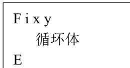

{0}------------------------------------------------

# CCF 全国信息学奥林匹克联赛（NOIP2017）复赛

## 提高组 day1

（请选手务必仔细阅读本页内容）

## 一. 题目概况

|           |                   |                |          |
|-----------|-------------------|----------------|----------|
| 中文题目名称    | 小凯的疑惑             | 时间复杂度          | 逛公园      |
| 英文题目与子目录名 | math              | complexity     | park     |
| 可执行文件名    | math              | complexity     | park     |
| 输入文件名     | math.in           | complexity.in  | park.in  |
| 输出文件名     | math.out          | complexity.out | park.out |
| 每个测试点时限   | 1 秒               | 1 秒            | 3 秒      |
| 测试点数目     | 20                | 10             | 10       |
| 每个测试点分值   | 5                 | 10             | 10       |
| 附加样例文件    | 有                 | 有              | 有        |
| 结果比较方式    | 全文比较（过滤行末空格及文末回车） |                |          |
| 题目类型      | 传统                | 传统             | 传统       |
| 运行内存上限    | 256M              | 256M           | 512M     |

## 二. 提交源程序文件名

|              |          |                |          |
|--------------|----------|----------------|----------|
| 对于 C++语言     | math.cpp | complexity.cpp | park.cpp |
| 对于 C 语言      | math.c   | complexity.c   | park.c   |
| 对于 pascal 语言 | math.pas | complexity.pas | park.pas |

## 三. 编译命令（不包含任何优化开关）

|              |                             |                                         |                             |
|--------------|-----------------------------|-----------------------------------------|-----------------------------|
| 对于 C++语言     | g++ -o math math.cpp -lm | g++ -o complexity complexity.cpp -lm | g++ -o park park.cpp -lm |
| 对于 C 语言      | gcc -o math math.c -lm   | gcc -o complexity complexity.c -lm   | gcc -o park park.c -lm   |
| 对于 pascal 语言 | fpc math.pas                | fpc complexity.pas                      | fpc park.pas                |

### 注意事项:

- 1、文件名（程序名和输入输出文件名）必须使用英文小写。
- 2、C/C++中函数 main() 的返回值类型必须是 int，程序正常结束时的返回值必须是 0。
- 3、全国统一评测时采用的机器配置为：CPU AMD Athlon(tm) II x2 240 processor，2.8GHz，内存 4G，上述时限以此配置为准。
- 4、只提供 Linux 格式附加样例文件。
- 5、提交的程序代码文件的放置位置请参照各省的具体要求。
- 6、特别提醒：评测在当前最新公布的 NOI Linux 下进行，各语言的编译器版本以其为准。

{1}------------------------------------------------

### 1. 小凯的疑惑

(math.cpp/c/pas)

#### 【问题描述】

小凯手中有两种面值的金币，两种面值均为正整数且彼此互素。每种金币小凯都有无数个。在不找零的情况下，仅凭这两种金币，有些物品他是无法准确支付的。现在小凯想知道在无法准确支付的物品中，最贵的价值是多少金币？注意：输入数据保证存在小凯无法准确支付的商品。

#### 【输入格式】

输入文件名为 math.in。

输入数据仅一行，包含两个正整数 a 和 b，它们之间用一个空格隔开，表示小凯手中金币的面值。

#### 【输出格式】

输出文件名为 math.out。

输出文件仅一行，一个正整数 N，表示不找零的情况下，小凯用手中的金币不能准确支付的最贵的物品的价值。

#### 【输入输出样例 1】

| math.in | math.out |
|---------|----------|
| 3 7     | 11       |

见选手目录下的 math/math1.in 和 math/math1.ans。

##### 【输入输出样例 1 说明】

小凯手中有面值为 3 和 7 的金币无数个，在不找零的前提下无法准确支付价值为 1、2、4、5、8、11 的物品，其中最贵的物品价值为 11，比 11 贵的物品都能买到，比如：

$$
12 = 3 * 4 + 7 * 0
$$

$$
13 = 3 * 2 + 7 * 1
$$

$$
14 = 3 * 0 + 7 * 2
$$

$$
15 = 3 * 5 + 7 * 0
$$

.....

##### 【输入输出样例 2】

见选手目录下的 math/math2.in 和 math/math2.ans。

#### 【数据规模与约定】

对于 30% 的数据：  $1 \leq a, b \leq 50$ 。

对于 60% 的数据：  $1 \leq a, b \leq 10,000$ 。

对于 100% 的数据：  $1 \leq a, b \leq 1,000,000,000$ 。

{2}------------------------------------------------

### 2. 时间复杂度

(complexity.cpp/c/pas)

#### 【问题描述】

小明正在学习一种新的编程语言 A++，刚学会循环语句的他激动地写了好多程序并给出了他自己算出的时间复杂度，可他的编程老师实在不想一个一个检查小明的程序，于是你的机会来啦！下面请你编写程序来判断小明对他的每个程序给出的时间复杂度是否正确。

A++语言的循环结构如下：

|                     |
|---------------------|
| F i x y 循环体 E |
|---------------------|

其中“F i x y”表示新建变量  $i$ （变量  $i$  不可与未被销毁的变量重名）并初始化为  $x$ ，然后判断  $i$  和  $y$  的大小关系，若  $i$  小于等于  $y$  则进入循环，否则不进入。每次循环结束后  $i$  都会被修改成  $i+1$ ，一旦  $i$  大于  $y$  终止循环。

$x$  和  $y$  可以是正整数（ $x$  和  $y$  的大小关系不定）或变量  $n$ 。 $n$  是一个表示数据规模的变量，在时间复杂度计算中需保留该变量而不能将其视为常数，该数**远大于** 100。

“E”表示循环体结束。循环体结束时，这个循环体新建的变量也被销毁。

注：本题中为了书写方便，在描述复杂度时，使用大写英文字母“O”表示通常意义下“ $\Theta$ ”的概念。

#### 【输入格式】

输入文件名为 complexity.in。

输入文件第一行一个正整数  $t$ ，表示有  $t$ （ $t \leq 10$ ）个程序需要计算时间复杂度。每个程序我们只需抽取其中“F i x y”和“E”即可计算时间复杂度。**注意：循环结构允许嵌套。**

接下来每个程序的第一行包含一个正整数  $L$  和一个字符串， $L$  代表程序行数，字符串表示这个程序的复杂度，“ $O(1)$ ”表示常数复杂度，“ $O(n^w)$ ”表示复杂度为  $n^w$ ，其中  $w$  是一个小于 100 的正整数（输入中不包含引号），输入保证复杂度只有  $O(1)$  和  $O(n^w)$  两种类型。

接下来  $L$  行代表程序中循环结构中的“F i x y”或者“E”。

程序行若以“F”开头，表示进入一个循环，之后有空格分离的三个字符（串） $i x y$ ，其中  $i$  是一个小写字母（保证不为“n”），表示新建的变量名， $x$  和  $y$  可能是正整数或  $n$ ，已知若为正整数则一定小于 100。

程序行若以“E”开头，则表示循环体结束。

#### 【输出格式】

输出文件名为 complexity.out。

输出文件共  $t$  行，对应输入的  $t$  个程序，每行输出“Yes”或“No”或者“ERR”（输出中不包含引号），若程序实际复杂度与输入给出的复杂度一致则输出“Yes”，不一致则输出“No”，若程序有语法错误（其中语法错误只有：① F 和 E 不匹配 ②新建的变量与已经存在但未被销毁的变量重复两种情况），则输出“ERR”。

注意：即使在程序不会执行的循环体中出现了语法错误也会编译错误，要输出“ERR”。

{3}------------------------------------------------

#### 【输入输出样例 1】

| <b>complexity.in</b> | <b>complexity.out</b> |
|----------------------|-----------------------|
| 8                    | Yes                   |
| 2 O(1)               | Yes                   |
| F i 1 1              | ERR                   |
| E                    | Yes                   |
| 2 O(n^1)             | No                    |
| F x 1 n              | Yes                   |
| E                    | Yes                   |
| 1 O(1)               | ERR                   |
| F x 1 n              |                       |
| 4 O(n^2)             |                       |
| F x 5 n              |                       |
| F y 10 n             |                       |
| E                    |                       |
| E                    |                       |
| 4 O(n^2)             |                       |
| F x 9 n              |                       |
| E                    |                       |
| F y 2 n              |                       |
| E                    |                       |
| 4 O(n^1)             |                       |
| F x 9 n              |                       |
| F y n 4              |                       |
| E                    |                       |
| E                    |                       |
| 4 O(1)               |                       |
| F y n 4              |                       |
| F x 9 n              |                       |
| E                    |                       |
| E                    |                       |
| 4 O(n^2)             |                       |
| F x 1 n              |                       |
| F x 1 10             |                       |
| E                    |                       |
| E                    |                       |

见选手目录下的

complexity/complexity1.in 和 complexity/complexity1.ans。

##### 【输入输出样例 1 说明】

第一个程序 i 从 1 到 1 是常数复杂度。

第二个程序 x 从 1 到 n 是 n 的一次方的复杂度。

{4}------------------------------------------------

第三个程序有一个 F 开启循环却没有 E 结束，语法错误。

第四个程序二重循环， $n$  的平方的复杂度。

第五个程序两个一重循环， $n$  的一次方的复杂度。

第六个程序第一重循环正常，但第二重循环开始即终止（因为  $n$  远大于 100，100 大于 4）。

第七个程序第一重循环无法进入，故为常数复杂度。

第八个程序第二重循环中的变量  $x$  与第一重循环中的变量重复，出现语法错误②，输出 ERR。

#### 【输入输出样例 2】

见选手目录下的

complexity/complexity2.in 和 complexity/complexity2.ans。

#### 【数据规模与约定】

对于 30% 的数据：不存在语法错误，数据保证小明给出的每个程序的前  $L/2$  行一定为以 F 开头的语句，第  $L/2+1$  行至第  $L$  行一定为以 E 开头的语句， $L \leq 10$ ，若  $x$ 、 $y$  均为整数， $x$  一定小于  $y$ ，且只有  $y$  有可能为  $n$ 。

对于 50% 的数据：不存在语法错误， $L \leq 100$ ，且若  $x$ 、 $y$  均为整数， $x$  一定小于  $y$ ，且只有  $y$  有可能为  $n$ 。

对于 70% 的数据：不存在语法错误， $L \leq 100$ 。

对于 100% 的数据： $L \leq 100$ 。

{5}------------------------------------------------

### 3. 逛公园

(park.cpp/c/pas)

#### **【问题描述】**

策策同学特别喜欢逛公园。公园可以看成一张 $N$ 个点 $M$ 条边构成的有向图，且没有自环和重边。其中1号点是公园的入口， $N$ 号点是公园的出口，每条边有一个非负权值，代表策策经过这条边所要花的时间。

策策每天都会去逛公园，他总是从1号点进去，从 $N$ 号点出来。

策策喜欢新鲜的事物，他不希望有两天逛公园的路线完全一样，同时策策还是一个特别热爱学习的好孩子，他不希望每天在逛公园这件事上花费太多的时间。如果1号点到 $N$ 号点的最短路长为 $d$ ，那么策策只会喜欢长度不超过 $d + K$ 的路线。

策策同学想知道总共有多少条满足条件的路线，你能帮帮他吗？

为避免输出过大，答案对 $P$ 取模。

如果有无穷多条合法的路线，请输出-1。

#### **【输入格式】**

输入文件名为 park.in。

第一行包含一个整数  $T$ ，代表数据组数。

接下来 $T$ 组数据，对于每组数据：

第一行包含四个整数  $N, M, K, P$ ，每两个整数之间用一个空格隔开。

接下来 $M$ 行，每行三个整数 $a_i, b_i, c_i$ ，代表编号为 $a_i, b_i$ 的点之间有一条权值为 $c_i$ 的有向边，每两个整数之间用一个空格隔开。

#### **【输出格式】**

输出文件名为 park.out。

输出文件包含  $T$  行，每行一个整数代表答案。

#### **【输入输出样例 1】**

| park.in  | park.out |
|----------|----------|
| 2        | 3        |
| 5 7 2 10 | -1       |
| 1 2 1    |          |
| 2 4 0    |          |
| 4 5 2    |          |
| 2 3 2    |          |
| 3 4 1    |          |
| 3 5 2    |          |
| 1 5 3    |          |
| 2 2 0 10 |          |
| 1 2 0    |          |
| 2 1 0    |          |

见选手目录下的 park/park1.in 和 park/park1.ans。

对于第一组数据，最短路为 3。

1-5, 1-2-4-5, 1-2-3-5 为 3 条合法路径。

{6}------------------------------------------------

#### **【输入输出样例 2】**

见选手目录下的 park/park2.in 和 park/park2.ans。

#### **【数据规模与约定】**

对于不同的测试点，我们约定各种参数的规模**不会超过**如下

| 测试点编号 | $T$ | $N$    | $M$    | $K$ | 是否有 0 边 |
|-------|-----|--------|--------|-----|---------|
| 1     | 5   | 5      | 10     | 0   | 否       |
| 2     | 5   | 1000   | 2000   | 0   | 否       |
| 3     | 5   | 1000   | 2000   | 50  | 否       |
| 4     | 5   | 1000   | 2000   | 50  | 否       |
| 5     | 5   | 1000   | 2000   | 50  | 否       |
| 6     | 5   | 1000   | 2000   | 50  | 是       |
| 7     | 5   | 100000 | 200000 | 0   | 否       |
| 8     | 3   | 100000 | 200000 | 50  | 否       |
| 9     | 3   | 100000 | 200000 | 50  | 是       |
| 10    | 3   | 100000 | 200000 | 50  | 是       |
|       |     |        |        |     |         |

对于 100% 的数据,  $1 \leq P \leq 10^9, 1 \leq a_i, b_i \leq N, 0 \leq c_i \leq 1000$ 。

数据保证：至少存在一条合法的路线。