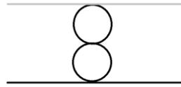
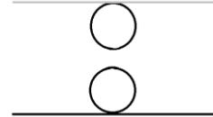
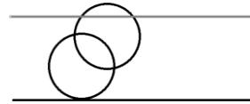
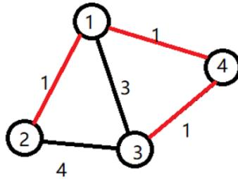
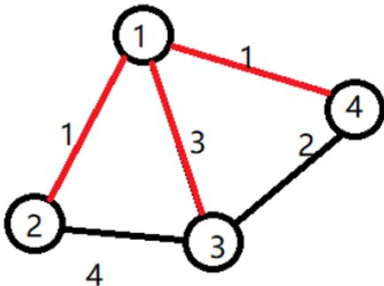

{0}------------------------------------------------

# CCF 全国信息学奥林匹克联赛（NOIP2017）复赛

## 提高组 day2

（请选手务必仔细阅读本页内容）

## 一. 题目概况

|           |                   |              |             |
|-----------|-------------------|--------------|-------------|
| 中文题目名称    | 奶酪                | 宝藏           | 列队          |
| 英文题目与子目录名 | cheese            | treasure     | phalanx     |
| 可执行文件名    | cheese            | treasure     | phalanx     |
| 输入文件名     | cheese.in         | treasure.in  | phalanx.in  |
| 输出文件名     | cheese.out        | treasure.out | phalanx.out |
| 每个测试点时限   | 1 秒               | 1 秒          | 2 秒         |
| 测试点数目     | 10                | 20           | 20          |
| 每个测试点分值   | 10                | 5            | 5           |
| 附加样例文件    | 有                 | 有            | 有           |
| 结果比较方式    | 全文比较（过滤行末空格及文末回车） |              |             |
| 题目类型      | 传统                | 传统           | 传统          |
| 运行内存上限    | 256M              | 256M         | 512M        |

## 二. 提交源程序文件名

|              |            |              |             |
|--------------|------------|--------------|-------------|
| 对于 C++语言     | cheese.cpp | treasure.cpp | phalanx.cpp |
| 对于 C 语言      | cheese.c   | treasure.c   | phalanx.c   |
| 对于 pascal 语言 | cheese.pas | treasure.pas | phalanx.pas |

## 三. 编译命令（不包含任何优化开关）

|              |                                 |                                     |                                   |
|--------------|---------------------------------|-------------------------------------|-----------------------------------|
| 对于 C++语言     | g++ -o cheese cheese.cpp -lm | g++ -o treasure treasure.cpp -lm | g++ -o phalanx phalanx.cpp -lm |
| 对于 C 语言      | gcc -o cheese cheese.c -lm   | gcc -o treasure treasure.c -lm   | gcc -o phalanx phalanx.c -lm   |
| 对于 pascal 语言 | fpc cheese.pas                  | fpc treasure.pas                    | fpc phalanx.pas                   |

### 注意事项：

- 1、文件名（程序名和输入输出文件名）必须使用英文小写。
- 2、C/C++中函数 main() 的返回值类型必须是 int，程序正常结束时的返回值必须是 0。
- 3、全国统一评测时采用的机器配置为：CPU AMD Athlon(tm) II x2 240 processor，2.8GHz，内存 4G，上述时限以此配置为准。
- 4、只提供 Linux 格式附加样例文件。
- 5、提交的程序代码文件的放置位置请参照各省的具体要求。
- 6、特别提醒：评测在当前最新公布的 NOI Linux 下进行，各语言的编译器版本以其为准。

{1}------------------------------------------------

### 1. 奶酪

(cheese.cpp/c/pas)

#### **【问题描述】**

现有一块大奶酪，它的高度为  $h$ ，它的长度和宽度我们可以认为是无限大的，奶酪中间有许多**半径相同**的球形空洞。我们可以在这块奶酪中建立空间坐标系，在坐标系中，奶酪的下表面为 $z = 0$ ，奶酪的上表面为 $z = h$ 。

现在，奶酪的下表面有一只小老鼠 Jerry，它知道奶酪中所有空洞的球心所在的坐标。如果两个空洞相切或是相交，则 Jerry 可以从其中一个空洞跑到另一个空洞，特别地，如果一个空洞与下表面相切或是相交，Jerry 则可以从奶酪下表面跑进空洞；如果一个空洞与上表面相切或是相交，Jerry 则可以从空洞跑到奶酪上表面。

位于奶酪下表面的 Jerry 想知道，在**不破坏奶酪**的情况下，能否利用已有的空洞跑到奶酪的上表面去？

空间内两点 $P_1(x_1, y_1, z_1)$ 、 $P_2(x_2, y_2, z_2)$ 的距离公式如下：

$$
\text{dist}(P_1, P_2) = \sqrt{(x_1 - x_2)^2 + (y_1 - y_2)^2 + (z_1 - z_2)^2}
$$

#### **【输入格式】**

输入文件名为 cheese.in。

每个输入文件包含多组数据。

输入文件的第一行，包含一个正整数  $T$ ，代表该输入文件中所含的数据组数。

接下来是  $T$  组数据，每组数据的格式如下：

第一行包含三个正整数  $n$ ， $h$  和  $r$ ，两个数之间以一个空格分开，分别代表奶酪中空洞的数量，奶酪的高度和空洞的半径。

接下来的  $n$  行，每行包含三个整数  $x$ 、 $y$ 、 $z$ ，两个数之间以一个空格分开，表示空洞球心坐标为 $(x, y, z)$ 。

#### **【输出格式】**

输出文件名为 cheese.out。

输出文件包含  $T$  行，分别对应  $T$  组数据的答案，如果在第  $i$  组数据中，Jerry 能从下表面跑到上表面，则输出 “Yes”，如果不能，则输出 “No”（均不包含引号）。

#### **【输入输出样例 1】**

| cheese.in | cheese.out |
|-----------|------------|
| 3         | Yes        |
| 2 4 1     | No         |
| 0 0 1     | Yes        |
| 0 0 3     |            |
| 2 5 1     |            |
| 0 0 1     |            |
| 0 0 4     |            |
| 2 5 2     |            |
| 0 0 2     |            |
| 2 0 4     |            |

{2}------------------------------------------------

见选手目录下的 cheese/cheese1.in 和 cheese/cheese1.ans。

##### 【输入输出样例 1 说明】

第一组数据，由奶酪的剖面图可见：
第一个空洞在（0，0，0）与下表面相切
第二个空洞在（0，0，4）与上表面相切
两个空洞在（0，0，2）相切

Diagram showing two circles stacked vertically between two horizontal lines, touching each other and the lines.

输出 Yes

第二组数据，由奶酪的剖面图可见：
两个空洞既不相交也不相切

Diagram showing two separate circles between two horizontal lines, neither touching the lines nor each other.

输出 No

第三组数据，由奶酪的剖面图可见：
两个空洞相交
且与上下表面相切或相交

Diagram showing two overlapping circles between two horizontal lines, with one circle touching the top line and the other touching the bottom line.

输出 Yes

#### 【输入输出样例 2】

见选手目录下的 cheese/cheese2.in 和 cheese/cheese2.ans。

#### 【数据规模与约定】

对于 20%的数据，n = 1，1 ≤ h, r ≤ 10,000，坐标的绝对值不超过 10,000。
对于 40%的数据，1 ≤ n ≤ 8，1 ≤ h, r ≤ 10,000，坐标的绝对值不超过 10,000。
对于 80%的数据，1 ≤ n ≤ 1,000，1 ≤ h, r ≤ 10,000，坐标的绝对值不超过 10,000。
对于 100%的数据，1 ≤ n ≤ 1,000，1 ≤ h, r ≤ 1,000,000,000，T ≤ 20，坐标的绝对值不超过 1,000,000,000。

{3}------------------------------------------------

### 2. 宝藏

(`treasure.cpp/c/pas`)

#### **【问题描述】**

参与考古挖掘的小明得到了一份藏宝图，藏宝图上标出了  $n$  个深埋在地下的宝藏屋，也给出了这  $n$  个宝藏屋之间可供开发的  $m$  条道路和它们的长度。

小明决心亲自前往挖掘所有宝藏屋中的宝藏。但是，每个宝藏屋距离地面都很远，也就是说，从地面打通一条到某个宝藏屋的道路是很困难的，而开发宝藏屋之间的道路则相对容易很多。

小明的决心感动了考古挖掘的赞助商，赞助商决定免费赞助他打通一条从地面到某个宝藏屋的通道，通往哪个宝藏屋则由小明来决定。

在此基础上，小明还需要考虑如何开凿宝藏屋之间的道路。已经开凿出的道路可以任意通行不消耗代价。每开凿出一条新道路，小明就会与考古队一起挖掘出由该条道路所能到达的宝藏屋的宝藏。另外，小明不想开发无用道路，即两个已经被挖掘过的宝藏屋之间的道路无需再开发。

新开发一条道路的代价是：

这条道路的长度  $\times$  从赞助商帮你打通的宝藏屋到这条道路起点的宝藏屋所经过的宝藏屋的数量（包括赞助商帮你打通的宝藏屋和这条道路起点的宝藏屋）。

请你编写程序为小明选定由赞助商打通的宝藏屋和之后开凿的道路，使得工程总代价最小，并输出这个最小值。

#### **【输入格式】**

输入文件名为 `treasure.in`。

第一行两个用空格分离的正整数  $n$  和  $m$ ，代表宝藏屋的个数和道路数。

接下来  $m$  行，每行三个用空格分离的正整数，分别是由一条道路连接的两个宝藏屋的编号（编号为  $1 \sim n$ ），和这条道路的长度  $v$ 。

#### **【输出格式】**

输出文件名为 `treasure.out`。

输出共一行，一个正整数，表示最小的总代价。

#### **【输入输出样例 1】**

| <code>treasure.in</code>                         | <code>treasure.out</code> |
|--------------------------------------------------|---------------------------|
| 4 5 1 2 1 1 3 3 1 4 1 2 3 4 3 4 1 | 4                         |

见选手目录下的 `treasure/treasure1.in` 与 `treasure/treasure1.ans`

##### **【输入输出样例 1 说明】**

{4}------------------------------------------------

A graph with 4 nodes (1, 2, 3, 4) and weighted edges. Node 1 is connected to 2 (weight 1), 3 (weight 3), and 4 (weight 1). Node 2 is connected to 3 (weight 4). Node 4 is connected to 3 (weight 1). Edges (1,2), (1,4), and (4,3) are highlighted in red.

小明选定让赞助商打通了 1 号宝藏屋。小明开发了道路 1→2，挖掘了 2 号宝藏。开发了道路 1→4，挖掘了 4 号宝藏。还开发了道路 4→3，挖掘了 3 号宝藏。工程总代价为： $1 \times 1 + 1 \times 1 + 1 \times 2 = 4$   
 (1→2)    (1→4)    (4→3)

#### 【样例输入输出 2】

| treasure.in | treasure.out |
|-------------|--------------|
| 4 5         | 5            |
| 1 2 1       |              |
| 1 3 3       |              |
| 1 4 1       |              |
| 2 3 4       |              |
| 3 4 2       |              |

见选手目录下的 treasure/treasure2.in 与 treasure/treasure2.ans。

#### 【输入输出样例 2 说明】

A graph with 4 nodes (1, 2, 3, 4) and weighted edges. Node 1 is connected to 2 (weight 1), 3 (weight 3), and 4 (weight 1). Node 2 is connected to 3 (weight 4). Node 3 is connected to 4 (weight 2). Edges (1,2), (1,3), and (1,4) are highlighted in red.

小明选定让赞助商打通了 1 号宝藏屋。小明开发了道路 1→2，挖掘了 2 号宝藏。开发了道路 1→3，挖掘了 3 号宝藏。还开发了道路 1→4，挖掘了 4 号宝藏。工程总代价为： $1 \times 1 + 3 \times 1 + 1 \times 1 = 5$   
 (1→2)    (1→3)    (1→4)

#### 【输入输出样例 3】

见选手目录下的 treasure/treasure3.in 和 treasure/treasure3.out。

{5}------------------------------------------------

#### **【数据规模与约定】**

对于 20% 的数据：

保证输入是一棵树， $1 \leq n \leq 8$ ， $v \leq 5000$  且所有的  $v$  都相等。

对于 40% 的数据：

$1 \leq n \leq 8$ ， $0 \leq m \leq 1000$ ， $v \leq 5000$  且所有的  $v$  都相等。

对于 70% 的数据：

$1 \leq n \leq 8$ ， $0 \leq m \leq 1000$ ， $v \leq 5000$

对于 100% 的数据：

$1 \leq n \leq 12$ ， $0 \leq m \leq 1000$ ， $v \leq 500000$

{6}------------------------------------------------

### 3. 列队

(phalanx.cpp/c/pas)

#### 【问题描述】

Sylvia 是一个热爱学习的女孩子。

前段时间, Sylvia 参加了学校的军训。众所周知, 军训的时候需要站方阵。Sylvia 所在的方阵中有  $n \times m$  名学生, 方阵的行数为  $n$ , 列数为  $m$ 。

为了便于管理, 教官在训练开始时, 按照从前到后, 从左到右的顺序给方阵中的学生从 1 到  $n \times m$  编上了号码 (参见后面的样例)。即: 初始时, 第  $i$  行第  $j$  列的学生的编号是  $(i-1) \times m + j$ 。

然而在练习方阵的时候, 经常会有学生因为各种各样的事情需要离队。在一天中, 一共发生了  $q$  件这样的离队事件。每一次离队事件可以用数对  $(x, y)$  ( $1 \leq x \leq n, 1 \leq y \leq m$ ) 描述, 表示第  $x$  行第  $y$  列的学生离队。

在有学生离队后, 队伍中出现了一个空位。为了队伍的整齐, 教官会依次下达这样的两条指令:

1. 向左看齐。这时第一列保持不动, 所有学生向左填补空缺。不难发现在这条指令之后, 空位在第  $x$  行第  $m$  列。

2. 向前看齐。这时第一行保持不动, 所有学生向前填补空缺。不难发现在这条指令之后, 空位在第  $n$  行第  $m$  列。

教官规定不能有两个或更多学生同时离队。即在前一个离队的学生归队之后, 下一个学生才能离队。因此在每一个离队的学生要归队时, 队伍中有且仅有第  $n$  行第  $m$  列一个空位, 这时这个学生会自然地填补到这个位置。

因为站方阵真的很无聊, 所以 Sylvia 想要计算每一次离队事件中, 离队的同学的编号是多少。

注意: 每一个同学的编号不会随着离队事件的发生而改变, 在发生离队事件后方阵中同学的编号可能是乱序的。

#### 【输入格式】

输入文件名为 phalanx.in。

输入共  $q+1$  行。

第 1 行包含 3 个用空格分隔的正整数  $n, m, q$ , 表示方阵大小是  $n$  行  $m$  列, 一共发生了  $q$  次事件。

接下来  $q$  行按照事件发生顺序描述了  $q$  件事件。每一行是两个整数  $x, y$ , 用一个空格分隔, 表示这个离队事件中离队的学生当时排在第  $x$  行第  $y$  列。

#### 【输出格式】

输出文件名为 phalanx.out。

按照事件输入的顺序, 每一个事件输出一行一个整数, 表示这个离队事件中离队学生的编号。

#### 【输入输出样例 1】

| phalanx.in | phalanx.out |
|------------|-------------|
| 2 2 3      | 1           |
| 1 1        | 1           |
| 2 2        | 4           |
| 1 2        |             |

{7}------------------------------------------------

见选手目录下的 `phalanx/phalanx1.in` 与 `phalanx/phalanx1.ans`。

#### 【输入输出样例 1 说明】

$$
\begin{aligned} \begin{bmatrix} 1 & 2 \\ 3 & 4 \end{bmatrix} &\Rightarrow \begin{bmatrix} & 2 \\ 3 & 4 \end{bmatrix} \Rightarrow \begin{bmatrix} 2 & \\ 3 & 4 \end{bmatrix} \Rightarrow \begin{bmatrix} 2 & 4 \\ 3 & \end{bmatrix} \Rightarrow \begin{bmatrix} 2 & 4 \\ 3 & 1 \end{bmatrix} \\ \begin{bmatrix} 2 & 4 \\ 3 & 1 \end{bmatrix} &\Rightarrow \begin{bmatrix} 2 & 4 \\ 3 & \end{bmatrix} \Rightarrow \begin{bmatrix} 2 & 4 \\ 3 & \end{bmatrix} \Rightarrow \begin{bmatrix} 2 & 4 \\ 3 & \end{bmatrix} \Rightarrow \begin{bmatrix} 2 & 4 \\ 3 & 1 \end{bmatrix} \\ \begin{bmatrix} 2 & 4 \\ 3 & 1 \end{bmatrix} &\Rightarrow \begin{bmatrix} 2 & \\ 3 & 1 \end{bmatrix} \Rightarrow \begin{bmatrix} 2 & \\ 3 & 1 \end{bmatrix} \Rightarrow \begin{bmatrix} 2 & 1 \\ 3 & \end{bmatrix} \Rightarrow \begin{bmatrix} 2 & 1 \\ 3 & 4 \end{bmatrix} \end{aligned}
$$

列队的过程如上图所示，每一行描述了一个事件。

在第一个事件中，编号为 1 的同学离队，这时空位在第一行第一列。接着所有同学向左标齐，这时编号为 2 的同学向左移动一步，空位移动到第一行第二列。然后所有同学向上标齐，这时编号为 4 的同学向上一步，这时空位移动到第二行第二列。最后编号为 1 的同学返回填补到空位中。

#### 【样例输入输出 2】

见选手目录下的 `phalanx/phalanx2.in` 与 `phalanx/phalanx2.ans`。

#### 【数据规模与约定】

| 测试点编号                | $n$                  | $m$                  | $q$                  | 其他约定         |
|----------------------|----------------------|----------------------|----------------------|--------------|
| 1, 2 3, 4 5, 6 | $\leq 1000$          | $\leq 1000$          | $\leq 500$           | 无            |
| 7, 8 9, 10        | $\leq 5 \times 10^4$ | $\leq 5 \times 10^4$ |                      |              |
| 11, 12               | $= 1$                | $\leq 10^5$          | $\leq 10^5$          | 所有事件 $x = 1$ |
| 13, 14               |                      | $\leq 3 \times 10^5$ | $\leq 3 \times 10^5$ |              |
| 15, 16               | $\leq 3 \times 10^5$ |                      |                      |              |
| 17, 18               | $\leq 10^5$          | $\leq 10^5$          | $\leq 10^5$          | 无            |
| 19, 20               | $\leq 3 \times 10^5$ | $\leq 3 \times 10^5$ | $\leq 3 \times 10^5$ |              |

数据保证每一个事件满足  $1 \leq x \leq n, 1 \leq y \leq m$ 。