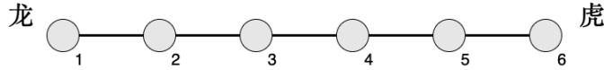
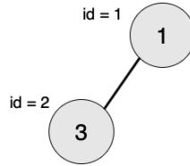
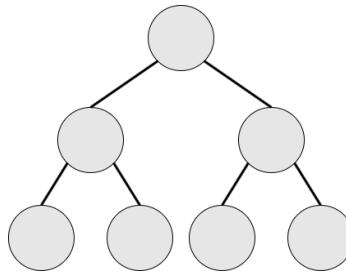
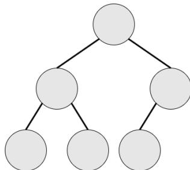
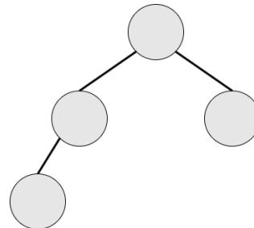

{0}------------------------------------------------

# CCF 全国信息学奥林匹克联赛（NOIP2018）复赛

## 普及组

（请选手务必仔细阅读本页内容）

## 一. 题目概况

|           |                   |           |         |          |
|-----------|-------------------|-----------|---------|----------|
| 中文题目名称    | 标题统计              | 龙虎斗       | 摆渡车     | 对称二叉树    |
| 英文题目与子目录名 | title             | fight     | bus     | tree     |
| 可执行文件名    | title             | fight     | bus     | tree     |
| 输入文件名     | title.in          | fight.in  | bus.in  | tree.in  |
| 输出文件名     | title.out         | fight.out | bus.out | tree.out |
| 每个测试点时限   | 1 秒               | 1 秒       | 2 秒     | 1 秒      |
| 测试点数目     | 20                | 25        | 20      | 25       |
| 每个测试点分值   | 5                 | 4         | 5       | 4        |
| 附加样例文件    | 有                 | 有         | 有       | 有        |
| 结果比较方式    | 全文比较（过滤行末空格及文末回车） |           |         |          |
| 题目类型      | 传统                | 传统        | 传统      | 传统       |
| 运行内存上限    | 256M              | 256M      | 256M    | 256M     |

## 二. 提交源程序文件名

|              |           |           |         |          |
|--------------|-----------|-----------|---------|----------|
| 对于 C++语言     | title.cpp | fight.cpp | bus.cpp | tree.cpp |
| 对于 C 语言      | title.c   | fight.c   | bus.c   | tree.c   |
| 对于 pascal 语言 | title.pas | fight.pas | bus.pas | tree.pas |

## 三. 编译命令（不包含任何优化开关）

|              |                               |                               |                           |                             |
|--------------|-------------------------------|-------------------------------|---------------------------|-----------------------------|
| 对于 C++语言     | g++ -o title<br>title.cpp -lm | g++ -o fight<br>fight.cpp -lm | g++ -o bus<br>bus.cpp -lm | g++ -o tree<br>tree.cpp -lm |
| 对于 C 语言      | gcc -o title title.c<br>-lm   | gcc -o fight fight.c<br>-lm   | gcc -o bus<br>bus.c -lm   | gcc -o tree tree.c<br>-lm   |
| 对于 pascal 语言 | fpc title.pas                 | fpc fight.pas                 | fpc bus.pas               | fpc tree.pas                |

### 注意事项：

- 1、文件名（程序名和输入输出文件名）必须使用英文小写。
- 2、C/C++中函数 main() 的返回值类型必须是 int，程序正常结束时的返回值必须是 0。
- 3、全国统一评测时采用的机器配置为：Intel(R) Core(TM) i7-8700K CPU @ 3.70GHz，内存 32GB。上述时限以此配置为准。
- 4、只提供 Linux 格式附加样例文件。
- 5、特别提醒：评测在当前最新公布的 NOI Linux 下进行，各语言的编译器版本以其为准。

{1}------------------------------------------------

### 1. 标题统计

(title.cpp/c/pas)

#### **【问题描述】**

凯凯刚写了一篇美妙的作文，请问这篇作文的标题中有多少个字符？

注意：标题中可能包含大、小写英文字母、数字字符、空格和换行符。统计标题字符数时，空格和换行符不计算在内。

#### **【输入格式】**

输入文件名为 title.in。

输入文件只有一行，一个字符串 s。

#### **【输出格式】**

输出文件名为 title.out。

输出文件只有一行，包含一个整数，即作文标题的字符数（不含空格和换行符）。

#### **【输入输出样例 1】**

| title.in | title.out |
|----------|-----------|
| 234      | 3         |

见选手目录下的 title/title1.in 和 title/title1.ans。

##### **【输入输出样例 1 说明】**

标题中共有 3 个字符，这 3 个字符都是数字字符。

#### **【输入输出样例 2】**

| title.in | title.out |
|----------|-----------|
| Ca 45    | 4         |

见选手目录下的 title/title2.in 和 title/title2.ans。

##### **【输入输出样例 2 说明】**

标题中共有 5 个字符，包括 1 个大写英文字母，1 个小写英文字母和 2 个数字字符，还有 1 个空格。由于空格不计入结果中，故标题的有效字符数为 4 个。

#### **【数据规模与约定】**

规定  $|s|$  表示字符串 s 的长度（即字符串中的字符和空格数）。

对于 40% 的数据， $1 \leq |s| \leq 5$ ，保证输入为数字字符及行末换行符。

对于 80% 的数据， $1 \leq |s| \leq 5$ ，输入只可能包含大、小写英文字母、数字字符及行末换行符。

对于 100% 的数据， $1 \leq |s| \leq 5$ ，输入可能包含大、小写英文字母、数字字符、空格和行末换行符。

{2}------------------------------------------------

### 2. 龙虎斗

(fight.cpp/c/pas)

#### 【问题描述】

轩轩和凯凯正在玩一款叫《龙虎斗》的游戏，游戏的棋盘是一条线段，线段上有  $n$  个兵营（自左至右编号  $1 \sim n$ ），相邻编号的兵营之间相隔 1 厘米，即棋盘为长度为  $n - 1$  厘米的线段。 $i$  号兵营里有  $c_i$  位工兵。

下面图 1 为  $n = 6$  的示例：



Diagram 1: A horizontal line representing a board with 6 camps numbered 1 to 6. Camps 1 to 5 are grey circles, and camp 6 is a grey circle. The word '龙' (Dragon) is above camp 1, and '虎' (Tiger) is above camp 6.

图 1.  $n = 6$  的示例

轩轩在左侧，代表“龙”；凯凯在右侧，代表“虎”。他们以  $m$  号兵营作为分界，靠左的工兵属于龙势力，靠右的工兵属于虎势力，而第  $m$  号兵营中的工兵很纠结，他们不属于任何一方。

一个兵营的气势为：该兵营中的工兵数  $\times$  该兵营到  $m$  号兵营的距离；参与游戏一方的势力定义为：属于这一方所有兵营的气势之和。

下面图 2 为  $n = 6, m = 4$  的示例，其中红色为龙方，黄色为虎方：


Diagram 2: A horizontal line representing a board with 6 camps numbered 1 to 6. Camps 1, 2, and 3 are red circles (Dragon side). Camp 4 is a grey circle (m=4). Camps 5 and 6 are yellow circles (Tiger side). The word '龙' (Dragon) is above camp 1, and '虎' (Tiger) is above camp 6. The label 'm=4' is above camp 4.

图 2.  $n = 6, m = 4$  的示例

游戏过程中，某一刻天降神兵，共有  $s_1$  位工兵突然出现在了  $p_1$  号兵营。作为轩轩和凯凯的朋友，你知道如果龙虎双方气势差距太悬殊，轩轩和凯凯就不愿意继续玩下去了。为了让游戏继续，你需要选择一个兵营  $p_2$ ，并将你手里的  $s_2$  位工兵全部派往兵营  $p_2$ ，使得双方气势差距尽可能小。

注意：你手中的工兵落在哪个兵营，就和该兵营中其他工兵有相同的势力归属（如果落在  $m$  号兵营，则不属于任何势力）。

#### 【输入格式】

输入文件名为 `fight.in`。

输入文件的第一行包含一个正整数  $n$ ，代表兵营的数量。

接下来的一行包含  $n$  个正整数，相邻两数之间以一个空格分隔，第  $i$  个正整数代表编号为  $i$  的兵营中起始时的工兵数量  $c_i$ 。

接下来的一行包含四个正整数，相邻两数间以一个空格分隔，分别代表  $m, p_1, s_1, s_2$ 。

#### 【输出格式】

输出文件名为 `fight.out`。

输出文件有一行，包含一个正整数，即  $p_2$ ，表示你选择的兵营编号。如果存在多个编号同时满足最优，取最小的编号。

#### 【输入输出样例 1】

| fight.in    | fight.out |
|-------------|-----------|
| 6           | 2         |
| 2 3 2 3 2 3 |           |
| 4 6 5 2     |           |

{3}------------------------------------------------

见选手目录下的 fight/fight1.in 和 fight/fight1.ans。

##### 【输入输出样例 1 说明】

见问题描述中的图 2。

双方以  $m = 4$  号兵营分界，有  $s_1 = 5$  位工兵突然出现在  $p_1 = 6$  号兵营。

龙方的气势为：

$$
2 \times (4 - 1) + 3 \times (4 - 2) + 2 \times (4 - 3) = 14
$$

虎方的气势为：

$$
2 \times (5 - 4) + (3 + 5) \times (6 - 4) = 18
$$

当你将手中的  $s_2 = 2$  位工兵派往  $p_2 = 2$  号兵营时，龙方的气势变为：

$$
14 + 2 \times (4 - 2) = 18
$$

此时双方气势相等。

#### 【输入输出样例 2】

| fight.in                     | fight.out |
|------------------------------|-----------|
| 6<br>1 1 1 1 1 16<br>5 4 1 1 | 1         |

见选手目录下的 fight/fight2.in 和 fight/fight2.ans。

##### 【输入输出样例 2 说明】

双方以  $m = 5$  号兵营分界，有  $s_1 = 1$  位工兵突然出现在  $p_1 = 4$  号兵营。

龙方的气势为：

$$
1 \times (5 - 1) + 1 \times (5 - 2) + 1 \times (5 - 3) + (1 + 1) \times (5 - 4) = 11
$$

虎方的气势为：

$$
16 \times (6 - 5) = 16
$$

当你将手中的  $s_2 = 1$  位工兵派往  $p_2 = 1$  号兵营时，龙方的气势变为：

$$
11 + 1 \times (5 - 1) = 15
$$

此时可以使双方气势的差距最小。

#### 【输入输出样例 3】

见选手目录下的 fight/fight3.in 和 fight/fight3.ans。

#### 【数据规模与约定】

$1 < m < n, 1 \leq p_1 \leq n$ 。

对于 20% 的数据， $n = 3, m = 2, c_i = 1, s_1, s_2 \leq 100$ 。

另有 20% 的数据， $n \leq 10, p_1 = m, c_i = 1, s_1, s_2 \leq 100$ 。

对于 60% 的数据， $n \leq 100, c_i = 1, s_1, s_2 \leq 100$ 。

对于 80% 的数据， $n \leq 100, c_i, s_1, s_2 \leq 100$ 。

对于 100% 的数据， $n \leq 10^5, c_i, s_1, s_2 \leq 10^9$ 。

{4}------------------------------------------------

### 3. 摆渡车

(bus.cpp/c/pas)

#### 【问题描述】

有  $n$  名同学要乘坐摆渡车从人大附中前往人民大学，第  $i$  位同学在第  $t_i$  分钟去等车。只有一辆摆渡车在工作，但摆渡车容量可以视为无限大。摆渡车从人大附中出发、把车上的同学送到人民大学、再回到人大附中（去接其他同学），这样往返一趟总共花费  $m$  分钟（同学上下车时间忽略不计）。摆渡车要将所有同学都送到人民大学。

凯凯很好奇，如果他能任意安排摆渡车出发的时间，那么这些同学的等车时间之和最小为多少呢？

注意：摆渡车回到人大附中后可以即刻出发。

#### 【输入格式】

输入文件名为 bus.in。

第一行包含两个正整数  $n, m$ ，以一个空格分开，分别代表等车人数和摆渡车往返一趟的时间。

第二行包含  $n$  个正整数，相邻两数之间以一个空格分隔，第  $i$  个非负整数  $t_i$  代表第  $i$  个同学到达车站的时刻。

#### 【输出格式】

输出文件名为 bus.out。

输出一行，一个整数，表示所有同学等车时间之和的最小值（单位：分钟）。

#### 【输入输出样例 1】

| bus.in           | bus.out |
|------------------|---------|
| 5 1<br>3 4 4 3 5 | 0       |

见选手目录下的 bus/bus1.in 和 bus/bus1.ans。

##### 【输入输出样例 1 说明】

同学 1 和同学 4 在第 3 分钟开始等车，等待 0 分钟，在第 3 分钟乘坐摆渡车出发。摆渡车在第 4 分钟回到人大附中。

同学 2 和同学 3 在第 4 分钟开始等车，等待 0 分钟，在第 4 分钟乘坐摆渡车出发。摆渡车在第 5 分钟回到人大附中。

同学 5 在第 5 分钟开始等车，等待 0 分钟，在第 5 分钟乘坐摆渡车出发。自此所有同学都被送到人民大学。总等待时间为 0。

#### 【输入输出样例 2】

| bus.in             | bus.out |
|--------------------|---------|
| 5 5<br>11 13 1 5 5 | 4       |

见选手目录下的 bus/bus2.in 和 bus/bus2.ans。

{5}------------------------------------------------

##### **【输入输出样例 2 说明】**

同学 3 在第 1 分钟开始等车，等待 0 分钟，在第 1 分钟乘坐摆渡车出发。摆渡车在第 6 分钟回到人大附中。

同学 4 和同学 5 在第 5 分钟开始等车，等待 1 分钟，在第 6 分钟乘坐摆渡车出发。摆渡车在第 11 分钟回到人大附中。

同学 1 在第 11 分钟开始等车，等待 2 分钟；同学 2 在第 13 分钟开始等车，等待 0 分钟。他/她们在第 13 分钟乘坐摆渡车出发。自此所有同学都被送到人民大学。总等待时间为 4。可以证明，没有总等待时间小于 4 的方案。

#### **【输入输出样例 3】**

见选手目录下的 bus/bus3.in 和 bus/bus3.ans。

#### **【数据规模与约定】**

对于 10% 的数据， $n \leq 10$ ,  $m = 1$ ,  $0 \leq t_i \leq 100$ 。

对于 30% 的数据， $n \leq 20$ ,  $m \leq 2$ ,  $0 \leq t_i \leq 100$ 。

对于 50% 的数据， $n \leq 500$ ,  $m \leq 100$ ,  $0 \leq t_i \leq 10^4$ 。

另有 20% 的数据， $n \leq 500$ ,  $m \leq 10$ ,  $0 \leq t_i \leq 4 \times 10^6$ 。

对于 100% 的数据， $n \leq 500$ ,  $m \leq 100$ ,  $0 \leq t_i \leq 4 \times 10^6$ 。

{6}------------------------------------------------

### 4. 对称二叉树

(tree.cpp/c/pas)

#### **【问题描述】**

一棵有点权的有根树如果满足以下条件，则被轩轩称为**对称二叉树**：

1. 二叉树；
2. 将这棵树**所有**节点的左右子树交换，新树和原树对应位置的结构相同且点权相等。

下图中节点内的数字为权值，节点外的 *id* 表示节点编号。

|              | 对称二叉树                                                                                                                                                                                                                                                                                                             | 非对称二叉树<br>(权值不对称)                                                                                                                                                                                                                                                                                                  | 非对称二叉树<br>(结构不对称)                                                                                                                                                                                                                                                                                                  |
|--------------|-------------------------------------------------------------------------------------------------------------------------------------------------------------------------------------------------------------------------------------------------------------------------------------------------------------------|--------------------------------------------------------------------------------------------------------------------------------------------------------------------------------------------------------------------------------------------------------------------------------------------------------------------|--------------------------------------------------------------------------------------------------------------------------------------------------------------------------------------------------------------------------------------------------------------------------------------------------------------------|
| 原树           | <p>Image: Diagram of a symmetric binary tree. Root node id=1, value=3. Left child id=2, value=4; right child id=3, value=4. Node id=2 has left child id=4, value=5 and right child id=5, value=1. Node id=3 has left child id=6, value=1 and right child id=7, value=5.</p>                                       | <p>Image: Diagram of an asymmetric binary tree due to values. Root node id=1, value=3. Left child id=2, value=4; right child id=3, value=4. Node id=2 has left child id=4, value=5 and right child id=5, value=1. Node id=3 has left child id=6, value=2 and right child id=7, value=5.</p>                        | <p>Image: Diagram of an asymmetric binary tree due to structure. Root node id=1, value=3. Left child id=2, value=4; right child id=3, value=4. Node id=2 has left child id=4, value=1 and right child id=5, value=1. Node id=3 has left child id=6, value=1 and right child id=7, value=1.</p>                     |
| 所有节点的左右子树交换后 | <p>Image: Diagram of the symmetric tree after swapping all left and right subtrees. Root node id=1, value=3. Left child id=3, value=4; right child id=2, value=4. Node id=3 has left child id=7, value=5 and right child id=6, value=1. Node id=2 has left child id=5, value=1 and right child id=4, value=5.</p> | <p>Image: Diagram of the asymmetric tree after swapping all left and right subtrees. Root node id=1, value=3. Left child id=3, value=4; right child id=2, value=4. Node id=3 has left child id=7, value=5 and right child id=6, value=2. Node id=2 has left child id=5, value=1 and right child id=4, value=5.</p> | <p>Image: Diagram of the asymmetric tree after swapping all left and right subtrees. Root node id=1, value=3. Left child id=3, value=4; right child id=2, value=4. Node id=3 has left child id=6, value=1 and right child id=7, value=1. Node id=2 has left child id=5, value=1 and right child id=4, value=1.</p> |

现在给出一棵二叉树，希望你找出它的一棵子树，**该子树为对称二叉树，且节点数最多**。请输出这棵子树的节点数。

注意：只有树根的树也是对称二叉树。本题中约定，以节点 *T* 为子树根的一棵“子树”指的是：节点 *T* 和它的**全部**后代节点构成的二叉树。

#### **【输入格式】**

输入文件名为 tree.in。

第一行一个正整数 *n*，表示给定的树的节点的数目，规定节点编号 1~*n*，其中节点 1 是树根。

第二行 *n* 个正整数，用一个空格分隔，第 *i* 个正整数 *v<sub>i</sub>* 代表节点 *i* 的权值。

接下来 *n* 行，每行两个正整数 *l<sub>i</sub>*, *r<sub>i</sub>*，分别表示节点 *i* 的左右孩子的编号。如果不存在左 / 右孩子，则以 -1 表示。两个数之间用一个空格隔开。

#### **【输出格式】**

输出文件名为 tree.out。

输出文件共一行，包含一个整数，表示给定的树的最大对称二叉子树的节点数。

{7}------------------------------------------------

#### 【输入输出样例 1】

| tree.in                   | tree.out |
|---------------------------|----------|
| 2<br>1 3<br>2 -1<br>-1 -1 | 1        |

见选手目录下的 tree/tree1.in 和 tree/tree1.ans。

##### 【输入输出样例 1 说明】



```
graph TD; n1((1)) --- n3((3)); n1_id[id = 1]; n3_id[id = 2];
```

Diagram of a tree with two nodes. Node 1 (id=1) is connected to Node 3 (id=2).

最大的对称二叉子树为以节点 2 为树根的子树，节点数为 1。

#### 【输入输出样例 2】

| tree.in                                                                                                     | tree.out |
|-------------------------------------------------------------------------------------------------------------|----------|
| 10<br>2 2 5 5 5 5 4 4 2 3<br>9 10<br>-1 -1<br>-1 -1<br>-1 -1<br>-1 -1<br>-1 2<br>3 4<br>5 6<br>-1 -1<br>7 8 | 3        |

见选手目录下的 tree/tree2.in 和 tree/tree2.ans。

##### 【输入输出样例 2 说明】


```
graph TD; n2_1((2)) --- n2_9((2)); n2_1 --- n3_10((3)); n2_9 --- n4_7((4)); n3_10 --- n4_8((4)); n3_10 --- n5_6((5)); n4_7 --- n5_3((5)); n4_7 --- n5_4((5)); n4_8 --- n5_5((5)); n4_8 --- n5_6((5)); n5_6 --- n2_2((2)); n2_1_id[id = 1]; n2_9_id[id = 9]; n3_10_id[id = 10]; n4_7_id[id = 7]; n4_8_id[id = 8]; n5_6_id[id = 6]; n5_3_id[id = 3]; n5_4_id[id = 4]; n5_5_id[id = 5]; n2_2_id[id = 2];
```

Diagram of a complex tree structure with 10 nodes. Node 2 (id=1) is the root. It has two children: Node 2 (id=9) and Node 3 (id=10). Node 2 (id=9) has one child: Node 4 (id=7). Node 3 (id=10) has two children: Node 4 (id=8) and Node 5 (id=6). Node 4 (id=7) has two children: Node 5 (id=3) and Node 5 (id=4). Node 4 (id=8) has two children: Node 5 (id=5) and Node 5 (id=6). Node 5 (id=6) has one child: Node 2 (id=2).

{8}------------------------------------------------

最大的对称二叉子树为以节点 7 为树根的子树，节点数为 3。

#### 【输入输出样例 3】

见选手目录下的 tree/tree3.in 和 tree/tree3.ans。

#### 【数据规模与约定】

共 25 个测试点。

$v_i \leq 1000$ 。

测试点 1~3,  $n \leq 10$ , 保证根结点的左子树的所有节点都没有右孩子, 根结点的右子树的所有节点都没有左孩子。

测试点 4~8,  $n \leq 10$ 。

测试点 9~12,  $n \leq 10^5$ , 保证输入是一棵“满二叉树”。

测试点 13~16,  $n \leq 10^5$ , 保证输入是一棵“完全二叉树”。

测试点 17~20,  $n \leq 10^5$ , 保证输入的树的点权均为 1。

测试点 21~25,  $n \leq 10^6$ 。

本题约定：

层次：节点的层次从根开始定义起，根为第一层，根的孩子为第二层。树中任一节点的层次等于其父亲节点的层次加 1。

树的深度：树中节点的最大层次称为树的深度。

满二叉树：设二叉树的深度为  $h$ ，且二叉树有  $2^h - 1$  个节点，这就是满二叉树。



Diagram of a full binary tree with depth 3, showing 7 nodes across three levels.

满二叉树（深度为 3）

完全二叉树：设二叉树的深度为  $h$ ，除第  $h$  层外，其它各层的结点数都达到最大个数，第  $h$  层所有的结点都连续集中在最左边，这就是完全二叉树。



Diagram of a complete binary tree with depth 3, where the last level has 3 nodes on the left.

完全二叉树（深度为 3）



Diagram of another complete binary tree with depth 3, where the last level has 2 nodes on the left.

完全二叉树（深度为 3）