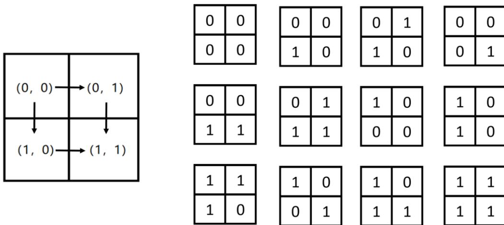

{0}------------------------------------------------

# CCF 全国信息学奥林匹克联赛（NOIP2018）复赛

## 提高组 day2

（请选手务必仔细阅读本页内容）

## 一. 题目概况

|           |                   |          |             |
|-----------|-------------------|----------|-------------|
| 中文题目名称    | 旅行                | 填数游戏     | 保卫王国        |
| 英文题目与子目录名 | travel            | game     | defense     |
| 可执行文件名    | travel            | game     | defense     |
| 输入文件名     | travel.in         | game.in  | defense.in  |
| 输出文件名     | travel.out        | game.out | defense.out |
| 每个测试点时限   | 1s                | 1s       | 2s          |
| 测试点数目     | 25                | 20       | 25          |
| 每个测试点分值   | 4                 | 5        | 4           |
| 附加样例文件    | 有                 | 有        | 有           |
| 结果比较方式    | 全文比较（过滤行末空格及文末回车） |          |             |
| 题目类型      | 传统                | 传统       | 传统          |
| 运行内存上限    | 512MB             | 512MB    | 512MB       |

## 二. 提交源程序文件名

|              |            |          |             |
|--------------|------------|----------|-------------|
| 对于 C++语言     | travel.cpp | game.cpp | defense.cpp |
| 对于 C 语言      | travel.c   | game.c   | defense.c   |
| 对于 pascal 语言 | travel.pas | game.pas | defense.pas |

## 三. 编译命令（不包含任何优化开关）

|              |                                 |                             |                                   |
|--------------|---------------------------------|-----------------------------|-----------------------------------|
| 对于 C++语言     | g++ -o travel travel.cpp -lm | g++ -o game game.cpp -lm | g++ -o defense defense.cpp -lm |
| 对于 C 语言      | gcc -o travel travel.c -lm   | gcc -o game game.c -lm   | gcc -o defense defense.c -lm   |
| 对于 pascal 语言 | fpc travel.pas                  | fpc game.pas                | fpc defense.pas                   |

### 注意事项：

- 1、文件名（程序名和输入输出文件名）必须使用英文小写。
- 2、C/C++中函数 main() 的返回值类型必须是 int，程序正常结束时的返回值必须是 0。
- 3、全国统一评测时采用的机器配置为：Intel(R) Core(TM) i7-8700K CPU @ 3.70GHz，内存 32GB。上述时限以此配置为准。
- 4、只提供 Linux 格式附加样例文件。
- 5、特别提醒：评测在当前最新公布的 NOI Linux 下进行，各语言的编译器版本以其为准。

{1}------------------------------------------------

### 1. 旅行

(travel.cpp/c/pas)

#### 【问题描述】

小 Y 是一个爱好旅行的 OIer。她来到 X 国，打算将各个城市都玩一遍。

小 Y 了解到，X 国的  $n$  个城市之间有  $m$  条双向道路。每条双向道路连接两个城市。不存在两条连接同一对城市的道路，也不存在一条连接一个城市和它本身的道路。并且，从任意一个城市出发，通过这些道路都可以到达任意一个其他城市。小 Y 只能通过这些道路从一个城市前往另一个城市。

小 Y 的旅行方案是这样的：任意选定一个城市作为起点，然后从起点开始，每次可以选择一条与当前城市相连的道路，走向一个**没有去过**的城市，或者沿着**第一次**访问该城市时经过的道路后退到上一个城市。当小 Y 回到起点时，她可以选择结束这次旅行或继续旅行。需要注意的是，小 Y 要求在旅行方案中，每个城市都被访问到。

为了让自己的旅行更有意义，小 Y 决定在每到达一个新的城市（包括起点）时，将它的编号记录下来。她知道这样会形成一个长度为  $n$  的序列。她希望这个序列的字典序最小，你能帮帮她吗？

对于两个长度均为  $n$  的序列 A 和 B，当且仅当存在一个正整数  $x$ ，满足以下条件时，我们说序列 A 的字典序小于 B。

- 对于任意正整数  $1 \leq i < x$ ，序列 A 的第  $i$  个元素  $A_i$  和序列 B 的第  $i$  个元素  $B_i$  相同。
- 序列 A 的第  $x$  个元素的值小于序列 B 的第  $x$  个元素的值。

#### 【输入格式】

输入文件名为 travel.in。

输入文件共  $m + 1$  行。第一行包含两个整数  $n, m (m \leq n)$ ，中间用一个空格分隔。

接下来  $m$  行，每行包含两个整数  $u, v (1 \leq u, v \leq n)$ ，表示编号为  $u$  和  $v$  的城市之间有一条道路，两个整数之间用一个空格分隔。

#### 【输出格式】

输出文件名为 travel.out。

输出文件包含一行， $n$  个整数，表示字典序最小的序列。相邻两个整数之间用一个空格分隔。

#### 【输入输出样例 1】

| travel.in | travel.out  |
|-----------|-------------|
| 6 5       | 1 3 2 5 4 6 |
| 1 3       |             |
| 2 3       |             |
| 2 5       |             |
| 3 4       |             |
| 4 6       |             |

见选手目录下的 travel/travel1.in 和 travel/travel1.ans。

{2}------------------------------------------------

#### 【输入输出样例 2】

| travel.in                                     | travel.out  |
|-----------------------------------------------|-------------|
| 6 6 1 3 2 3 2 5 3 4 4 5 4 6 | 1 3 2 4 5 6 |

见选手目录下的 travel/travel2.in 和 travel/travel2.ans。

#### 【输入输出样例 3】

见选手目录下的 travel/travel3.in 和 travel/travel3.ans。  
这组样例满足  $m = n - 1$ 。

#### 【输入输出样例 4】

见选手目录下的 travel/travel4.in 和 travel/travel4.ans。  
这组样例满足  $m = n$ 。

#### 【数据规模与约定】

对于 100% 的数据和所有样例， $1 \leq n \leq 5000$  且  $m = n - 1$  或  $m = n$ 。  
对于不同的测试点，我们约定数据的规模如下：

| 测试点编号      | $n =$ | $m =$   | 特殊性质          |
|------------|-------|---------|---------------|
| 1, 2, 3    | 10    | $n - 1$ | 无             |
| 4, 5       | 100   |         | 无             |
| 6, 7, 8    | 1000  |         | 每个城市最多与两个城市相连 |
| 9, 10      | 1000  |         | 无             |
| 11, 12, 13 | 5000  |         | 每个城市最多与三个城市相连 |
| 14, 15     | 5000  |         | 无             |
| 16, 17     | 10    | $n$     | 无             |
| 18, 19     | 100   |         | 无             |
| 20, 21, 22 | 1000  |         | 每个城市最多与两个城市相连 |
| 23, 24, 25 | 5000  |         | 无             |

{3}------------------------------------------------

### 2. 填数游戏

(game.cpp/c/pas)

#### 【问题描述】

小 D 特别喜欢玩游戏。这一天，他在玩一款填数游戏。

这个填数游戏的棋盘是一个  $n \times m$  的矩形表格。玩家需要在表格的每个格子中填入一个数字（数字 0 或者数字 1），填数时需要满足一些限制。

下面我们来具体描述这些限制。

为了方便描述，我们先给出一些定义：

- 我们用每个格子的行列坐标来表示一个格子，即（行坐标，列坐标）。（注意：行列坐标均从 0 开始编号）
- 合法路径  $P$ ：一条路径是合法的当且仅当：
  - 这条路径从矩形表格的左上角的格子  $(0,0)$  出发，到矩形的右下角格子  $(n-1, m-1)$  结束；
  - 在这条路径中，每次只能从当前的格子移动到右边与它相邻的格子，或者从当前格子移动到下面与它相邻的格子。

例如：在下面这个矩形中，只有两条路径是合法的，它们分别是  $P_1: (0,0) \rightarrow (0,1) \rightarrow (1,1)$  和  $P_2: (0,0) \rightarrow (1,0) \rightarrow (1,1)$ 。

Two 2x2 grids illustrating valid paths. The left grid shows the coordinate system with (0,0) at top-left, (0,1) at top-right, (1,0) at bottom-left, and (1,1) at bottom-right. Arrows indicate possible moves: right from (0,0) to (0,1), down from (0,0) to (1,0), right from (1,0) to (1,1), and down from (0,1) to (1,1). The right grid shows the same grid with red numbers: 0 at (0,0), 1 at (0,1), 0 at (1,0), and 1 at (1,1).

对于一条合法的路径  $P$ ，我们可以用一个字符串  $w(P)$  来表示，该字符串的长度为  $n + m - 2$ ，其中只包含字符“R”或者字符“D”，第  $i$  个字符记录了路径  $P$  中第  $i$  步的移动方法，“R”表示移动到当前格子右边与它相邻的格子，“D”表示移动到当前格子下面与它相邻的格子。例如，上图中对于路径  $P_1$ ，有  $w(P_1) = \text{"RD"}$ ；而对于另一条路径  $P_2$ ，有  $w(P_2) = \text{"DR"}$ 。

同时，将每条合法路径  $P$  经过的每个格子上填入的数字依次连接后，会得到一个长度为  $n + m - 1$  的 01 字符串，记为  $s(P)$ 。例如，如果我们在格子  $(0,0)$  和  $(1,0)$  上填入数字 0，在格子  $(0,1)$  和  $(1,1)$  上填入数字 1（见上图红色数字）。那么对于路径  $P_1$ ，我们可以得到  $s(P_1) = \text{"011"}$ ，对于路径  $P_2$ ，有  $s(P_2) = \text{"001"}$ 。

游戏要求小 D 找到一种填数字 0、1 的方法，使得对于两条路径  $P_1, P_2$ ，如果  $w(P_1) > w(P_2)$ ，那么必须  $s(P_1) \leq s(P_2)$ 。我们说字符串  $a$  比字符串  $b$  小，当且仅当字符串  $a$  的字典序小于字符串  $b$  的字典序，字典序的定义详见第一题。但是仅仅是找一种方法无法满足小 D 的好奇心，小 D 更想知道这个游戏有多少种玩法，也就是说，有多少种填数字的方法满足游戏的要求？

{4}------------------------------------------------

小 D 能力有限，希望你帮助他解决这个问题，即有多少种填 0、1 的方法能满足题目要求。由于答案可能很大，你需要输出答案对  $10^9 + 7$  取模的结果。

#### **【输入格式】**

输入文件名为 `game.in`。

输入文件共一行，包含两个正整数  $n$ 、 $m$ ，由一个空格分隔，表示矩形的大小。其中  $n$  表示矩形表格的行数， $m$  表示矩形表格的列数。

#### **【输出格式】**

输出文件名为 `game.out`。

输出共一行，包含一个正整数，表示有多少种填 0、1 的方法能满足游戏的要求。  
注意：输出答案对  $10^9+7$  取模的结果。

#### **【输入输出样例 1】**

| <b>game.in</b> | <b>game.out</b> |
|----------------|-----------------|
| 2 2            | 12              |

见选手目录下的 `game/game1.in` 和 `game/game1.ans`。

#### **【样例解释】**

The diagram illustrates a 2x2 grid with coordinates (0, 0), (0, 1), (1, 0), and (1, 1). Arrows indicate movement from (0, 0) to (0, 1) and (1, 0), and from (0, 1) to (1, 1). To the right of this grid are 12 separate 2x2 grids, each filled with 0s and 1s, representing all possible valid configurations for a 2x2 board that satisfy the problem's constraints.

Diagram showing a 2x2 grid with coordinates (0,0), (0,1), (1,0), (1,1) and arrows indicating movement. To the right are 12 different 2x2 grids filled with 0s and 1s, representing all valid configurations for a 2x2 board.

对于  $2 \times 2$  棋盘，有上图所示的 12 种填数方法满足要求。

#### **【输入输出样例 2】**

| <b>game.in</b> | <b>game.out</b> |
|----------------|-----------------|
| 3 3            | 112             |

见选手目录下的 `game/game2.in` 和 `game/game2.ans`。

#### **【输入输出样例 3】**

| <b>game.in</b> | <b>game.out</b> |
|----------------|-----------------|
| 5 5            | 7136            |

见选手目录下的 `game/game3.in` 和 `game/game3.ans`。

{5}------------------------------------------------

#### **【数据规模与约定】**

| 测试点编号 | $n \leq$ | $m \leq$ |
|-------|----------|----------|
| 1~4   | 3        | 3        |
| 5~10  | 2        | 1000000  |
| 11~13 | 3        | 1000000  |
| 14~16 | 8        | 8        |
| 17~20 | 8        | 1000000  |

{6}------------------------------------------------

### 3. 保卫王国

(defense.cpp/c/pas)

#### **【问题描述】**

Z 国有  $n$  座城市， $n - 1$  条双向道路，每条双向道路连接两座城市，且任意两座城市都能通过若干条道路相互到达。

Z 国的国防部长小 Z 要在城市中驻扎军队。驻扎军队需要满足如下几个条件：

- 一座城市可以驻扎一支军队，也可以不驻扎军队。
- 由道路直接连接的两座城市中至少要有一座城市驻扎军队。
- 在城市里驻扎军队会产生花费，在编号为  $i$  的城市中驻扎军队的花费是  $p_i$ 。

小 Z 很快就规划出了一种驻扎军队的方案，使总花费最小。但是国王又给小 Z 提出了  $m$  个要求，每个要求规定了其中两座城市是否驻扎军队。小 Z 需要针对每个要求逐一给出回答。具体而言，如果国王提出的第  $j$  个要求能够满足上述驻扎条件（不需要考虑第  $j$  个要求之外的其它要求），则需要给出在此要求前提下驻扎军队的最小开销。如果国王提出的第  $j$  个要求无法满足，则需要输出  $-1$  ( $1 \leq j \leq m$ )。现在请你来帮助小 Z。

#### **【输入格式】**

输入文件名为 defense.in。

第 1 行包含两个正整数  $n, m$  和一个字符串 *type*，分别表示城市数、要求数和数据类型。*type* 是一个由大写字母 A, B 或 C 和一个数字 1, 2, 3 组成的字符串。它可以帮助你获得部分分。你可能不需要用到这个参数。这个参数的含义在【数据规模与约定】中有具体的描述。

第 2 行  $n$  个整数  $p_i$ ，表示编号  $i$  的城市中驻扎军队的花费。

接下来  $n - 1$  行，每行两个正整数  $u, v$ ，表示有一条  $u$  到  $v$  的双向道路。

接下来  $m$  行，第  $j$  行四个整数  $a, x, b, y$  ( $a \neq b$ )，表示第  $j$  个要求是在城市  $a$  驻扎  $x$  支军队，在城市  $b$  驻扎  $y$  支军队。其中， $x$ 、 $y$  的取值只有 0 或 1：若  $x$  为 0，表示城市  $a$  不得驻扎军队，若  $x$  为 1，表示城市  $a$  必须驻扎军队；若  $y$  为 0，表示城市  $b$  不得驻扎军队，若  $y$  为 1，表示城市  $b$  必须驻扎军队。

输入文件中每一行相邻的两个数据之间均用一个空格分隔。

#### **【输出格式】**

输出文件名为 defense.out。

输出共  $m$  行，每行包含 1 个整数，第  $j$  行表示在满足国王第  $j$  个要求时的最小开销，如果无法满足国王的第  $j$  个要求，则该行输出  $-1$ 。

#### **【输入输出样例 1】**

| defense.in | defense.out |
|------------|-------------|
| 5 3 C3     | 12          |
| 2 4 1 3 9  | 7           |
| 1 5        | -1          |
| 5 2        |             |
| 5 3        |             |
| 3 4        |             |
| 1 0 3 0    |             |
| 2 1 3 1    |             |
| 1 0 5 0    |             |

{7}------------------------------------------------

见选手目录下的 `defense/defense1.in` 和 `defense/defense1.ans`。

#### **【样例解释】**

对于第一个要求，在 4 号和 5 号城市驻扎军队时开销最小。

对于第二个要求，在 1 号、2 号、3 号城市驻扎军队时开销最小。

第三个要求是无法满足的，因为在 1 号、5 号城市都不驻扎军队就意味着由道路直接连接的两座城市中都没有驻扎军队。

#### **【输入输出样例 2】**

见选手目录下的 `defense/defense2.in` 和 `defense/defense2.ans`。

#### **【数据规模与约定】**

对于 100% 的数据， $n, m \leq 300000, 1 \leq p_i \leq 100000$ 。

| 测试点编号 | type | $n =$  | $m =$  |
|-------|------|--------|--------|
| 1~2   | A3   | 10     | 10     |
| 3~4   | C3   |        |        |
| 5~6   | A3   | 100    | 100    |
| 7     | C3   |        |        |
| 8~9   | A3   | 2000   | 2000   |
| 10~11 | C3   |        |        |
| 12~13 | A1   | 100000 | 100000 |
| 14~16 | A2   |        |        |
| 17    | A3   |        |        |
| 18~19 | B1   |        |        |
| 20~21 | C1   |        |        |
| 22    | C2   |        |        |
| 23~25 | C3   |        |        |

数据类型的含义：

A：城市*i*与城市*i* + 1直接相连。

B：任意城市与城市 1 的距离不超过 100（距离定义为最短路径上边的数量），即如果这棵树以 1 号城市为根，深度不超过 100。

C：在树的形态上无特殊约束。

1：询问时保证  $a = 1, x = 1$ ，即要求在城市 1 驻军。对  $b, y$  没有限制。

2：询问时保证  $a, b$  是相邻的（由一条道路直接连通）

3：在询问上无特殊约束。