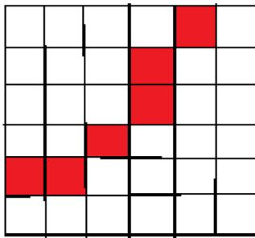
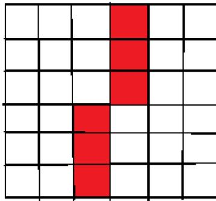
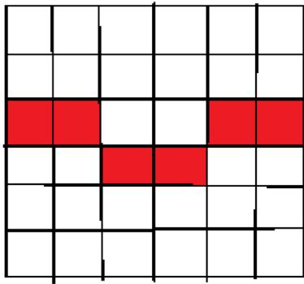
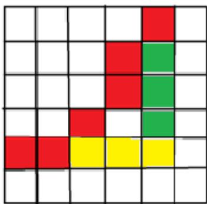
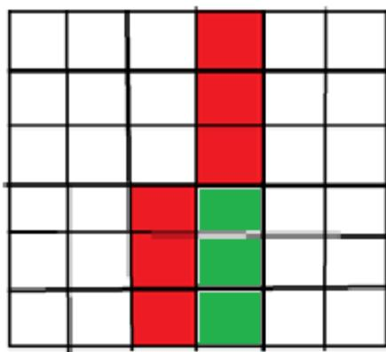
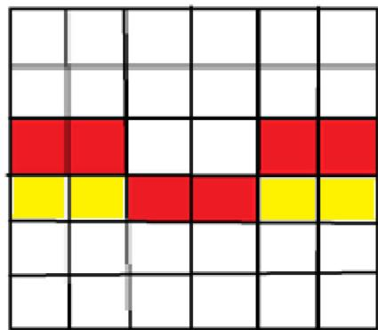
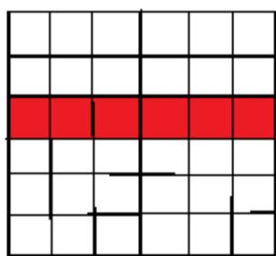
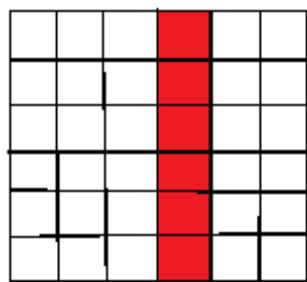
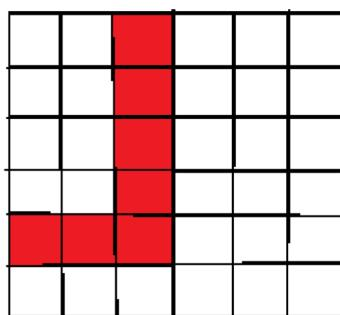
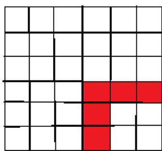

{0}------------------------------------------------

# 2023 NOIP真题及题解

## CCF 全国青少年信息学奥林匹克联赛

## CCF NOIP 2023

时间: 2023 年 11 月 18 日 08:30 ~ 13:00

|         |          |             |            |         |
|---------|----------|-------------|------------|---------|
| 题目名称    | 词典       | 三值逻辑        | 双序列拓展      | 天天爱打卡   |
| 题目类型    | 传统型      | 传统型         | 传统型        | 传统型     |
| 目录      | dict     | tribool     | expand     | run     |
| 可执行文件名  | dict     | tribool     | expand     | run     |
| 输入文件名   | dict.in  | tribool.in  | expand.in  | run.in  |
| 输出文件名   | dict.out | tribool.out | expand.out | run.out |
| 每个测试点时限 | 1.0 秒    | 1.0 秒       | 1.0 秒      | 2.0 秒   |
| 内存限制    | 512 MiB  | 512 MiB     | 512 MiB    | 512 MiB |
| 测试点数目   | 10       | 10          | 20         | 25      |
| 测试点是否等分 | 是        | 是           | 是          | 是       |

提交源程序文件名

|           |          |             |            |         |
|-----------|----------|-------------|------------|---------|
| 对于 C++ 语言 | dict.cpp | tribool.cpp | expand.cpp | run.cpp |
|-----------|----------|-------------|------------|---------|

编译选项

|           |                        |
|-----------|------------------------|
| 对于 C++ 语言 | -O2 -std=c++14 -static |
|-----------|------------------------|

**注意事项 (请仔细阅读)**

1. 文件名 (程序名和输入输出文件名) 必须使用英文小写。
2. C/C++ 中函数 main() 的返回值类型必须是 int, 程序正常结束时的返回值必须是 0。
3. 提交的程序代码文件的放置位置请参考各省的具体要求。
4. 因违反以上三点而出现的错误或问题, 申诉时一律不予受理。
5. 若无特殊说明, 结果的比较方式为全文比较 (过滤行末空格及文末回车)。
6. 选手提交的程序源文件必须不大于 100KB。
7. 程序可使用的栈空间内存限制与题目的内存限制一致。
8. 全国统一评测时采用的机器配置为: Intel(R) Core(TM) i7-8700K CPU @3.70GHz, 内存 32GB。上述时限以此配置为准。
9. 只提供 Linux 格式附加样例文件。
10. 评测在当前最新公布的 NOI Linux 下进行, 各语言的编译器版本以此为准。

{1}------------------------------------------------

## 词典 (dict)

### 【题目描述】

小 S 的词典里有  $n$  个两两不同的、长度均为  $m$  的单词  $w_1, w_2, \dots, w_n$ 。每个单词都是一个小写字母构成的字符串。

小 S 可以做以下操作任意多次（可以不做）：选择词典中的任意一个单词，交换其中任意两个字符。

对于每个  $1 \leq i \leq n$ ，小 S 想知道，是否可以通过以上操作得到新的  $n$  个单词  $w'_1, w'_2, \dots, w'_n$ ，使得对于每个  $j \neq i$ ， $w'_i$  的字典序比  $w'_j$  都要小。对于  $n=1$  的情况，我们约定：上述性质是自然成立的。

对于两个同样长度的字符串  $s = s_1 s_2 \dots s_L$  和  $t = t_1 t_2 \dots t_L$ ，称字符串  $s$  字典序小于字符串  $t$ ，当且仅当以下条件成立：存在位置  $i$ ，在第  $i$  个字符之前  $s$  和  $t$  都相同，而且  $s_i < t_i$ ，即小写字母  $s_i$  在英文字母顺序中先于  $t_i$ 。

### 【输入格式】

从文件 *dict.in* 中读入数据。

输入的第一行包含两个正整数  $n$  和  $m$ ，分别表示单词个数和单词长度。

接下来  $n$  行，每行包含一个长度为  $m$  的小写字母字符串  $w_i$ ，表示一个单词。

### 【输出格式】

输出到文件 *dict.out* 中。

输出一行，其中包含一个长度为  $n$  的 01 字符串  $a$ ；对于  $1 \leq i \leq n$ ，如果题目描述中的性质成立，则  $a_i = 1$ ，否则  $a_i = 0$ 。

### 【样例 1 输入】

```
1 4 7
2 abandon
3 bananaa
4 baannaa
5 notnotn
```

### 【样例 1 输出】

```
1 1110
```

{2}------------------------------------------------

### **【样例 1 解释】**

- 不做任何操作，第一个单词字典序最小，因此输出第一个字符为 **1**；
- 交换 **bananaa** 的前两个字符以及 **abandon** 的第三个和第六个字符，得到 **abondan**, **abnanaa**, **baannaa**, **notnotn**，此时第二个单词字典序最小，因此输出第二个字符为 **1**；
- 交换 **baannaa** 的第一个和最后一个字符得到 **aaannab**，其余字符串不变，此时第三个单词字典序最小，因此输出第三个字符为 **1**；
- 无论如何操作，第四个单词不会小于第二个单词，因此输出第四个字符为 **0**。

### **【样例 2】**

见选手目录下的 *dict/dict2.in* 与 *dict/dict2.ans*。

该组样例满足测试点 4 的限制。

### **【样例 3】**

见选手目录下的 *dict/dict3.in* 与 *dict/dict3.ans*。

该组样例满足测试点 7 的限制。

### **【样例 4】**

见选手目录下的 *dict/dict4.in* 与 *dict/dict4.ans*。

该组样例满足测试点 10 的限制。

### **【数据范围】**

对于所有测试数据，保证： $1 \leq n \leq 3,000$ ， $1 \leq m \leq 3,000$ ， $w_i$  为长度为  $m$  的小写字母字符串且两两不同。

| 测试点编号 | $n \leq$ | $m \leq$ |
|-------|----------|----------|
| 1     | 1        | 1        |
| 2 ~ 4 | 26       |          |
| 5 ~ 7 | 15       | 2        |
| 8     | 300      | 300      |
| 9     | $10^3$   | $10^3$   |
| 10    | 3,000    | 3,000    |

### **【参考解析】**

{3}------------------------------------------------

枚举每个*i*判断是否满足条件

如果想要 $w'_i < w'_j$ ，那么一定是将 $w_i$ 中的字符从小到大排序得到 $w'_i$ ，将所有其他 $w'_j$ 从大到小排序。

假设 $w_i$ 从小到大排序是 $a_i$ ，从大到小是 $b_i$ ，那么一定有 $a_i < b_i$

所以我们就是要判断 $a_i < \min(b_i)$

排序如果使用计数排序，时间复杂度为 $\Theta(nm)$

{4}------------------------------------------------

## 三值逻辑 (tribool)

### 【题目描述】

小 L 今天学习了 Kleene 三值逻辑。

在三值逻辑中，一个变量的值可能为：真 (True，简写作  $T$ )、假 (False，简写作  $F$ ) 或未确定 (Unknown，简写作  $U$ )。

在三值逻辑上也可以定义逻辑运算。由于小 L 学习进度很慢，只掌握了逻辑非运算  $\neg$ ，其运算法则为：

$$
\neg T = F, \neg F = T, \neg U = U.
$$

现在小 L 有  $n$  个三值逻辑变量  $x_1, \dots, x_n$ 。小 L 想进行一些有趣的尝试，于是他写下了  $m$  条语句。语句有以下三种类型，其中  $\leftarrow$  表示赋值：

1.  $x_i \leftarrow v$ ，其中  $v$  为  $T, F, U$  的一种；
2.  $x_i \leftarrow x_j$ ；
3.  $x_i \leftarrow \neg x_j$ 。

一开始，小 L 会给这些变量赋初值，然后按顺序运行这  $m$  条语句。

小 L 希望执行了所有语句后，所有变量的最终值与初值都相等。在此前提下，小 L 希望初值中 Unknown 的变量尽可能少。

在本题中，你需要帮助小 L 找到 Unknown 变量个数最少的赋初值方案，使得执行了所有语句后所有变量的最终值和初始值相等。小 L 保证，至少对于本题的所有测试用例，这样的赋初值方案都必然是存在的。

### 【输入格式】

从文件 `tribool.in` 中读入数据。

本题的测试点包含有多组测试数据。

输入的第一行包含两个整数  $c$  和  $t$ ，分别表示测试点编号和测试数据组数。对于样例， $c$  表示该样例与测试点  $c$  拥有相同的限制条件。

接下来，对于每组测试数据：

- 输入的第一行包含两个整数  $n$  和  $m$ ，分别表示变量个数和语句条数。
- 接下来  $m$  行，按运行顺序给出每条语句。
  - 输入的第一个字符  $v$  描述这条语句的类型。保证  $v$  为  $TFU+-$  的其中一种。
  - 若  $v$  为  $TFU$  的某一种时，接下来给出一个整数  $i$ ，表示该语句为  $x_i \leftarrow v$ ；
  - 若  $v$  为  $+$ ，接下来给出两个整数  $i, j$ ，表示该语句为  $x_i \leftarrow x_j$ ；
  - 若  $v$  为  $-$ ，接下来给出两个整数  $i, j$ ，表示该语句为  $x_i \leftarrow \neg x_j$ 。

### 【输出格式】

输出到文件 `tribool.out` 中。

{5}------------------------------------------------

对于每组测试数据输出一行一个整数,表示所有符合条件的赋初值方案中, *Unknown* 变量个数的最小值。

#### **【样例 1 输入】**

```
1 1 3
2 3 3
3 - 2 1
4 - 3 2
5 + 1 3
6 3 3
7 - 2 1
8 - 3 2
9 - 1 3
10 2 2
11 T 2
12 U 2
```

#### **【样例 1 输出】**

```
1 0
2 3
3 1
```

### **【样例 1 解释】**

第一组测试数据中,  $m$  行语句依次为

- $x_2 \leftarrow \neg x_1$ ;
- $x_3 \leftarrow \neg x_2$ ;
- $x_1 \leftarrow x_3$ 。

一组合法的赋初值方案为  $x_1 = T, x_2 = F, x_3 = T$ , 共有 0 个 *Unknown* 变量。因为不存在赋初值方案中有小于 0 个 *Unknown* 变量, 故输出为 0。

第二组测试数据中,  $m$  行语句依次为

- $x_2 \leftarrow \neg x_1$ ;
- $x_3 \leftarrow \neg x_2$ ;
- $x_1 \leftarrow \neg x_3$ 。

唯一的赋初值方案为  $x_1 = x_2 = x_3 = U$ , 共有 3 个 *Unknown* 变量, 故输出为 3。

{6}------------------------------------------------

第三组测试数据中,  $m$  行语句依次为

- $x_2 \leftarrow T$ ;
- $x_2 \leftarrow U$ ;

一个最小化 *Unknown* 变量个数的赋初值方案为  $x_1 = T, x_2 = U$ 。  $x_1 = x_2 = U$  也是一个合法的方案, 但它没有最小化 *Unknown* 变量的个数。

### 【样例 2】

见选手目录下的 *tribool/tribool2.in* 与 *tribool/tribool2.ans*。

该组样例满足测试点 2 的条件。

### 【样例 3】

见选手目录下的 *tribool/tribool3.in* 与 *tribool/tribool3.ans*。

该组样例满足测试点 5 的条件。

### 【样例 4】

见选手目录下的 *tribool/tribool4.in* 与 *tribool/tribool4.ans*。

该组样例满足测试点 8 的条件。

### 【数据范围】

对于所有测试数据, 保证:

- $1 \leq t \leq 6$ ,  $1 \leq n, m \leq 10^5$ ;
- 对于每个操作,  $v$  为 *TFU+-* 中的某个字符,  $1 \leq i, j \leq n$ 。

| 测试点编号 | $n, m \leq$ | $v$ 可能的取值 |
|-------|-------------|-----------|
| 1, 2  | 10          | TFU+-     |
| 3     | $10^3$      | TFU       |
| 4     | $10^5$      | TFU       |
| 5     | $10^3$      | U+        |
| 6     | $10^5$      | U+        |
| 7     | $10^3$      | +-        |
| 8     | $10^5$      | +-        |
| 9     | $10^3$      | TFU+-     |
| 10    | $10^5$      | TFU+-     |

### 【参考解析】

{7}------------------------------------------------

对变量 $x$ , 我们使用两个节点 $p_x, \neg p_x$ 代表这个节点的值和取反的值, 并且建立三个点 $T, F, U$ 代表真假和未知

对于赋值语句, 我们开一个新节点代表这个变量新的值

如果是 $p_x = p_y$ , 那么我们连接 $p_x$ 和 $p_y$ ,  $\neg p_x$ 和 $\neg p_y$ 。

如果是 $p_x = \neg p_y$ , 那么我们连接 $p_x$ 和 $\neg p_y$ ,  $\neg p_x$ 和 $p_y$ 。

如果是 $p_x = T$ , 我们连接 $p_x$ 和 $T$ ,  $\neg p_x$ 和 $F$ 。

如果是 $p_x = F$ , 我们连接 $p_x$ 和 $F$ ,  $\neg p_x$ 和 $T$ 。

如果是 $p_x = U$ , 我们连接 $p_x$ 和 $U$ ,  $\neg p_x$ 和 $U$ 。

最后, 我们将最后代表变量 $x$ 的节点和初始节点相连, 代表他们的值相等

最后我们检测, 如果 $p_x = \neg p_x$ , 那么 $p_x$ 就一定要是 $U$ , 让答案加一即可

时间复杂度 $\Theta(n\alpha(n))$

{8}------------------------------------------------

## 双序列拓展 (expand)

### 【题目描述】

称某个序列  $B = \{b_1, b_2, \dots, b_n\}$  是另一个序列  $A = \{a_1, a_2, \dots, a_m\}$  的**拓展**当且仅当存在正整数序列  $L = \{l_1, l_2, \dots, l_m\}$ , 将  $a_i$  替换为  $l_i$  个  $a_i$  后得到序列  $B$ 。例如,

- $\{1, 3, 3, 3, 2, 2, 2\}$  是  $\{1, 3, 3, 2\}$  的拓展, 取  $L = \{1, 1, 2, 3\}$  或  $\{1, 2, 1, 3\}$ ;
- 而  $\{1, 3, 3, 2\}$  不是  $\{1, 3, 3, 3, 2, 2, 2\}$  的拓展,  $\{1, 2, 3\}$  不是  $\{1, 3, 2\}$  的拓展。

小 R 给了你两个序列  $X$  和  $Y$ , 他希望你找到  $X$  的一个长度为  $l_0 = 10^{100}$  的拓展  $F = \{f_i\}$  以及  $Y$  的一个长度为  $l_0$  的拓展  $G = \{g_i\}$ , 使得任意  $1 \leq i, j \leq l_0$  都有  $(f_i - g_i)(f_j - g_j) > 0$ 。由于序列太长, 你只需要告诉小 R 是否存在这样的两个序列即可。

为了避免你扔硬币蒙混过关, 小 R 还给了  $q$  次额外询问, 每次额外询问中小 R 会修改  $X$  和  $Y$  中若干元素的值。你需要对每次得到的新的  $X$  和  $Y$  都进行上述的判断。

询问之间是独立的, 每次询问中涉及的修改均在原始序列上完成。

### 【输入格式】

从文件 `expand.in` 中读入数据。

输入的第一行包含四个整数  $c, n, m, q$ , 分别表示测试点编号、序列  $X$  的长度、序列  $Y$  的长度和额外询问的个数。对于样例,  $c$  表示该样例与测试点  $c$  拥有相同的限制条件。

输入的第二行包含  $n$  个整数  $x_1, x_2, \dots, x_n$ , 描述序列  $X$ 。

输入的第三行包含  $m$  个整数  $y_1, y_2, \dots, y_m$ , 描述序列  $Y$ 。

接下来依次描述  $q$  组额外询问。对于每组额外询问:

- 输入的第一行包含两个整数  $k_x$  和  $k_y$ , 分别表示对序列  $X$  和  $Y$  产生的修改个数。
- 接下来  $k_x$  行每行包含两个整数  $p_x, v_x$ , 表示将  $x_{p_x}$  修改为  $v_x$ 。
- 接下来  $k_y$  行每行包含两个整数  $p_y, v_y$ , 表示将  $y_{p_y}$  修改为  $v_y$ 。

### 【输出格式】

输出到文件 `expand.out` 中。

输出一行, 其中包含一个长度为  $(q+1)$  的 01 序列, 序列的第一个元素表示初始询问的答案, 之后  $q$  个元素依次表示每组额外询问的答案。对于每个询问, 如果存在满足题目条件的序列  $F$  和  $G$ , 输出 1, 否则输出 0。

### 【样例 1 输入】

```
1 3 3 3 3
2 8 6 9
3 1 7 4
```

{9}------------------------------------------------

```

4 1 0
5 3 0
6 0 2
7 1 8
8 3 5
9 1 1
10 2 8
11 1 7

```

### **【样例 1 输出】**

```
1 1001
```

### **【样例 1 解释】**

由于  $F$  和  $G$  太长,用省略号表示重复最后一个元素直到序列长度为  $l_0$ 。如  $\{1, 2, 3, 3, \dots\}$  表示序列从第三个元素之后都是 3。

以下依次描述四次询问,其中第一次询问为初始询问,之后的三次为额外询问:

1.  $A = \{8, 6, 9\}$ ,  $B = \{1, 7, 4\}$ , 取  $F = \{8, 8, 6, 9, \dots\}$ ,  $G = \{1, 7, 4, 4, \dots\}$ ;
2.  $A = \{8, 6, 0\}$ ,  $B = \{1, 7, 4\}$ , 可以证明不存在满足要求的方案;
3.  $A = \{8, 6, 9\}$ ,  $B = \{8, 7, 5\}$ , 可以证明不存在满足要求的方案;
4.  $A = \{8, 8, 9\}$ ,  $B = \{7, 7, 4\}$ , 取  $F = \{8, 8, 9, \dots\}$ ,  $G = \{7, 7, 4, \dots\}$ 。

### **【样例 2】**

见选手目录下的 *expand/expand2.in* 与 *expand/expand2.ans*。

该组样例满足测试点 4 的条件。

### **【样例 3】**

见选手目录下的 *expand/expand3.in* 与 *expand/expand3.ans*。

该组样例满足测试点 7 的条件。

### **【样例 4】**

见选手目录下的 *expand/expand4.in* 与 *expand/expand4.ans*。

该组样例满足测试点 9 的条件。

{10}------------------------------------------------

### **【样例 5】**

见选手目录下的 *expand/expand5.in* 与 *expand/expand5.ans*。  
该组样例满足测试点 18 的条件。

### **【数据范围】**

对于所有测试数据，保证：

- $1 \leq n, m \leq 5 \times 10^5$ ;
- $0 \leq q \leq 60$ ;
- $0 \leq x_i, y_i < 10^9$ ;
- $0 \leq k_x, k_y \leq 5 \times 10^5$ , 且所有额外询问的  $(k_x + k_y)$  的和不超过  $5 \times 10^5$ ;
- $1 \leq p_x \leq n$ ,  $1 \leq p_y \leq m$ ,  $0 \leq v_x, v_y < 10^9$ ;
- 对于每组额外询问,  $p_x$  两两不同,  $p_y$  两两不同。

| 测试点编号   | $n, m \leq$       | 特殊性质 |
|---------|-------------------|------|
| 1       | 1                 | 否    |
| 2       | 2                 |      |
| 3, 4    | 6                 |      |
| 5       | 200               |      |
| 6, 7    | 2,000             |      |
| 8, 9    | $4 \times 10^4$   | 是    |
| 10, 11  | $1.5 \times 10^5$ |      |
| 12 ~ 14 | $5 \times 10^5$   |      |
| 15, 16  | $4 \times 10^4$   | 否    |
| 17, 18  | $1.5 \times 10^5$ |      |
| 19, 20  | $5 \times 10^5$   |      |

特殊性质：对于每组询问（包括初始询问和额外询问），保证  $x_1 < y_1$ ，且  $x_n$  是序列  $X$  唯一的一个最小值， $y_m$  是序列  $Y$  唯一的一个最大值。

### **【参考解析】**

不妨设  $a_1 < b_1$ ，否则我们交换两个序列

我们建立一个  $n \times m$  的网格图，第  $i$  行第  $j$  列可以通过当且仅当  $a_i < b_j$ ，

那么我们发现，原问题等价于是是否可以 从左上角走到右下角

那么不可以走到当且仅当存在一个从右上角到左下角的路径使得起点和终点不连通

{11}------------------------------------------------



A 6x6 grid where the following cells are colored red: (1,5), (2,4), (2,3), (3,2), (4,1), and (5,1). All other cells are white.

A 6x6 grid with red cells at (1,5), (2,4), (2,3), (3,2), (4,1), and (5,1).



A 6x6 grid where the following cells are colored red: (1,4), (2,4), (3,4), (3,3), (3,2), and (3,1). All other cells are white.

A 6x6 grid with red cells at (1,4), (2,4), (3,4), (3,3), (3,2), and (3,1).



A 6x6 grid where the following cells are colored red: (3,3), (4,3), (1,2), (2,2), (5,2), and (6,2). All other cells are white.

A 6x6 grid with red cells at (3,3), (4,3), (1,2), (2,2), (5,2), and (6,2).

注意到如果有 $a_i < b_j, a_k \geq b_j, a_i \geq b_l$ , 那么一定有 $a_k > b_l$   
形象地说, 就是如果存在一个矩形的左上角可以通过,  
但是右上角和左下角不能通过, 那么右下角一定不能通过,  
那么我们可以将路径的最下面填充为不能通过 (黄色),  
同理, 在对称的情况也可以将右边 (绿色)

{12}------------------------------------------------



A 6x6 grid with a path from bottom-left to top-right. Red cells are (1,5), (2,5), (3,4), (3,3), (4,2), (5,2), (6,2). Green cells are (5,3), (5,4), (5,5). Yellow cells are (3,2), (4,2), (5,2).



A 6x6 grid with a path from bottom-left to top-right. Red cells are (3,5), (3,4), (3,3), (3,2), (4,2), (5,2). Green cells are (4,3), (4,4), (4,5).



A 6x6 grid with a path from bottom-left to top-right. Red cells are (1,4), (2,4), (4,4), (5,4), (1,3), (2,3), (3,3), (4,3), (5,3). Yellow cells are (1,2), (2,2), (4,2), (5,2).

那么我们可以总结出一定为以下四种情况

存在一行不能通过

存在一列不能通过

存在一个L字形使得起点被包围

存在一个L字形使得终点被包围



A 6x6 grid with a horizontal red bar in the 4th row from the top, spanning columns 1 to 6.



A 6x6 grid with a vertical red bar in the 3rd column from the left, spanning rows 1 to 6.



A 6x6 grid with an L-shaped red barrier. The vertical part is in column 3, rows 1 to 4. The horizontal part is in row 4, columns 1 to 3.



A 6x6 grid with an L-shaped red barrier. The vertical part is in column 3, rows 4 to 6. The horizontal part is in row 4, columns 3 to 6.

{13}------------------------------------------------

对于前两种情况对应的即是

$$
\max(a) \geq \max(b)
$$

$$
\min(a) \geq \min(b)
$$

后面两种情况，可以通过排序后的结果计算出对于 $a_i$ ,

不能通过的最长的前缀 $la_i$ , 对于 $b_i$ ,

可以计算出不能通过的最长前缀 $lb_i$ , 那么就是要

$$
\max_{1 \leq x \leq la_i} lb_x \geq i
$$

另一种情况也是对称的

通过离散化可以做到 $\Theta(q(n + m) + (n + m + \sum k) \log(n + m + \sum k))$

{14}------------------------------------------------

## 天天爱打卡 (run)

### 【题目描述】

小 T 同学非常热衷于跑步。为了让跑步更加有趣，他决定制作一款叫做《天天爱打卡》的软件，使得用户每天都可以进行跑步打卡。

开发完成后，小 T 同学计划进行试运行，他找了大 Y 同学来帮忙。试运行共  $n$  天，编号为从 1 到  $n$ 。

对大 Y 同学来说，如果某天他选择跑步打卡，那么他的能量值会减少  $d$ 。初始时，他的能量值是 0，并且试运行期间他的能量值可以是负数。

而且大 Y 不会连续跑步打卡超过  $k$  天；即不能存在  $1 \leq x \leq n - k$ ，使得他在第  $x$  到第  $x + k$  天均进行了跑步打卡。

小 T 同学在软件中设计了  $m$  个挑战，第  $i$  ( $1 \leq i \leq m$ ) 个挑战可以用三个正整数  $(x_i, y_i, v_i)$  描述，表示如果在第  $x_i$  天时，用户已经连续跑步打卡至少  $y_i$  天（即第  $x_i - y_i + 1$  到第  $x_i$  天均完成了跑步打卡），那么小 T 同学就会请用户吃饭，从而使用户的能量值提高  $v_i$ 。

现在大 Y 想知道，在软件试运行的  $n$  天结束后，他的能量值最高可以达到多少？

### 【输入格式】

从文件 `run.in` 中读入数据。

本题的测试点包含有多组测试数据。

输入的第一行包含两个整数  $c$  和  $t$ ，分别表示测试点编号和测试数据组数。对于样例， $c$  表示该样例与测试点  $c$  拥有相同的限制条件。

接下来，对于每组测试数据：

- 输入的第一行包含四个正整数  $n, m, k, d$ ，分别表示试运行的天数、挑战的个数、大 Y 单次跑步打卡的连续天数限制以及大 Y 跑步打卡减少的能量值。
- 接下来  $m$  行，每行包含三个正整数  $x_i, y_i, v_i$ ，表示一次挑战。

### 【输出格式】

输出到文件 `run.out` 中。

输出一行一个整数表示对应的答案。

### 【样例 1 输入】

```
1 1 1
2 3 2 2 1
3 2 2 4
```

{15}------------------------------------------------

```
4 3 2 3
```

### **【样例 1 输出】**

```
1 2
```

### **【样例 1 解释】**

在第 1,2 天跑步打卡, 第 3 天不跑步打卡, 最终会获得  $(-1) + (-1) + 4 = 2$  的能量值。

### **【样例 2】**

见选手目录下的 *run/run2.in* 与 *run/run2.ans*。  
该组样例满足测试点 3 的条件。

### **【样例 3】**

见选手目录下的 *run/run3.in* 与 *run/run3.ans*。  
该组样例满足测试点 5 的条件。

### **【样例 4】**

见选手目录下的 *run/run4.in* 与 *run/run4.ans*。  
该组样例满足测试点 15 的条件。

### **【样例 5】**

见选手目录下的 *run/run5.in* 与 *run/run5.ans*。  
该组样例满足测试点 17 的条件。

#### **【样例 6】**

见选手目录下的 *run/run6.in* 与 *run/run6.ans*。  
该组样例满足测试点 19 的条件。

{16}------------------------------------------------

### **【数据范围】**

记  $l_i = x_i - y_i + 1$ ,  $r_i = x_i$ ;

对于所有测试数据, 保证:  $1 \leq t \leq 10$ ,  $1 \leq k \leq n \leq 10^9$ ,  $1 \leq m \leq 10^5$ ,  $1 \leq l_i \leq r_i \leq n$ ,  $1 \leq d, v_i \leq 10^9$ 。

| 测试点编号   | $n \leq$ | $m \leq$ | 特殊性质 |
|---------|----------|----------|------|
| 1, 2    | 18       | $10^2$   | 无    |
| 3, 4    | $10^2$   | $10^2$   |      |
| 5 ~ 7   | $10^3$   | $10^3$   |      |
| 8, 9    |          | $10^5$   |      |
| 10, 11  | $10^5$   | $10^3$   |      |
| 12 ~ 14 |          |          |      |
| 15, 16  | $10^9$   | $10^5$   | A    |
| 17, 18  |          |          | B    |
| 19 ~ 21 |          |          | C    |
| 22 ~ 25 |          |          | 无    |

特殊性质 A:  $k \leq 10^2$ ;

特殊性质 B:  $\forall 1 \leq i < m$ ,  $r_i < l_{i+1}$ ;

特殊性质 C:  $\forall 1 \leq i < j \leq m$ ,  $l_i < l_j$ ,  $r_i < r_j$ 。

### **【参考解析】**

设  $f_{i,j}$  为第  $i$  天连续跑了  $j$  天之后

$j > 0$ ,  $f_{i,j} = f_{i-1,j-1} + w_j - d$ , 其中  $w_j$  为该天连续跑步是否有贡献

$j = 0$ ,  $f_{i,0} = \max(f_{i-1,*})$

对于连续若干天没有贡献, 我们可以压缩起来一起转移, 对于一个区间是等差数列的贡献记录一下平移的量, 使用动态开点的线段树优化转移

需要区间加、区间赋值等差数列, 区间求最大值, 并且特殊记录  $f_{i,0}$

时间复杂度  $\Theta(m \log n)$