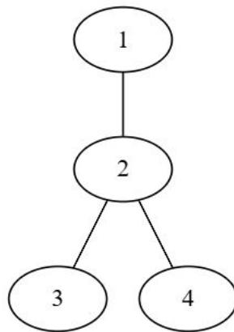
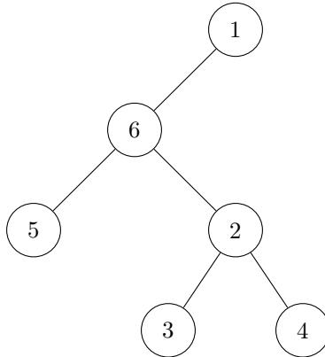

{0}------------------------------------------------

# CCF 全国青少年信息学奥林匹克联赛

## CCF NOIP 2024

时间：2024 年 11 月 30 日 08:30 ~ 13:00

|         |          |            |              |           |
|---------|----------|------------|--------------|-----------|
| 题目名称    | 编辑字符串    | 遗失的赋值      | 树的遍历         | 树上查询      |
| 题目类型    | 传统型      | 传统型        | 传统型          | 传统型       |
| 目录      | edit     | assign     | traverse     | query     |
| 可执行文件名  | edit     | assign     | traverse     | query     |
| 输入文件名   | edit.in  | assign.in  | traverse.in  | query.in  |
| 输出文件名   | edit.out | assign.out | traverse.out | query.out |
| 每个测试点时限 | 1.0 秒    | 1.0 秒      | 1.0 秒        | 2.0 秒     |
| 内存限制    | 512 MiB  | 512 MiB    | 512 MiB      | 1024 MiB  |
| 测试点数目   | 20       | 20         | 25           | 25        |
| 测试点是否等分 | 是        | 是          | 是            | 是         |

提交源程序文件名

|           |          |            |              |           |
|-----------|----------|------------|--------------|-----------|
| 对于 C++ 语言 | edit.cpp | assign.cpp | traverse.cpp | query.cpp |
|-----------|----------|------------|--------------|-----------|

编译选项

|           |                        |
|-----------|------------------------|
| 对于 C++ 语言 | -O2 -std=c++14 -static |
|-----------|------------------------|

## 注意事项（请仔细阅读）

1. 文件名（程序名和输入输出文件名）必须使用英文小写。
2. main 函数的返回值类型必须是 int，程序正常结束时的返回值必须是 0。
3. 提交的程序代码文件的放置位置请参考各省的具体要求。
4. 因违反以上三点而出现的错误或问题，申诉时一律不予受理。
5. 若无特殊说明，结果的比较方式为全文比较（过滤行末空格及文末回车）。
6. 选手提交的程序源文件必须不大于 100KB。
7. 程序可使用的栈空间内存限制与题目的内存限制一致。
8. 全国统一评测时采用的机器配置为：Intel(R) Core(TM) i7-8700K CPU @3.70GHz，内存 32GB。上述时限以此配置为准。
9. 只提供 Linux 格式附加样例文件。
10. 评测在当前最新公布的 NOI Linux 下进行，各语言的编译器版本以此为准。

{1}------------------------------------------------

## 编辑字符串 (edit)

### 【题目描述】

小 M 有两个长度为  $n$  且字符集为  $\{0, 1\}$  的字符串  $s_1, s_2$ 。

小 M 希望两个字符串中对应位置字符相同的出现次数尽可能多，即满足  $s_{1,i} = s_{2,i}$  的  $i(1 \leq i \leq n)$  尽可能多。为此小 M 有一个字符串编辑工具，这个工具提供的基本操作是在一个字符串中交换两个**相邻**的字符。为了保持字符串的可辨识性，规定两个字符串中的部分字符不能参与交换。小 M 可以用工具对  $s_1$  或  $s_2$  进行多次字符交换，其中可以参与交换的字符能够交换任意多次。

现在小 M 想知道，在使用编辑工具后，两个字符串中对应位置字符相同的出现次数最多能有多少。

### 【输入格式】

从文件 *edit.in* 中读入数据。

**本题包含多组测试数据。**

输入的第一行包含一个整数  $T$ ，表示测试数据的组数。

接下来包含  $T$  组数据，每组数据的格式如下：

- 第一行包含一个整数  $n$ ，表示字符串长度。
- 第二行包含一个长度为  $n$  且字符集为  $\{0, 1\}$  的字符串  $s_1$ 。
- 第三行包含一个长度为  $n$  且字符集为  $\{0, 1\}$  的字符串  $s_2$ 。
- 第四行包含一个长度为  $n$  且字符集为  $\{0, 1\}$  的字符串  $t_1$ ，其中  $t_{1,i}$  为 **1** 表示  $s_{1,i}$  可以参与交换， $t_{1,i}$  为 **0** 表示  $s_{1,i}$  不可以参与交换。
- 第五行包含一个长度为  $n$  且字符集为  $\{0, 1\}$  的字符串  $t_2$ ，其中  $t_{2,i}$  为 **1** 表示  $s_{2,i}$  可以参与交换， $t_{2,i}$  为 **0** 表示  $s_{2,i}$  不可以参与交换。

### 【输出格式】

输出到文件 *edit.out* 中。

对于每组测试数据输出一行，包含一个整数，表示对应的答案。

### 【样例 1 输入】

```

1 1
2 6
3 011101
4 111010
5 111010

```

{2}------------------------------------------------

6 101101

### 【样例 1 输出】

1 4

### 【样例 1 解释】

最开始时， $s_1 = 011101$ ，第 4 和第 6 个字符不能参与交换； $s_2 = 111010$ ，第 2 和第 5 个字符不能参与交换。

考虑如下操作：先交换  $s_{1,1}$  与  $s_{1,2}$  得到  $s_1 = 101101$ ，再交换  $s_{1,2}$  与  $s_{1,3}$  得到  $s_1 = 110101$ ，最后交换  $s_{2,3}$  与  $s_{2,4}$  得到  $s_2 = 110110$ 。此时  $s_1$  与  $s_2$  的前 4 个位置上的字符都是相同的。可以证明不存在更好的方案，故输出 4。

### 【样例 2】

见选手目录下的 *edit/edit2.in* 与 *edit/edit2.ans*。

该样例共有 10 组测试数据，其中第  $i(1 \leq i \leq 10)$  组测试数据满足数据范围中描述的测试点  $2i - 1$  的限制。

### 【数据范围】

对于所有的测试数据，保证： $1 \leq T \leq 10$ ， $1 \leq n \leq 10^5$ 。

| 测试点编号  | $n \leq$ | 特殊性质 |
|--------|----------|------|
| 1 ~ 4  | 10       | 无    |
| 5, 6   | $10^3$   | A    |
| 7, 8   | $10^5$   |      |
| 9, 10  | $10^3$   | B    |
| 11, 12 | $10^5$   |      |
| 13, 14 | $10^3$   | C    |
| 15, 16 | $10^5$   |      |
| 17, 18 | $10^3$   | 无    |
| 19, 20 | $10^5$   |      |

特殊性质 A：保证  $s_1$  的所有字符相同。

特殊性质 B：保证  $t_1 = t_2$ 。

特殊性质 C：保证  $t_1$  和  $t_2$  中各自恰有一个字符 '0'。

{3}------------------------------------------------

## 遗失的赋值 (assign)

### 【题目描述】

小 F 有  $n$  个变量  $x_1, x_2, \dots, x_n$ 。每个变量可以取 1 至  $v$  的整数取值。

小 F 在这  $n$  个变量之间添加了  $n - 1$  条二元限制，其中第  $i (1 \leq i \leq n - 1)$  条限制为：若  $x_i = a_i$ ，则要求  $x_{i+1} = b_i$ ，且  $a_i$  与  $b_i$  为 1 到  $v$  之间的整数；当  $x_i \neq a_i$  时，第  $i$  条限制对  $x_{i+1}$  的值不做任何约束。除此之外，小 F 还添加了  $m$  条一元限制，其中第  $j (1 \leq j \leq m)$  条限制为： $x_{c_j} = d_j$ 。

小 F 记住了所有  $c_j$  和  $d_j$  的值，但把所有  $a_i$  和  $b_i$  的值都忘了。同时小 F 知道：存在给每一个变量赋值的方案同时满足所有这些限制。

现在小 F 想知道，有多少种  $a_i, b_i (1 \leq i \leq n - 1)$  取值的组合，使得能够确保至少存在一种给每个变量  $x_i$  赋值的方案可以同时满足所有限制。由于方案数可能很大，小 F 只需要你输出方案数对  $10^9 + 7$  取模的结果。

### 【输入格式】

从文件 *assign.in* 中读入数据。

本题包含多组测试数据。

输入的第一行包含一个整数  $T$ ，表示测试数据的组数。

接下来包含  $T$  组数据，每组数据的格式如下：

第一行包含三个整数  $n, m, v$ ，分别表示变量个数、一元限制个数和变量的取值上限。

接下来  $m$  行，第  $j$  行包含两个整数  $c_j, d_j$ ，描述一个一元限制。

### 【输出格式】

输出到文件 *assign.out* 中。

对于每组测试数据输出一行，包含一个整数，表示方案数对  $10^9 + 7$  取模的结果。

### 【样例 1 输入】

```
1 3
2 2 1 2
3 1 1
4 2 2 2
5 1 1
6 2 2
7 2 2 2
8 1 1
```

{4}------------------------------------------------

```
9 1 2
```

### 【样例 1 输出】

```
1 4
2 3
3 0
```

### 【样例 1 解释】

- 对于第一组测试数据，所有可能的  $(a_1, b_1)$  取值的组合  $(1, 1), (1, 2), (2, 1), (2, 2)$  都满足限制。例如， $(a_1, b_1) = (1, 1)$  时， $(x_1, x_2) = (1, 1)$  满足所有限制，而  $(a_1, b_1) = (2, 2)$  时， $(x_1, x_2) = (1, 1)$  与  $(x_1, x_2) = (1, 2)$  均满足所有限制。
- 对于第二组测试数据，只有  $(x_1, x_2) = (1, 2)$  一种可能的变量赋值，因此只有  $(a_1, b_1) = (1, 1)$  不满足限制，其余三种赋值均满足限制。
- 对于第三组测试数据，不存在一种变量赋值同时满足  $x_1 = 1$  和  $x_1 = 2$ ，因此也不存在满足限制的  $(a_1, b_1)$ 。

### 【样例 2】

见选手目录下的 *assign/assign2.in* 与 *assign/assign2.ans*。

该样例共有 10 组测试数据，其中第  $i(1 \leq i \leq 10)$  组测试数据满足数据范围中描述的测试点  $i$  的限制。

### 【样例 3】

见选手目录下的 *assign/assign3.in* 与 *assign/assign3.ans*。

该样例共有 10 组测试数据，其中第  $i(1 \leq i \leq 10)$  组测试数据满足数据范围中描述的测试点  $i + 10$  的限制。

### 【数据范围】

对于所有的测试数据，保证：

- $1 \leq T \leq 10$ ,
- $1 \leq n \leq 10^9, 1 \leq m \leq 10^5, 2 \leq v \leq 10^9$ ,
- 对于任意的  $j(1 \leq j \leq m)$ ，都有  $1 \leq c_j \leq n, 1 \leq d_j \leq v$ 。

{5}------------------------------------------------

| 测试点    | $n \leq$ | $m \leq$ | $v \leq$ | 特殊性质 |
|--------|----------|----------|----------|------|
| 1, 2   | 6        | 6        | 2        | 无    |
| 3      | 9        | 9        |          |      |
| 4, 5   | 12       | 12       |          |      |
| 6      | $10^3$   | 1        | $10^3$   |      |
| 7      | $10^5$   |          | $10^5$   |      |
| 8, 9   | $10^9$   |          | $10^9$   |      |
| 10     | $10^3$   | $10^3$   | $10^3$   | A    |
| 11     | $10^4$   | $10^4$   | $10^4$   |      |
| 12     | $10^5$   | $10^5$   | $10^5$   |      |
| 13     | $10^4$   | $10^3$   | $10^4$   | B    |
| 14     | $10^6$   | $10^4$   | $10^6$   |      |
| 15, 16 | $10^9$   | $10^5$   | $10^9$   |      |
| 17     | $10^4$   | $10^3$   | $10^4$   | 无    |
| 18     | $10^6$   | $10^4$   | $10^6$   |      |
| 19, 20 | $10^9$   | $10^5$   | $10^9$   |      |

特殊性质 A: 保证  $m = n$ , 且对于任意的  $j(1 \leq j \leq m)$ , 都有  $c_j = j$ 。

特殊性质 B: 保证  $d_j = 1$ 。

{6}------------------------------------------------

## 树的遍历 (traverse)

### 【题目描述】

小 Q 是一个算法竞赛初学者，正在学习图论知识中的树的遍历。一棵由  $n$  个结点， $n - 1$  条边构成的树，初始时所有结点都未被标记，它的遍历过程如下：

1. 选择一个结点  $s$  作为遍历起始结点，并把该结点打上标记。
2. 假设当前访问的结点为  $u$ ，寻找任意一个与  $u$  相邻且未标记的结点  $v$ ，将  $v$  作为新的当前访问结点并打上标记。之后再次进入第 2 步。
3. 假设在第 2 步中，与  $u$  相邻的结点都已被标记，如果  $u = s$  则遍历过程结束，否则将  $u$  设为遍历  $u$  之前的上一个结点并再进入第 2 步。

例如在下面的树中，一种可能的遍历过程如下：

- 选取 1 作为遍历起始结点，并把 1 打上标记；
- 2 与 1 相邻且未标记，将 2 设为当前访问结点，并把 2 打上标记。
- 2 与 3 相邻且未标记，将 3 设为当前访问结点，并把 3 打上标记。
- 3 所有相邻的结点都被标记，将当前访问结点设为遍历结点 3 之前的结点 2。
- 2 与 4 相邻且未标记，将 4 设为当前访问结点，并把 4 打上标记。
- 4 所有相邻的结点都被标记，将当前访问结点设为遍历结点 4 之前的结点 2。
- 2 所有相邻的结点都被标记，将当前访问结点设为遍历结点 2 之前的结点 1。
- 1 所有相邻的结点都被标记，且 1 是遍历起始结点，故遍历结束。



```

graph TD
  1((1)) --- 2((2))
  2 --- 3((3))
  2 --- 4((4))
  
```

A tree diagram with 4 nodes. Node 1 is at the top, connected to node 2 below it. Node 2 is connected to node 3 on the left and node 4 on the right.

图 1: 样例 1 中的树

作为一个奇思妙想的学生，小 Q 在学习完上述知识后不满足于以结点为基础的遍历方式，于是开始研究以边为基础的遍历方式。定义两条边**相邻**，当且仅当它们有一个公共的结点。初始时，所有的边都未被标记。这种以边为基础的遍历过程如下：

1. 选择一条边  $b$  作为遍历起始边，并把该边打上标记。
2. 假设当前访问边为  $e$ ，寻找任意一条与  $e$  相邻且未标记的边  $f$ ，将  $f$  作为新的当前访问边并打上标记。之后再次进入第 2 步。

{7}------------------------------------------------

3. 假设在第 2 步中，与  $e$  相邻的边都已被标记，如果  $e = b$  则遍历过程结束，否则将  $e$  设为遍历  $e$  之前的上一条边并再进入第 2 步。

例如在上面的树中，一种可能的遍历过程如下（定义  $\{u, v\}$  表示连接结点  $u$  和  $v$  的边）：

- 选取  $\{1, 2\}$  作为遍历起始边，并把  $\{1, 2\}$  打上标记；
- $\{1, 2\}$  与  $\{2, 3\}$  相邻且未标记，将  $\{2, 3\}$  设为当前访问边，并把  $\{2, 3\}$  打上标记。
- $\{2, 3\}$  与  $\{2, 4\}$  相邻且未标记，将  $\{2, 4\}$  设为当前访问边，并把  $\{2, 4\}$  打上标记。
- $\{2, 4\}$  所有相邻的边都被标记，将当前访问边设为遍历  $\{2, 4\}$  之前的边  $\{2, 3\}$ 。
- $\{2, 3\}$  所有相邻的边都被标记，将当前访问边设为遍历  $\{2, 3\}$  之前的边  $\{1, 2\}$ 。
- $\{1, 2\}$  所有相邻的边都被标记，且  $\{1, 2\}$  是遍历起始边，故遍历结束。

小 Q 惊奇的发现，在这个新的树的遍历过程中，如果将每条边看作一个新的结点，将步骤 2 中的所有新结点  $e$  和  $f$  连接一条新边，就会生成一棵由  $n - 1$  个新结点和  $n - 2$  条新边连接成的新树。例如上述遍历过程得到的新树如下（新的结点和新边都用红色表示）：


A diagram showing a new tree structure derived from an edge traversal. The nodes are labeled with sets: {1}, {1,2}, {2,3}, {2,4}, {3}, and {4}. The edges are: {1} connected to {1,2} (grey), {1,2} connected to {2,3} (red), {1,2} connected to {2} (grey), {2} connected to {2,3} (grey), {2} connected to {2,4} (grey), {2,3} connected to {3} (grey), {2,4} connected to {4} (grey), and {2,3} connected to {2,4} (red). The red edges and nodes {1,2}, {2,3}, and {2,4} represent the new tree structure.

图 2: 一种可能的新树

现在小 Q 在  $n - 1$  条边中选择了  $k$  条关键边。小 Q 想知道，以任意一条关键边作为起始遍历边，通过上述遍历过程能够生成多少种不同的新树。这里两棵树被认为是不同的，当且仅当至少存在某一对新的结点，它们仅在其中一棵树中连有新边。

由于结果可能很大，你只需要输出其对  $10^9 + 7$  取模的结果即可。

{8}------------------------------------------------

### 【输入格式】

从文件 *traverse.in* 中读入数据。

本题有多组测试数据。

输入的第一行包含两个整数  $c, T$ ，表示测试点的编号和测试数据的组数。在样例中， $c$  表示该样例与测试点  $c$  的数据范围相同。

接下来包含  $T$  组数据，每组数据的格式如下：

- 第一行包含两个整数  $n, k$ ，表示树的结点数以及小 Q 选择的关键边的数量。
- 接下来  $n - 1$  行，第  $i$  行包含两个整数  $u_i, v_i$ ，表示树上编号为  $i$  的边连接结点  $u_i$  和  $v_i$ 。
- 接下来一行包含  $k$  个整数  $e_1, e_2, \dots, e_k$ ，表示小 Q 选择的关键边的编号。保证关键边的编号互不相同。

### 【输出格式】

输出到文件 *traverse.out* 中。

对于每组测试数据输出一行，包含一个整数，表示结果对  $10^9 + 7$  取模的结果。

### 【样例 1 输入】

```
1 1 1
2 4 1
3 1 2
4 2 3
5 2 4
6 1
```

### 【样例 1 输出】

```
1 2
```

### 【样例 1 解释】

两种可能的新树如下：

- 新结点  $\{1, 2\}$  和新结点  $\{2, 3\}$  连新边，新结点  $\{2, 3\}$  和新结点  $\{2, 4\}$  连新边。
- 新结点  $\{1, 2\}$  和新结点  $\{2, 4\}$  连新边，新结点  $\{2, 4\}$  和新结点  $\{2, 3\}$  连新边。

{9}------------------------------------------------

### **【样例 2 输入】**

```
1 7 1
2 5 2
3 1 2
4 1 3
5 2 4
6 2 5
7 1 3
```

### **【样例 2 输出】**

```
1 3
```

### **【样例 2 解释】**

三种可能的新树如下：

- 新结点  $\{1,2\}$  和  $\{1,3\}$ ， $\{1,2\}$  和  $\{2,4\}$ ， $\{2,4\}$  和  $\{2,5\}$  之间分别连新边。该新树可以选择  $\{1,2\}$  作为起始遍历边得到。
- 新结点  $\{1,2\}$  和  $\{1,3\}$ ， $\{1,2\}$  和  $\{2,5\}$ ， $\{2,5\}$  和  $\{2,4\}$  之间分别连新边。该新树可以选择  $\{1,2\}$  或  $\{2,4\}$  作为起始遍历边得到。
- 新结点  $\{1,2\}$  和  $\{1,3\}$ ， $\{1,2\}$  和  $\{2,4\}$ ， $\{1,2\}$  和  $\{2,5\}$  之间分别连新边。该新树可以选择  $\{2,4\}$  作为起始遍历边得到。

### **【样例 3】**

见选手目录下的 *traverse/traverse3.in* 与 *traverse/traverse3.ans*。

该组样例满足  $c = 4$ 。

### **【样例 4】**

见选手目录下的 *traverse/traverse4.in* 与 *traverse/traverse4.ans*。

该组样例满足  $c = 7$ 。

### **【样例 5】**

见选手目录下的 *traverse/traverse5.in* 与 *traverse/traverse5.ans*。

该组样例满足  $c = 11$ 。

{10}------------------------------------------------

### **【样例 6】**

见选手目录下的 *traverse/traverse6.in* 与 *traverse/traverse6.ans*。  
该组样例满足  $c = 13$ 。

### **【样例 7】**

见选手目录下的 *traverse/traverse7.in* 与 *traverse/traverse7.ans*。  
该组样例满足  $c = 15$ 。

### **【样例 8】**

见选手目录下的 *traverse/traverse8.in* 与 *traverse/traverse8.ans*。  
该组样例满足  $c = 16$ 。

### **【样例 9】**

见选手目录下的 *traverse/traverse9.in* 与 *traverse/traverse9.ans*。  
该组样例满足  $c = 18$ 。

### **【样例 10】**

见选手目录下的 *traverse/traverse10.in* 与 *traverse/traverse10.ans*。  
该组样例满足  $c = 19$ 。

### **【样例 11】**

见选手目录下的 *traverse/traverse11.in* 与 *traverse/traverse11.ans*。  
该组样例满足  $c = 22$ 。

### **【样例 12】**

见选手目录下的 *traverse/traverse12.in* 与 *traverse/traverse12.ans*。  
该组样例满足  $c = 24$ 。

### **【数据范围】**

对于所有的测试数据，保证：

- $1 \leq T \leq 10$ ;
- $2 \leq n \leq 10^5$ ;
- $1 \leq k < n$ ;

{11}------------------------------------------------

- 对于任意的  $i(1 \leq i \leq n-1)$ ，都有  $1 \leq u_i, v_i \leq n$ ，且构成一颗合法的树。
- 对于任意的  $i(1 \leq i \leq k)$ ，都有  $1 \leq e_i < n$ ，且两两不同。

| 测试点     | $n$         | $k$        | 特殊性质 |                      |
|---------|-------------|------------|------|----------------------|
| 1 ~ 3   | $\leq 5$    | $\leq 1$   | 无    |                      |
| 4 ~ 6   | $\leq 10^5$ |            |      |                      |
| 7 ~ 10  |             | $\leq 2$   |      |                      |
| 11, 12  | $\leq 500$  | $\leq 8$   |      |                      |
| 13, 14  | $\leq 10^2$ | $< n$      |      |                      |
| 15      | $\leq 500$  |            |      |                      |
| 16, 17  | $\leq 10^5$ | $\leq 500$ |      |                      |
| 18      |             | $< n$      |      | A                    |
| 19 ~ 21 |             |            |      | B                    |
| 22, 23  |             |            |      | $\leq 2 \times 10^4$ |
| 24, 25  | $\leq 10^5$ |            |      |                      |

- 特殊性质 A：对于任意的  $i(1 \leq i \leq n-1)$ ，都有  $u_i = i, v_i = i+1$ 。
- 特殊性质 B：对于任意的  $i(1 \leq i \leq n-1)$ ，都有  $u_i = 1, v_i = i+1$ 。

### 【提示】

数据输入的规模可能较大，请选手注意输入读取方式的效率。

{12}------------------------------------------------

## 树上查询 (query)

### 【题目描述】

有一天小 S 和她的朋友小 N 一起研究一棵包含了  $n$  个结点的树。

这是一棵有根树，根结点编号为 1，每个结点  $u$  的深度  $\text{dep}_u$  定义为  $u$  到 1 的简单路径上的**结点数量**。

除此之外，再定义  $\text{LCA}^*(l, r)$  为编号在  $[l, r]$  中所有结点的最近公共祖先，即  $l, l+1, \dots, r$  的公共祖先结点中深度最大的结点。

小 N 对这棵树提出了  $q$  个询问。在每个询问中，小 N 都会给出三个参数  $l, r, k$ ，表示他想知道  $[l, r]$  中任意长度大于等于  $k$  的连续子区间的最近公共祖先深度的最大值，即

$$
\max_{l \leq l' \leq r' \leq r \wedge r' - l' + 1 \geq k} \text{dep}_{\text{LCA}^*(l', r')}
$$

你的任务是帮助小 S 来回答这些询问。

### 【输入格式】

从文件 *query.in* 中读入数据。

输入的第一行包含一个正整数  $n$ ，表示树的结点数。

接下来  $n-1$  行，每行包含两个正整数  $u, v$ ，表示存在一条从结点  $u$  到结点  $v$  的边。

第  $n+1$  行包含一个正整数  $q$ ，表示询问的数量。

接下来  $q$  行，每行包含三个正整数  $l, r, k$ ，描述了一次询问。

### 【输出格式】

输出到文件 *query.out* 中。

对于每次询问输出一行，包含一个整数，表示对应的答案。

### 【样例 1 输入】

```
1 6
2 5 6
3 6 1
4 6 2
5 2 3
6 2 4
7 3
8 2 5 2
9 1 4 1
```

{13}------------------------------------------------

10 1 6 3

### 【样例 1 输出】

1 3
2 4
3 3

### 【样例 1 解释】



A tree diagram with nodes 1, 2, 3, 4, 5, 6. Node 1 is the root, connected to 6. Node 6 is connected to 5 and 2. Node 2 is connected to 3 and 4.

图 3: 样例 1 中的树

- 对于第一组询问, LCA\*(2,3) = 2, LCA\*(3,4) = 2, LCA\*(4,5) = 6, 2 的深度为 3, 6 的深度为 2, 因此答案为 max{3,3,2} = 3。
• 对于第二组询问, 答案为 1,2,3,4 四个结点的最大深度, 因此答案为 4。
• 对于第三组询问, LCA\*(1,3) = 1, LCA\*(2,4) = 2, LCA\*(3,5) = 6, LCA\*(4,6) = 6, 依旧是 2 的深度最大, 因此答案为 3。

### 【样例 2】

见选手目录下的 query/query2.in 与 query/query2.ans。
该样例满足 n,q ≤ 500。

### 【样例 3】

见选手目录下的 query/query3.in 与 query/query3.ans。
该样例满足 n,q ≤ 10^5 且树符合链的形态。

{14}------------------------------------------------

### **【样例 4】**

见选手目录下的 *query/query4.in* 与 *query/query4.ans*。  
该样例满足  $n, q \leq 5 \times 10^5$ 。

### **【数据范围】**

对于所有的测试数据，保证： $1 \leq n, q \leq 5 \times 10^5, 1 \leq l \leq r \leq n, 1 \leq k \leq r - l + 1$

| 测试点编号   | $n, q \leq$     | 特殊限制   |
|---------|-----------------|--------|
| 1 ~ 2   | 500             | 无      |
| 3 ~ 5   | 5000            |        |
| 6 ~ 9   | $10^5$          | 满足性质 A |
| 10 ~ 13 | $5 \times 10^5$ |        |
| 14 ~ 16 |                 | 满足性质 B |
| 17 ~ 20 | $10^5$          | 无      |
| 21 ~ 25 | $5 \times 10^5$ |        |

性质 A：保证输入的树符合链的形态，且根结点的度数为 1。

性质 B：对于每个询问保证  $k = r - l + 1$ 。