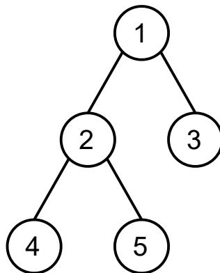

{0}------------------------------------------------

# CCF 全国青少年信息学奥林匹克联赛

## CCF NOIP 2025

时间：2025 年 11 月 29 日 08:30 ~ 13:00

|         |           |          |          |           |
|---------|-----------|----------|----------|-----------|
| 题目名称    | 糖果店       | 清仓甩卖     | 树的价值     | 序列询问      |
| 题目类型    | 传统型       | 传统型      | 传统型      | 传统型       |
| 目录      | candy     | sale     | tree     | query     |
| 可执行文件名  | candy     | sale     | tree     | query     |
| 输入文件名   | candy.in  | sale.in  | tree.in  | query.in  |
| 输出文件名   | candy.out | sale.out | tree.out | query.out |
| 每个测试点时限 | 1.0 秒     | 1.0 秒    | 2.0 秒    | 2.0 秒     |
| 内存限制    | 512 MiB   | 512 MiB  | 512 MiB  | 512 MiB   |
| 测试点数目   | 20        | 25       | 25       | 20        |
| 测试点是否等分 | 是         | 是        | 是        | 是         |

提交源程序文件名

|           |           |          |          |           |
|-----------|-----------|----------|----------|-----------|
| 对于 C++ 语言 | candy.cpp | sale.cpp | tree.cpp | query.cpp |
|-----------|-----------|----------|----------|-----------|

编译选项

|           |                        |
|-----------|------------------------|
| 对于 C++ 语言 | -O2 -std=c++14 -static |
|-----------|------------------------|

## 注意事项（请仔细阅读）

1. 文件名（程序名和输入输出文件名）必须使用英文小写。
2. main 函数的返回值类型必须是 int，程序正常结束时的返回值必须是 0。
3. 若无特殊说明，结果的比较方式为全文比较（过滤行末空格及文末换行）。
4. 选手提交的程序源文件大小不得超过 100 KiB。
5. 提交的程序源文件的放置位置请参考各省的具体要求。
6. 程序可使用的栈空间内存限制与题目的内存限制一致。
7. 禁止在源代码中改变编译器参数（如使用 #pragma 命令），禁止使用系统结构相关指令（如内联汇编）或其他可能造成不公平的方法。
8. 因违反上述规定而出现 的问题，申诉时一律不予受理。
9. 只提供 Linux 格式附加样例文件。
10. 全国统一评测时采用的机器配置为：Intel Core Ultra 9 285K CPU @ 3.70 GHz（关闭睿频与能效核），内存 96 GB。上述时限以此配置为准。
11. 评测在当前最新公布的 NOI Linux 下进行，各语言的编译器版本以此为准。

{1}------------------------------------------------

## 糖果店 (candy)

### 【题目描述】

小 X 开了一家糖果店，售卖  $n$  种糖果，每种糖果均有无限颗。对于不同种类的糖果，小 X 采用了不同的促销策略。具体地，对于第  $i$  ( $1 \leq i \leq n$ ) 种糖果，购买第一颗的价格为  $x_i$  元，第二颗为  $y_i$  元，第三颗又变回  $x_i$  元，第四颗则为  $y_i$  元，以此类推。

小 R 带了  $m$  元钱买糖果。小 R 不关心糖果的种类，只想得到数量尽可能多的糖果。你需要帮助小 R 求出， $m$  元钱能购买的糖果数量的最大值。

### 【输入格式】

从文件 *candy.in* 中读入数据。

输入的第一行包含两个正整数  $n, m$ ，代表糖果的种类数和小 R 的钱数。

输入的第  $i+1$  ( $1 \leq i \leq n$ ) 行包含两个正整数  $x_i, y_i$ ，分别表示购买第  $i$  种糖果时第奇数颗的价格和第偶数颗的价格。

### 【输出格式】

输出到文件 *candy.out* 中。

输出一行一个非负整数，表示  $m$  元钱能购买的糖果数量的最大值。

### 【样例 1 输入】

```
1 2 10
2 4 1
3 3 3
```

### 【样例 1 输出】

```
1 4
```

### 【样例 1 解释】

小 R 可以购买 4 颗第一种糖果，共花费  $4 + 1 + 4 + 1 = 10$  元。

{2}------------------------------------------------

### 【样例 2 输入】

```
1 3 15
2 1 7
3 2 3
4 3 1
```

### 【样例 2 输出】

```
1 8
```

小 R 可以购买 1 颗第一种糖果、1 颗第二种糖果与 6 颗第三种糖果，共花费  $1 + 2 + 12 = 15$  元。

### 【样例 3】

见选手目录下的 *candy/candy3.in* 与 *candy/candy3.ans*。  
该样例满足测试点 6 的约束条件。

### 【样例 4】

见选手目录下的 *candy/candy4.in* 与 *candy/candy4.ans*。  
该样例满足测试点 8,9 的约束条件。

### 【样例 5】

见选手目录下的 *candy/candy5.in* 与 *candy/candy5.ans*。  
该样例满足测试点 11,12 的约束条件。

### 【样例 6】

见选手目录下的 *candy/candy6.in* 与 *candy/candy6.ans*。  
该样例满足测试点 13 的约束条件。

### 【样例 7】

见选手目录下的 *candy/candy7.in* 与 *candy/candy7.ans*。  
该样例满足测试点 17,18 的约束条件。

{3}------------------------------------------------

### 【数据范围】

对于所有测试数据，均有：

- $1 \leq n \leq 10^5$ ;
- $1 \leq m \leq 10^{18}$ ;
- 对于所有  $1 \leq i \leq n$ ，均有  $1 \leq x_i, y_i \leq 10^9$ 。

| 测试点编号  | $n \leq$ | $m \leq$  | 特殊性质 |
|--------|----------|-----------|------|
| 1      | 1        | 10        | 无    |
| 2, 3   | 2        | 20        |      |
| 4, 5   | 10       |           |      |
| 6      | $10^2$   | $10^2$    | A    |
| 7      |          |           | B    |
| 8, 9   |          |           | 无    |
| 10     | $10^3$   | $10^4$    | A    |
| 11, 12 |          |           | B    |
| 13     |          |           | 无    |
| 14     | $10^5$   | $10^9$    | A    |
| 15, 16 |          |           | B    |
| 17, 18 |          |           | 无    |
| 19, 20 |          | $10^{18}$ |      |

特殊性质 A：对于所有  $1 \leq i \leq n$ ，均有  $x_i = y_i$ 。

特殊性质 B：对于所有  $1 \leq i \leq n$ ，均有  $x_i \geq y_i$ 。

{4}------------------------------------------------

## 清仓甩卖 (sale)

### 【题目描述】

小 X 的糖果促销策略很成功，现在糖果店只剩下了  $n$  颗糖果，其中第  $i$  ( $1 \leq i \leq n$ ) 颗糖果的原价为  $a_i$  元。小 X 计划将它们全部重新定价，清仓甩卖。具体地，小 X 会将每颗糖果的清仓价格分别定为 1 元或 2 元。设第  $i$  ( $1 \leq i \leq n$ ) 颗糖果的清仓价格为  $w_i \in \{1, 2\}$  元，则它的**性价比**被定义为原价与清仓价格的比值，即  $\frac{a_i}{w_i}$ 。

小 R 又带了  $m$  元钱买糖果。这一次，小 R 希望他购买到的糖果的原价总和最大，于是他采用了以下购买策略：将所有糖果按照**性价比从大到小排序**，然后依次考虑每一颗糖果。具体地，若小 R 在考虑第  $i$  ( $1 \leq i \leq n$ ) 颗糖果时剩余的钱至少为  $w_i$  元，则他会购买这颗糖果，否则他会跳过这颗糖果，继续考虑下一颗。特别地，若存在两颗糖果的性价比相同，则小 R 会先考虑**原价较高**的糖果；若存在两颗糖果的性价比与原价均相同，则小 R 会先考虑编号较小的糖果。

例如，若小 X 的糖果商店剩余 3 颗糖果，原价分别为  $a_1 = 1, a_2 = 3, a_3 = 5$ ，而清仓价格分别为  $w_1 = w_2 = 1, w_3 = 2$ ，则性价比分别为  $1, 3, \frac{5}{2}$ 。因此小 R 会先考虑第 2 颗糖果，然后考虑第 3 颗糖果，最后考虑第 1 颗糖果。

小 R 想知道，在小 X 的所有  $2^n$  种定价方案中，有多少种定价方案使得他按照上述购买策略能购买到的糖果的**原价总和最大**。你需要帮助小 R 求出满足要求的定价方案的数量。由于答案可能较大，你只需要求出答案对 998,244,353 取模后的结果。

### 【输入格式】

从文件 *sale.in* 中读入数据。

**本题包含多组测试数据。**

输入的第一行包含两个非负整数  $c, t$ ，分别表示测试点编号与测试数据组数。 $c = 0$  表示该测试点为样例。

接下来依次输入每组测试数据，对于每组测试数据：

- 第一行包含两个正整数  $n, m$ ，分别表示糖果的数量与小 R 的钱数。
- 第二行包含  $n$  个正整数  $a_1, a_2, \dots, a_n$ ，分别表示每颗糖果的原价。

### 【输出格式】

输出到文件 *sale.out* 中。

对于每组测试数据，输出一行一个非负整数，表示使得小 R 购买到的糖果的原价总和达到最大值的定价方案数对 998,244,353 取模后的结果。

### 【样例 1 输入】

{5}------------------------------------------------

```
1 0 1
2 3 2
3 1 3 5
```

### 【样例 1 输出】

```
1 6
```

### 【样例 1 解释】

该样例即为【题目描述】中的例子。共有以下 6 种定价方案使得小 R 购买到的糖果原价总和最大，分别为：

- $w_1 = w_2 = w_3 = 1$ ，小 R 购买到的糖果原价总和为 8；
- $w_1 = w_3 = 1, w_2 = 2$ ，小 R 购买到的糖果原价总和为 6；
- $w_1 = 1, w_2 = w_3 = 2$ ，小 R 购买到的糖果原价总和为 5；
- $w_2 = w_3 = 1, w_1 = 2$ ，小 R 购买到的糖果原价总和为 8；
- $w_3 = 1, w_1 = w_2 = 2$ ，小 R 购买到的糖果原价总和为 5；
- $w_1 = w_2 = w_3 = 2$ ，小 R 购买到的糖果原价总和为 5。

注意：若  $w_1 = w_2 = 1, w_3 = 2$ ，则小 R 会依次购买第 2 颗和第 1 颗糖果，原价总和为 4，但小 R 可以只购买第 3 颗糖果，原价总和为 5。因此该定价方案无法使小 R 购买到的糖果的原价总和达到最大值。

### 【样例 2】

见选手目录下的 *sale/sale2.in* 与 *sale/sale2.ans*。

该样例满足测试点 1~3 的约束条件。

### 【样例 3】

见选手目录下的 *sale/sale3.in* 与 *sale/sale3.ans*。

该样例满足测试点 4,5 的约束条件。

### 【样例 4】

见选手目录下的 *sale/sale4.in* 与 *sale/sale4.ans*。

该样例满足测试点 7~9 的约束条件。

{6}------------------------------------------------

### **【样例 5】**

见选手目录下的 *sale/sale5.in* 与 *sale/sale5.ans*。  
该样例满足测试点 10 ~ 12 的约束条件。

### **【样例 6】**

见选手目录下的 *sale/sale6.in* 与 *sale/sale6.ans*。  
该样例满足测试点 13 的约束条件。

### **【样例 7】**

见选手目录下的 *sale/sale7.in* 与 *sale/sale7.ans*。  
该样例满足测试点 14, 15 的约束条件。

### **【样例 8】**

见选手目录下的 *sale/sale8.in* 与 *sale/sale8.ans*。  
该样例满足测试点 17 的约束条件。

### **【样例 9】**

见选手目录下的 *sale/sale9.in* 与 *sale/sale9.ans*。  
该样例满足测试点 19, 20 的约束条件。

### **【样例 10】**

见选手目录下的 *sale/sale10.in* 与 *sale/sale10.ans*。  
该样例满足测试点 21 ~ 23 的约束条件。

### **【样例 11】**

见选手目录下的 *sale/sale11.in* 与 *sale/sale11.ans*。  
该样例满足测试点 24, 25 的约束条件。

### **【数据范围】**

设  $N$  为单个测试点内所有测试数据的  $n$  的和。对于所有测试数据，均有：

- $1 \leq t \leq 5 \times 10^4$ ;
- $1 \leq n \leq 5,000$ ,  $N \leq 5 \times 10^4$ ,  $1 \leq m \leq 2n - 1$ ;
- 对于所有  $1 \leq i \leq n$ , 均有  $1 \leq a_i \leq 10^9$ 。

{7}------------------------------------------------

| 测试点编号   | $n \leq$ | $N \leq$        | $m$           | 特殊性质 |
|---------|----------|-----------------|---------------|------|
| 1 ~ 3   | 5        | 5,000           | $\leq 2n - 1$ | 无    |
| 4,5     | 10       |                 |               |      |
| 6       | 40       |                 |               |      |
| 7 ~ 9   | 300      |                 | $= 2$         | B    |
| 10 ~ 12 |          |                 | $\leq 2n - 1$ |      |
| 13      |          |                 |               | 无    |
| 14, 15  | $10^3$   | $10^4$          | $= 2$         |      |
| 16      |          |                 | $= 2n - 1$    |      |
| 17      |          |                 | $= 2n - 2$    |      |
| 18      |          |                 | $\leq 2n - 1$ | A    |
| 19, 20  |          |                 |               | B    |
| 21 ~ 23 |          |                 |               | 无    |
| 24, 25  | 5,000    | $5 \times 10^4$ |               |      |

特殊性质 A:  $a_1 = a_2 = \cdots = a_n$ 。

特殊性质 B: 对于所有  $1 \leq i \leq n$ , 均有  $a_i > 5 \times 10^8$ 。

{8}------------------------------------------------

## 树的价值 (tree)

### 【题目描述】

给定一棵  $n$  个结点的有根树，其中结点 1 为根，结点  $i$  ( $2 \leq i \leq n$ ) 的父亲结点为结点  $p_i$ 。

对于  $1 \leq i \leq n$ ，定义结点  $i$  的**深度**  $d_i$  为结点 1 到结点  $i$  的简单路径的**边数**，也就是说， $d_1 = 0$ ， $d_i = d_{p_i} + 1$  ( $2 \leq i \leq n$ )。定义有根树的**高度**  $h$  为所有结点的**深度的最大值**，即  $h = \max_{i=1}^n d_i$ 。

给定高度的上界  $m$ 。在本题中，**给定的有根树的高度不超过  $m$** 。

你需要给每个结点设置一个**非负整数**作为它的**权值**。对于  $1 \leq i \leq n$ ，若结点  $i$  的权值为  $a_i$ ，令  $S_i$  表示结点  $i$  的**子树**中结点权值构成的集合。对于每一种权值设置方案，定义树的**价值**为  $\sum_{i=1}^n \text{mex}(S_i)$ ，其中  $\text{mex}(S)$  表示**不在**集合  $S$  中的**最小非负整数**。例如，在下图中，若设置  $a_1 = 3$ ， $a_2 = 2$ ， $a_3 = a_4 = 0$ ， $a_5 = 1$ ，则  $S_1 = \{0, 1, 2, 3\}$ ， $S_2 = \{0, 1, 2\}$ ， $S_3 = \{0\}$ ， $S_4 = \{0\}$ ， $S_5 = \{1\}$ ，树的**价值**为  $4 + 3 + 1 + 1 + 0 = 9$ 。



```

graph TD
  1((1)) --- 2((2))
  1 --- 3((3))
  2 --- 4((4))
  2 --- 5((5))
  
```

A rooted tree with 5 nodes. Node 1 is the root. Node 2 is the left child of node 1. Node 3 is the right child of node 1. Node 4 is the left child of node 2. Node 5 is the right child of node 2.

你需要求出，在所有权值设置方案中，树的**价值**的最大值。

### 【输入格式】

从文件 *tree.in* 中读入数据。

本题**包含多组测试数据**。

输入的第一行包含一个正整数  $t$ ，表示测试数据组数。

接下来依次输入每组测试数据，对于每组测试数据：

- 第一行包含两个正整数  $n, m$ ，分别表示结点数量与高度的上界。
- 第二行包含  $n - 1$  个正整数  $p_2, p_3, \dots, p_n$ ，分别表示每个结点的父亲结点。

### 【输出格式】

输出到文件 *tree.out* 中。

{9}------------------------------------------------

对于每组测试数据，输出一行一个非负整数，表示树的价值最大值。

### **【样例 1 输入】**

```
1 2
2 5 2
3 1 1 2 2
4 7 2
5 1 1 2 2 2 3
```

### **【样例 1 输出】**

```
1 9
2 13
```

### **【样例 1 解释】**

该样例共包含两组测试数据。

对于第一组测试数据，可以设置  $a_1 = 3, a_2 = 2, a_3 = a_4 = 0, a_5 = 1$ ，则树的价值为  $4 + 3 + 1 + 1 + 0 = 9$ 。

对于第二组测试数据，可以设置  $a_1 = 4, a_2 = 3, a_4 = 2, a_3 = a_6 = 1, a_5 = a_7 = 0$ ，则树的价值为  $5 + 4 + 2 + 0 + 1 + 0 + 1 = 13$ 。

### **【样例 2】**

见选手目录下的 *tree/tree2.in* 与 *tree/tree2.ans*。

该样例满足测试点 3, 4 的约束条件。

### **【样例 3】**

见选手目录下的 *tree/tree3.in* 与 *tree/tree3.ans*。

该样例满足测试点 7, 8 的约束条件。

### **【样例 4】**

见选手目录下的 *tree/tree4.in* 与 *tree/tree4.ans*。

该样例满足测试点 13, 14 的约束条件。

{10}------------------------------------------------

### 【样例 5】

见选手目录下的 *tree/tree5.in* 与 *tree/tree5.ans*。  
该样例满足测试点 18, 19 的约束条件。

### 【数据范围】

对于所有测试数据，均有：

- $1 \leq t \leq 5$ ;
- $2 \leq n \leq 8,000$ ,  $1 \leq m \leq \min(n - 1, 800)$ ;
- 对于所有  $2 \leq i \leq n$ , 均有  $1 \leq p_i \leq i - 1$ ;
- 给定的有根树的高度不超过  $m$ 。

| 测试点编号   | $n \leq$ | $m \leq$ |
|---------|----------|----------|
| 1, 2    | 7        | $n - 1$  |
| 3, 4    | 13       |          |
| 5, 6    | 18       |          |
| 7, 8    | 40       |          |
| 9, 10   | 120      |          |
| 11, 12  | 360      |          |
| 13, 14  | 4, 000   | 2        |
| 15 ~ 17 |          | 10       |
| 18, 19  |          | 50       |
| 20 ~ 25 | 8, 000   | 800      |

{11}------------------------------------------------

## 序列询问 (query)

### 【题目描述】

给定一个长度为  $n$  的整数序列  $a_1, a_2, \dots, a_n$ 。

有  $q$  次询问，其中第  $j$  ( $1 \leq j \leq q$ ) 次询问将会给出  $L_j, R_j$  ( $1 \leq L_j \leq R_j \leq n$ )。定义区间  $[l, r]$  ( $1 \leq l \leq r \leq n$ ) 是**极好的**，当且仅当区间  $[l, r]$  的长度在  $[L_j, R_j]$  内，即  $L_j \leq r - l + 1 \leq R_j$ 。定义区间  $[l, r]$  ( $1 \leq l \leq r \leq n$ ) 的**权值**为  $\sum_{i=l}^r a_i$ 。对于所有  $i = 1, 2, \dots, n$ ，求出所有**包含**  $i$  的极好区间的最大权值，即  $\max_{1 \leq l \leq i \leq r \leq n} \{ \sum_{k=l}^r a_k \mid L_j \leq r - l + 1 \leq R_j \}$ 。

### 【输入格式】

从文件 `query.in` 中读入数据。

输入的第一行包含一个正整数  $n$ ，表示序列长度。

输入的第二行包含  $n$  个整数  $a_1, a_2, \dots, a_n$ 。

输入的第三行包含一个正整数  $q$ ，表示询问次数。

输入的第  $j + 3$  ( $1 \leq j \leq q$ ) 行包含两个正整数  $L_j, R_j$ ，表示第  $j$  次询问。

### 【输出格式】

输出到文件 `query.out` 中。

对于每次询问，设包含  $i$  ( $1 \leq i \leq n$ ) 的极好区间的最大权值为  $k_i$ ，输出一行一个非负整数，表示  $\bigoplus_{i=1}^n ((i \times k_i) \bmod 2^{64})$ ，其中  $\oplus$  表示**二进制按位异或**。注意：对于任意整数  $x$ ，存在**唯一的非负整数**  $x'$  满足  $x' \equiv x \pmod{2^{64}}$  且  $0 \leq x' \leq 2^{64} - 1$ ，则记  $x \bmod 2^{64} = x'$ 。

### 【样例 1 输入】

```

1 4
2 2 4 -5 1
3 3
4 1 2
5 3 4
6 1 4

```

### 【样例 1 输出】

```

1 18446744073709551603
2 8

```

{12}------------------------------------------------

3 4

### 【样例 1 解释】

对于第 1 次询问：

- 包含 1 的极好区间为 [1, 1] 和 [1, 2]，权值分别为 2, 6;
- 包含 2 的极好区间为 [1, 2], [2, 2] 和 [2, 3]，权值分别为 6, 4, -1;
- 包含 3 的极好区间为 [2, 3], [3, 3] 和 [3, 4]，权值分别为 -1, -5, -4;
- 包含 4 的极好区间为 [3, 4] 和 [4, 4]，权值分别为 -4, 1。

因此  $k_1 = 6, k_2 = 6, k_3 = -1, k_4 = 1$ 。

对于第 2 次询问， $k_1 = 2, k_2 = 2, k_3 = 2, k_4 = 2$ 。

对于第 3 次询问， $k_1 = 6, k_2 = 6, k_3 = 2, k_4 = 2$ 。

### 【样例 2】

见选手目录下的 *query/query2.in* 与 *query/query2.ans*。

该样例满足测试点 2, 3 的约束条件。

### 【样例 3】

见选手目录下的 *query/query3.in* 与 *query/query3.ans*。

该样例满足测试点 4 的约束条件。

### 【样例 4】

见选手目录下的 *query/query4.in* 与 *query/query4.ans*。

该样例满足测试点 6, 7 的约束条件。

### 【样例 5】

见选手目录下的 *query/query5.in* 与 *query/query5.ans*。

该样例满足测试点 8 ~ 10 的约束条件。

### 【样例 6】

见选手目录下的 *query/query6.in* 与 *query/query6.ans*。

该样例满足测试点 11, 12 的约束条件。

{13}------------------------------------------------

### **【样例 7】**

见选手目录下的 *query/query7.in* 与 *query/query7.ans*。  
该样例满足测试点 13 的约束条件。

### **【样例 8】**

见选手目录下的 *query/query8.in* 与 *query/query8.ans*。  
该样例满足测试点 16 ~ 20 的约束条件。

### **【数据范围】**

对于所有测试数据，均有：

- $1 \leq n \leq 5 \times 10^4$ ,  $1 \leq q \leq 1,024$ ;
- 对于所有  $1 \leq i \leq n$ , 均有  $|a_i| \leq 10^5$ ;
- 对于所有  $1 \leq j \leq q$ , 均有  $1 \leq L_j \leq R_j \leq n$ 。

| 测试点编号   | $n \leq$        | $q \leq$ | 特殊性质 |
|---------|-----------------|----------|------|
| 1       | $10^3$          | 1        | 无    |
| 2, 3    | 3,000           | 50       |      |
| 4       | $10^4$          | 128      |      |
| 5       | $3 \times 10^4$ | 512      |      |
| 6, 7    | $5 \times 10^4$ | 1,024    | A    |
| 8 ~ 10  |                 | 512      | B    |
| 11, 12  |                 |          | C    |
| 13      |                 | 1,024    | D    |
| 14, 15  |                 |          | E    |
| 16 ~ 20 |                 |          | 无    |

特殊性质 A: 对于所有  $1 \leq j \leq q$ , 均有  $L_j = R_j$ 。

特殊性质 B: 对于所有  $1 \leq j \leq q$ , 均有  $R_j \leq 32$ 。

特殊性质 C: 对于所有  $1 \leq j \leq q$ , 均有  $L_j \leq 16$  且  $R_j \geq n - 1000$ 。

特殊性质 D: 对于所有  $1 \leq j \leq q$ , 均有  $L_j > n/2$ 。

特殊性质 E: 对于所有  $1 \leq j \leq q$ , 均有  $L_j > n/4$ 。