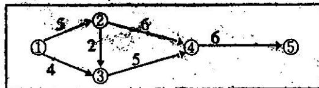

{0}------------------------------------------------

# 第七届全国青少年信息学(计算机)奥林匹克分区联赛初赛试题

(提高组 BASIC 语言 二小时完成)

●● 全部试题答案均要求写在答卷纸上,写在试卷纸上一律无效 ●●

一、选择一个正确答案代码(A/B/C/D),填入每题的括号内(每题1.5分,多选无分,共30分)

- 中央处理器 CPU 能访问的最大存储器容量取决于( )  
A)地址总线 B)数据总线 C)控制总线 D)内存容量
- 计算机软件保护法是用来保护软件( )的。  
A)编写权 B)复制权 C)使用权 D)著作权
- 64KB 的存储器用十六进制表示,它的最大的地址码是( )  
A) 10000 B)FFFF C)1FFFF D)EFFFF
- 在树型目录结构中,不允许两个文件名相同主要指的是( )  
A)同一个磁盘的不同目录下 B)不同磁盘的同一个目录下  
C)不同磁盘的不同目录下 D)同一个磁盘的同一个目录下
- 下列设备哪一项不是计算机输入设备( )  
A)鼠标 B)扫描仪 C)数字化仪 D)绘图仪
- 在计算机硬件系统中,cache 是( )存储器  
A)只读 B)可编程只读 C)可擦除可编程只读 D)高速缓冲
- 若我们说一个微机的 CPU 是用 PII300,此处的 300 确切指的是( )  
A)CPU 的主时钟频率 B)CPU 产品的系列号  
C)每秒执行 300 百万条指令 D)此种 CPU 允许最大内存容量
- E-mail 邮件本质上是一个( )  
A)文件 B)电报 C)电话 D)传真
- 2KB 的内存能存储( )个汉字的机内码  
A)1024 B)516 C)2048 D)218
- 以下对 Windows 的叙述中,正确的是( )  
A)从软盘上删除的文件和文件夹,不送到回收站  
B)在同一个文件夹中,可以创建两个同类、同名的文件  
C)删除了某个应用程序的快捷方式,将删除该应用程序对应的文件  
D)不能打开两个写字板应用程序
- 运算式  $(2047)_{10} - (3FF)_{16} + (2000)_8$  的结果是( )  
A)  $(2048)_{10}$  B)  $(2049)_{10}$  C)  $(3746)_8$  D)  $(1AF7)_{16}$

{1}------------------------------------------------

12. TCP/IP 协议共有( )层协议

- A)3 B)4 C)5 D)6

13. 若已知一个栈的入栈顺序是  $1, 2, 3, \dots, n$ , 其输出序列为  $P_1, P_2, P_3, \dots, P_n$ , 若  $P_1$  是  $n$ , 则  $P_i$  是( )

- A) $i$  B) $n-i$  C) $n-i+1$  D)不确定

14. 计算机病毒是( )

- A)通过计算机传播的危害人体健康的一种病毒  
 B)人为制造的能够侵入计算机系统并给计算机带来故障的程序或指令集合  
 C)一种由于计算机元器件老化而产生的对生态环境有害的物质  
 D)利用计算机的海量高速运算能力而研制出来的用于疾病预防的新型病毒

15. 下面关于算法的错误说法是( )

- A) 算法必须有输出 B) 算法必须在计算机上用某种语言实现  
 C) 算法不一定有输入 D) 算法必须在有限步执行后能结束

16.  $[x]$ 补码 = 10011000, 其原码为( )

- A) 011001111 B) 11101000 C) 11100110 D) 01100101

17. 以下哪一个不是栈的基本运算( )

- A) 删除栈顶元素 B) 删除栈底的元素  
 C) 判断栈是否为空 D) 将栈置为空栈

18. 在顺序表  $(2, 5, 7, 10, 14, 15, 18, 23, 35, 41, 52)$  中, 用二分法查找 12, 所需的关键码比较的次数为( )

- A)2 B)3 C)4 D)5

19. 一棵二叉树的高度为  $h$ , 所有结点的度为 0, 或为 2, 则此树最少有( )个结点

- A) $2^h - 1$  B) $2h - 1$  C) $2h + 1$  D) $h + 1$

20. 无向图  $G = (V, E)$ , 其中  $V = \{a, b, c, d, e, f\}$

$$
E = \{(a, b), (a, e), (a, c), (b, e), (c, f), (f, d), (e, d)\}
$$

对该图进行深度优先遍历, 得到的顶点序列正确的是( )

- A)  $a, b, e, c, d, f$  B)  $a, c, f, e, b, d$   
 C)  $a, e, b, c, f, d$  D)  $a, b, e, d, f, c$

## 二、问题求解 (5 + 7 = 12 分)

1. 已知一棵二叉树的结点名为大写英文字母, 其中序与后序遍历的顺序分别为: CBGEAFHDIJ 与 CGEBHFJIDA 则该二叉树的先序遍历的顺序为:

2. 平面上有三条平行直线, 每条直线上分别有 7, 5, 6 个点, 且不同直线上三个点都不在同一条直

{2}------------------------------------------------

线上。问用这些点为顶点,能组成多少个不同四边形?

## 三、阅读程序,写出程序正确的运行结果(4+7+8+9=28分)

```
1) 10 FOR K = 1 TO 10 : S = K * K * K
   20 FOR J = 1 TO K - 1
   30 S = S + 11 - J
   40 NEXT J
   50 FOR J = K TO 10
   60 S = S + J - K
   70 NEXT J
   80 S = S + J - K
   90 NEXT K
  100 PRINT "S = "; S + J - K
  110 END
```

输出

```
2) 10 INPUT " P = "; P
   20 FOR Q = P + 1 TO P * 2
   30 T = 0
   40 S = (P * Q) MOD (Q - P)
   50 IF S < > 0 THEN 80
   60 T = P + Q + INT((P * Q) / (Q - P))
   70 PRINT T;
   80 NEXT Q
   90 END
```

输入: P = 12

输出

```
3) 10 DIM A(10)
   20 INPUT "N = "; N
   30 FOR K = 1 TO 10
   40 M = N : J = 11
   50 IF M = 0 THEN 80
   60 J = J - 1 : A(J) = M MOD 10 : M = INT(M / 10)
   70 GOTO 50
   80 FOR H = J TO 10
   90 N = N + A(H)
  100 NEXT H , K
  110 PRINT N
  120 END
```

输入: N = 1234

输出:

```
4) 10 INPUT "X = "; X
   20 Y1 = 0 : Y2 = 1 : Y3 = 1
   30 IF Y2 > X THEN 60
   40 Y1 = Y1 + 1 : Y3 = Y3 + 2 : Y2 = Y2 + Y3
   50 GOTO 30
```

{3}------------------------------------------------

```
60 PRINT Y1
70 END
输入: X = 23420
输出:
```

## 四、完善程序(每空3分,共30分)

1. 存储空间的回收算法。设在内存中已经存放了若干个作业 A, B, C, D。其余的空间为可用的(如图一(a))。


Figure 1(a): Memory layout diagram showing four jobs A, B, C, and D. Job A starts at address 100 and has length 50. Job B starts at 300 and has length 100. Job C starts at 500 and has length 100. Job D starts at 600. There are gaps of 100 units between jobs.

图一(a)


Figure 1(b): Memory layout diagram showing four jobs A, B, C, and D with their start addresses d and lengths L. Job A: d=100, L=50, labeled '下靠' (bottom-align). Job B: d=300, L=100, labeled '上,下靠' (top and bottom-align). Job C: d=500, L=100, labeled '上,下不靠' (top and bottom not-align). Job D: d=600, L=100, labeled '上靠' (top-align).

图一(b)

此时,可用空间可用一个二维数组  $\Lambda$  表示,(如下表一(a)),其中:  
 $\Lambda(i,1)$  对应第  $i$  个可用空间首址  $\Lambda(i,2)$  对应第  $i$  个可用空间长度  
 如上图中,  $\Lambda$  :

|     |     |
|-----|-----|
| 100 | 50  |
| 300 | 100 |
| 500 | 100 |

表一(a)

|       |     |
|-------|-----|
| 0     | 0   |
| 100   | 50  |
| 300   | 100 |
| 500   | 100 |
| 10000 | 0   |

表一(b)

现某个作业释放一个区域,其首址为  $d$ , 长度为  $L$ , 此时将释放区域加入到可用空间表中。要求在加入时,若可用空间相邻时,则必须进行合并。因此出现下面的4种情况(如上图一(b)所示)。

- (1) 下靠,即回收区域和下面可用空间相邻,例如,  $d=80, L=20$ , 此时成为表二中的(a)。
- (2) 上靠,例如,  $d=600, L=50$ , 此时表成为表二中的(b)
- (3) 上、下靠,例如,  $d=150, L=150$ , 此时表成为表二中的(c)。
- (4) 上、下不靠,例如,  $d=430, L=20$ , 此时表成为表二中的(d)。

|     |     |
|-----|-----|
| 80  | 70  |
| 300 | 100 |
| 500 | 100 |

表二(a)  
(下靠)

|     |     |
|-----|-----|
| 100 | 50  |
| 300 | 100 |
| 500 | 150 |

表二(b)  
(上靠)

|     |     |
|-----|-----|
| 100 | 300 |
| 500 | 100 |

表二(c)  
(上、下靠)

|     |     |
|-----|-----|
| 100 | 50  |
| 300 | 100 |
| 430 | 20  |
| 500 | 100 |

表二(d)  
(上、下不靠)

程序说明:对数组  $\Lambda$  预置2个标志,即头和尾标志,成为表二(b),这样可使算法简单,  $sp$  为  $\Lambda$  表末地址。

```
程序清单: 10 DIM  $\Lambda$ (100,2)
           20 INPUT "SP = "; SP
           30 FOR K = 1 TO SP
```

{4}------------------------------------------------

```

40 INPUT A(K,1), A(K,2)
50 NEXT K
60 A(0,1) = 0 : A(0,2) = 0
65 _____ ① _____
70 A(SP,1) = 10000 : A(SP,2) = 0
75 INPUT " D,L = "; D,L
80 K = 1
90 IF A(K,1) < D THEN K = K + 1 : GOTO 90
100 _____ ② _____
110 IF A(K,1) + A(K,2) < > D THEN 400
120 IF D + L < > A(K+1,1) THEN 180
130 A(K,2) = _____ ③ _____
140 FOR J = K + 1 TO SP - 1
150 A(J,1) = A(J+1,1)
155 A(J,2) = A(J+1,2)
160 NEXT J
170 SP = SP - 1
175 GOTO 500
180 A(K,2) = A(K,2) + L
190 GOTO 500
400 IF D + L < > A(K+1,1) THEN 420
410 A(K+1,1) = _____ ④ _____ : A(K+1,2) = A(K+1,2) + L : GOTO 500
420 FOR J = SP TO K + 1 STEP - 1
430 A(J+1,1) = A(J,1) : A(J+1,2) = A(J,2)
440 NEXT J
450 _____ ⑤ _____ = D : A(K+1,2) = L : SP = SP + 1
500 FOR H = 1 TO SP - 1 : PRINT A(H,1), A(H,2) : NEXT H
510 END
    
```

### 2.求关键路径

设有一个工程网络如下图所示(无环路的有向图):

其中,顶点表示活动,①表示工程开始,⑤表示工程结束(可变,用 N 表示),边上的数字表示活动延续的时间。



```

graph LR
    1((①)) -- 5 --> 2((②))
    1 -- 4 --> 3((③))
    2 -- 2 --> 3
    2 -- 6 --> 4((④))
    3 -- 5 --> 4
    4 -- 6 --> 5((⑤))
    
```

A directed acyclic graph (DAG) representing an activity network. It has 5 nodes labeled ① to ⑤. Node ① is the start, and node ⑤ is the end. The edges and their weights are: ① to ② (5), ① to ③ (4), ② to ③ (2), ② to ④ (6), ③ to ④ (5), and ④ to ⑤ (6).

如上图,活动①开始 5 天后活动②才能开始工作,而活动③则要等①、②完成之后才能开始即最早也要 7 天后才能工作。

在工程网络中,延续时间最长的路径称为关键路径。上图中的关键路径为:

{5}------------------------------------------------

①—②—③—④—⑤ 共 18 天完成。

关键路径的算法如下:

#### 1. 数据结构:

数组 R            表示活动的延续时间,若无连线,则用 -1 表示;  
 EET            表示活动最早可以开始的时间  
 ET            表示活动最迟应该开始的时间

关键路径通过点 J,具有如下的性质:  $EET(J) = ET(J)$

#### 2. 约定:

结点的排列已经过拓扑排序,即序号前面的结点会影响序号后面结点的活动。

#### 3. 程序清单:

```

10  DIM R(20,20),EET(20),ET(20)
20  INPUT N
30  FOR I=1 TO N
40  FOR J=1 TO N
50  R(I,J) = -1
60  NEXT J,I
70  INPUT X,Y,W
80  IF X=0 THEN 110
90  R(X,Y) = W
100  _____①_____
110 EET(1) = 0
120 FOR I=2 TO N
130 MAX = 0
140 FOR J=1 TO N
150 IF (R(J,I) < > -1) AND _____②_____ THEN MAX = R(J,I) + EET(J)
160 NEXT J : EET(I) = MAX
170 NEXT I
180 _____③_____
190 FOR I=N-1 TO 1 STEP -1
200 MIN = 10000
210 FOR J=1 TO N
220 IF (R(I,J) < > -1) AND _____④_____ THEN MIN = ET(J) - R(I,J)
230 NEXT J
240 ET(I) = MIN
250 NEXT I
260 PRINT EET(N)
270 FOR I=1 TO N-1
280 IF _____⑤_____ THEN PRINT I; "---->";
290 NEXT I : PRINT N
300 END
    
```