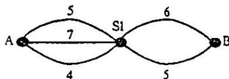

{0}------------------------------------------------

# 第七届全国青少年信息学(计算机)奥林匹克分区联赛初赛试题

(普及组 BASIC 语言 二小时完成)

●● 全部试题答案均要求写在答卷纸上,写在试卷纸上一律无效 ●●

一.选择一个正确答案代码(A/B/C/D),填入每题的括号内(每题 1.5 分,多选无分,共 30 分)

1. 在计算机内部,一切信息存取、处理和传递的形式是( )

- A) ASCII 码      B) BCD 码      C) 二进制      D) 十六进制

2. 在树型目录结构中,不允许两个文件名相同主要指的是( )

- A) 同一个磁盘的不同目录下      B) 不同磁盘的同一个目录下  
C) 不同磁盘的不同目录下      D) 同一个磁盘的同一个目录下

3. WORD 是一种( )

- A) 操作系统      B) 文字处理软件      C) 多媒体制作软件      D) 网络浏览器

4. 计算机软件保护法是用来保护软件( )的。

- A) 编写权      B) 复制权      C) 使用权      D) 著作权

5. 下面关于算法的错误说法是( )

- A) 算法必须有输出      B) 算法必须在计算机上用某种语言实现  
C) 算法不一定有输入      D) 算法必须在有限步执行后能结束

6. 解释程序的功能是( )

- A) 将高级语言程序转换为目标程序      B) 将汇编语言程序转换为目标程序  
C) 解释执行高级语言程序      D) 解释执行汇编语言程序

7. 与二进制数 101.01011 等值的十六进制数为( )

- A) A.B      B) 5.51      C) A.51      D) 5.58

8. 断电后计算机信息依然存在的部件为( )

- A) 寄存器      B) RAM 存储器      C) ROM 存储器      D) 运算器

9. 2KB 的内存能存储( )个汉字的机内码

- A) 1024      B) 516      C) 2048      D) 218

10. DOS 暂驻区中的程序主要是用于( )

- A) 执行 DOS 内部命令      B) 执行 DOS 外部命令  
C) 执行 DOS 所有命令      D) 基本输入输出

{1}------------------------------------------------

11. 若我们说一个微机的 CPU 是用的 PII300, 此处的 300 确切指的是( )

- A) CPU 的主时钟频率
- B) CPU 产品的系列号
- C) 每秒执行 300 百万条指令
- D) 此种 CPU 允许最大内存容量

12. 运算  $17 \text{ MOD } 4$  的结果是( )

- A) 7
- B) 3
- C) 1
- D) 4

13. 应用软件和系统软件的相互关系是( )

- A) 后者以前者为基础
- B) 前者以后者为基础
- C) 每一类都以另一类为基础
- D) 每一类都不以另一类为基础

14. 以下对 Windows 的叙述中, 正确的是( )

- A) 从软盘上删除的文件和文件夹, 不送到回收站
- B) 在同一个文件夹中, 可以创建两个同类、同名的文件
- C) 删除了某个应用程序的快捷方式, 将删除该应用程序对应的文件
- D) 不能打开两个写字板应用程序

15. E-mail 邮件本质上是一个( )

- A) 文件
- B) 电报
- C) 电话
- D) 传真

16. 计算机病毒是( )

- A) 通过计算机传播的危害人体健康的一种病毒
- B) 人为制造的能够侵入计算机系统并给计算机带来故障的程序或指令集合
- C) 一种由于计算机元器件老化而产生的对生态环境有害的物质
- D) 利用计算机的海量高速运算能力而研制出来的用于疾病预防的新型病毒

17. 下列设备哪一项不是计算机输入设备( )

- A) 鼠标
- B) 扫描仪
- C) 数字化仪
- D) 绘图仪

18. 在计算机硬件系统中, cache 是( )存储器

- A) 只读
- B) 可编程只读
- C) 可擦除可编程只读
- D) 高速缓冲

19. 在顺序表  $(2, 5, 7, 10, 14, 15, 18, 23, 35, 41, 52)$  中, 用二分法查找 12, 所需的关键码比较的次数为( )

- A) 2
- B) 3
- C) 4
- D) 5

20. 若已知一个栈的入栈顺序是  $1, 2, 3, \dots, n$ , 其输出序列为  $P_1, P_2, P_3, \dots, P_n$ , 若  $P_1$  是  $n$ , 则  $P_i$  是( )

- A)  $i$
- B)  $n-i$
- C)  $n-i+1$
- D) 不确定

## 二. 问题求解 (5+7=12 分)

1. 在 a, b, c, d, e, f 六件物品中, 按下面的条件能选出的物品是: \_\_\_\_\_

{2}------------------------------------------------

- (1)a,b 两样至少有一样
- (2)a,d 不能同时取
- (3)a,e,f 中必须有 2 样
- (4)b,c 要么都选,要么都不选
- (5)c,d 两样中选一样
- (6)若 d 不选,则 e 也不选

2. 平面上有三条平行直线,每条直线上分别有 7,5,6 个点,且不同直线上三个点都不在同一条直线上。

问用这些点为顶点,能组成多少个不同三角形?

三. 阅读程序,写出正确的运行结果(5+8+9+9=31 分)

```
1) 10 FOR K=1 TO 10
    15 S=K * K + K
    20 FOR J=1 TO K-1
    30 S=S+11 - J
    40 NEXT J
    50 FOR J=K TO 10
    60 S=S+J - K
    70 NEXT J
    80 S=S+J - K
    90 NEXT K
    100 PRINT"S=";S+J - K
    110 END
```

输出:

```
2) 10 DIM A(8)
    20 FOR K=1 TO 8
    30 F=K MOD 2
    40 IF F=0 THEN A(K)=0 ELSE A(K)=1
    50 FOR J=1 TO K
    60 IF F=0 THEN A(K)=A(K)+J ELSE A(K)=A(K)*J
    70 NEXT J
    80 NEXT K
    90 FOR J=1 TO 8
    100 PRINT A(J);
    110 NEXT J
    120 END
```

输出:

{3}------------------------------------------------

```
3)10 INPUT "P=";P
20 FOR Q=P+1 TO P*2
30 T=0
40 S=(P*Q) MOD (Q - P)
50 IF S<>0 THEN 80
60 T=P+Q+INT((P*Q)/(Q - P))
70 PRINT T;
80 NEXT Q
90 END
```

输入: P= 12

输出:

```
4)10 DIM A(40)
20 INPUT N,K
30 FOR J=1 TO N
40 INPUT A(J)
50 NEXT J
60 L=K
70 GOSUB 1000
80 L=N - K
90 GOSUB 1000
100 END
1000 J1=0
1010 P=1
1020 IF P=0 THEN 1100
1030 J1=J1+1
1035 S=0
1040 FOR J2=1 TO N
1050 IF A(J2)>A(J1) THEN S=S+1
1055 NEXT
1060 IF S<>(L-1) THEN 1090
1070 PRINT A(J1)
1080 P=0
1090 GOTO 1020
1100 RETURN
```

{4}------------------------------------------------

输入:10, 4

然后依次输入:12 34 5 65 67 87 7 90 120 13

输出:

## 四. 完善程序(每空 3 分 共 27 分)

1. 输入 n 个 0 到 100 之间的整数,由小到大排序输出,每行输出 3 个

程序清单:

```

10  DIM B(100)
20  INPUT N
30  FOR K=0 TO 100
40  B(K)=0
50  NEXT K
60  FOR K=1 TO N
70  INPUT X
80  B(X)= ①
90  NEXT K
100 K=0
110 FOR J=0 TO ②
120 IF ③ THEN 180
130 PRINT ④
140 K=K+1
150 B(J)=B(J)-1
160 IF ⑤ THEN PRINT
170 GOTO 120
180 NEXT J
190 END
    
```

2. 在 A,B 两个城市之间设有 N 个路站(如下图所示的 S1,且 N<100),城市与路站之间、路站和路站之间各有若干条路段(各路段数≤20,且每条路段上的距离均为一个整数)。

A,B 的一条通路是指:从 A 出发,可经过任一路段到达 S1,再从 S1 出发经过任一路段,...最后到达 B。通路上路段距离之和称为通路距离(最大距离≤1000)。

当所有的路段距离给出之后,求出所有不同距离的通路个数(相同距离仅记一次)。

{5}------------------------------------------------

例如:下图所示是当  $N=1$  时的情况:



```

    graph LR
        A((A)) -- 5 --> S1((S1))
        A -- 7 --> S1
        A -- 4 --> S1
        A -- 6 --> S1
        S1 -- 6 --> B((B))
        S1 -- 5 --> B
    
```

A graph diagram showing nodes A, S1, and B. There are four edges between A and S1 with weights 5, 7, 4, and 6. There are two edges between S1 and B with weights 6 and 5.

从 A 到 B 的通路条数为 6,但因其中通路  $5+5=4+6$ ,所以满足条件的不同距离的通路条数为 5。

算法说明:本题采用穷举算法。

数据结构:  $N$ : 记录 A,B 间路站的个数

数组  $D(I,0)$  记录第  $I-1$  到第  $I$  路站间路段的个数

$D(I,1), D(I,2), \dots$  记录每个路段距离

数组  $G$  记录可取到的距离

程序清单:

```

10  DIM D(100,20), B(100), G(1000)
20  INPUT "N=" ; N
30  FOR I=1 TO N+1
40  INPUT D(I,0)
50  FOR J=1 TO D(I,0)
60  INPUT D(I,J)
70  NEXT J,I
90  D(0,0)=1
100 FOR I=1 TO N+1 : B(I)=1 : NEXT I
110 B(0)=0
120 FOR I=0 TO 1000 : G(I)=0 : NEXT I
130 IF _____①_____ THEN 230
140 S=0
150 FOR I=1 TO N+1
160 S= _____②_____
165 NEXT I
170 G(S)=1 : J=N+1
190 IF _____③_____ THEN J=J-1:GOTO 190
200 B(J)=B(J)+1
210 FOR I=J+1 TO N+1 : B(I)=1 : NEXT I
220 GOTO 130
230 S=0
240 FOR I=1 TO 1000 : _____④_____ : NEXT I
250 PRINT S
260 END
    
```