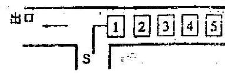

{0}------------------------------------------------

# 第八届全国青少年信息学奥林匹克联赛(NOIP2002)试题

(普及组 BASIC 语言 二小时完成)

●● 全部试题答案均要求写在答卷纸上,写在试卷纸上一律无效 ●●

一、选择一个正确答案代码(A/B/C/D),填入每题的括号内(每题 1.5 分,多选无分,共 30 分)

1)微型计算机的问世是由于( )的出现。

- A)中小规模集成电路
- B)晶体管电路
- C)(超)大规模集成电路
- D)电子管电路

2)下列说法中正确的是:( )。

- A)计算机体积越大,其功能就越强
- B)CPU 的主频越高,其运行速度越快
- C)两个显示器屏幕大小相同,则它们的分辨率必定相同
- D)点阵打印机的针数越多,则能打印的汉字字体越多

3)Windows 98 中,通过查找命令查找文件时,若输入 F\*.\*,则下列文件( )可以被查到。

- A) F.BAS
- B) FABC.BAS
- C) F.C
- D) EF.

4)CPU 处理数据的基本单位是字,一个字的字长( )。

- A)为 8 个二进制位
- B)为 16 个二进制位
- C)为 32 个二进制位
- D)与芯片的型号有关

5)资源管理器的目录前图标中增加“+”号,这个符号的意思是( )。

- A)该目录下的子目录已经展开
- B)该目录下还有子目录未展开
- C)该目录下没有子目录
- D)该目录为空目录

6)下列哪一种程序设计语言是解释执行的( )。

- A)PASCAL
- B)GW BASIC
- C)C++
- D)FORTRAN

7)启动 WORD 的不正确方法是( )。

- A)单击 Office 工具栏上的 Word 图标
- B)单击“开始”→“程序”→ Word
- C)单击“开始”→“运行”,并输入 Word 按回车
- D)双击桌面上的“Word 快捷图标”

8)多媒体计算机是指( )计算机。

- A)专供家庭使用的
- B)连接在网络上的高级
- C)装有 CD-ROM 的
- D)具有处理文字、图形、声音、影像等信息的

9)在树型目录结构中,不允许两个文件名相同主要是指( )。

- A)同一个磁盘的不同目录下
- B)不同磁盘的同一个目录下
- C)不同磁盘的不同目录下
- D)同一个磁盘的同一个目录下

10)用画笔(Paintbrush)绘制图形后并存储在文件中,该图形文件的文件名缺省后缀为( )。

{1}------------------------------------------------

- A) .jpg                      B) .bmp                      C) .gif                      D) .tiff
- 11) E-mail 地址中用户名和邮件所在服务器名之间的分隔符号是( )。
- A) #                      B) @                      C) &                      D) \$
- 12)  $(0.5)_{10} = ( )_{16}$ 。
- A) 0.1                      B) 0.75                      C) 0.8                      D) 0.25
- 13) IP v4 地址是由( )位二进制数码表示的。
- A) 16                      B) 32                      C) 24                      D) 8
- 14) 算式  $(2047)_{10} - (3FF)_{16} + (2000)_8$  的结果是( )。
- A)  $(2048)_{10}$                       B)  $(2049)_{10}$                       C)  $(3746)_8$                       D)  $(1AF7)_{16}$
- 15) 下列叙述中, 错误的是( )
- A) Excel 中编辑的表格可以在 Word 中使用
- B) 用 Word 编辑的文本可以存成纯文本文件
- C) 用记事本(Notepad)编辑文本时可以插入图片
- D) 用画笔(Paintbrush)绘图时可以输入文字
- 16) 一个向量第一个元素的存储地址是 100, 每个元素的长度是 2, 则第 5 个元素的地址是( )。
- A) 110                      B) 108                      C) 100                      D) 109
- 17) 在所有排序方法中, 关键字比较的次数与记录的初始排列次序无关的是( )。
- A) 希尔排序                      B) 起泡排序                      C) 插入排序                      D) 选择排序
- 18) 在计算机网络中, Modem 的功能是( )。
- A) 将模拟信号转换为数字信号                      B) 将数字信号转换为模拟信号
- C) 实现模拟信号与数字信号的相互转换                      D) 实现将模拟信号的数字编号
- 19) 设有一个含有 13 个元素的 Hash 表(0~12), Hash 函数是:  $H(key) = key \% 13$ , 其中 % 是 求余数运算。用线性探查法解决冲突, 则对于序列(2, 8, 31, 20, 19, 18, 53, 27), 18 应放在第几号格中( )。
- A) 5                      B) 9                      C) 4                      D) 0

20) 要使 1...8 号格子的访问顺序为: 8, 2, 6, 5, 7, 3, 1, 4, 则下图中的空格中应填入( )。

|   |   |   |    |   |   |   |   |
|---|---|---|----|---|---|---|---|
| 1 | 2 | 3 | 4  | 5 | 6 | 7 | 8 |
| 4 | 6 | 1 | -1 | 7 |   | 3 | 2 |

A) 6                      B) 0                      C) 5                      D) 3

## 二. 问题求解: (6+8 共 14 分)

1. 如下图, 有一个无穷大的的栈 S, 在栈的右边排列着 1, 2, 3, 4, 5 共五个车厢。其中每个车厢可以向左行走, 也可以进入栈 S 让后面的车厢通过。现已知第一个到达出口的是 3 号车厢, 请写出所有可能的到达出口的车厢排列总数(不必给出每种排列)。



Diagram showing a stack S and five cars numbered 1 to 5. An arrow labeled '出口' (Exit) points to the left from the stack. The cars are arranged in a line to the right of the stack, numbered 1, 2, 3, 4, 5 from left to right.

{2}------------------------------------------------

2. 将 N 个红球和 M 个黄球排成一行。例如: N=2, M=2 可得到以下 6 种排法:

红红黄黄 红黄红黄 红黄黄红 黄红红黄 黄红黄红 黄黄红红

问题: 当 N=4, M=3 时有多少种不同排法? (不用列出每种排法)

## 三. 阅读程序: (8+9+9 共 26 分)

1) 10 DIM a(20)

20 INPUT n, k

30 FOR i = 0 TO n - 1

40 a(i) = i + 1

45 NEXT i

50 a(n) = a(n - 1); L0 = n - 1; LK = n - 1

60 FOR i = 1 TO n - 1

70 L1 = L0 - k

80 IF L1 >= 0 THEN 100

90 L1 = L1 + n

100 IF L1 = Lk THEN 130

110 a(L0) = a(L1); L0 = L1

120 GOTO 150

130 a(L0) = a(n); Lk = Lk - 1

140 a(n) = a(Lk); L0 = Lk

150 NEXT i

160 a(L0) = a(n)

170 FOR i = 0 TO n - 1

180 PRINT a(i);

190 NEXT i

200 END

输入: 10, 4

输出:

2) 10 DIM CH\$(20)

20 INPUT N

30 FOR I = 1 TO N: READ CH\$(I); NEXT I

40 JR = 1; JW = N; JB = N

50 IF JR > JW THEN 160

60 IF CH\$(JW) <> "R" THEN 100

70 CH1\$ = CH\$(JR); CH\$(JR) = CH\$(JW)

80 CH\$(JW) = CH1\$; JR = JR + 1

90 GOTO 150

100 IF CH\$(JW) <> "W" THEN 130

110 JW = JW - 1

120 GOTO 150

130 CH1\$ = CH\$(JW); CH\$(JW) = CH\$(JB)

{3}------------------------------------------------

```
140 CH$ (JB) = CH1$ : JW = JW - 1 : JB = JB - 1
150 GOTO 50
160 FOR I = 1 TO N
170 PRINT CH$ (I);
180 NEXT I
190 DATA R,B,R,B,W,W,R,B,B,R
```

输入: 10

输出:

```
3)10 DIM A(20)
20 INPUT P, N, Q
30 J = 21
40 IF N <= 0 THEN 70
50 J = J - 1: A(J) = N MOD 10: N = INT(N / 10)
60 GOTO 40
70 S = 0
80 FOR I = J TO 20: S = S * P + A(I): NEXT I
90 PRINT S
100 J = 21
110 IF S <= 0 THEN 140
120 J = J - 1: A(J) = S MOD Q: S = INT(S / Q)
130 GOTO 110
140 FOR I = J TO 20: PRINT A(I);
150 NEXT I
160 END
```

输入: 7,3051,8

输出:

## 四. 完善程序: (15+15 共 30 分)

### 1. 问题描述:

将一个整数分成  $k$  组 ( $k \leq n$ , 要求每组不能为空), 显然这  $k$  个部分均可得到一个各自的和  $s_1, s_2, \dots, s_k$ 。

定义整数  $P$  为:

$$
P = (s_1 - s_2)^2 + (s_1 - s_3)^2 + \dots + (s_1 - s_k)^2 + (s_2 - s_3)^2 + \dots + (s_{k-1} - s_k)^2
$$

问题求解: 求出一种分法, 使  $P$  为最小 (若有多种方案仅记一种)

#### 程序说明:

- 数组:  $a(1), a(2), \dots, a(N)$  存放原数
- $s(1), s(2), \dots, s(K)$  存放每个部分的和
- $b(1), b(2), \dots, b(N)$  穷举用临时空间
- $d(1), d(2), \dots, d(N)$  存放最佳方案

{4}------------------------------------------------

程序:

```

10 DIM A(100), B(100), D(100), S(100)
20 INPUT N, K
30 FOR I = 1 TO N: INPUT A(I): NEXT I
40 FOR I = 0 TO N: B(I) = 1: NEXT I
50 CMIN = 100000
60 IF B(0) <> 1 THEN 260
70 FOR I = 1 TO K: ① : NEXT I
80 FOR I = 1 TO N
90 ②
100 NEXT I
110 SUM = 0
120 FOR I = 1 TO N - 1
130 FOR J = ③
140 SUM = SUM + (S(I) - S(J)) * (S(I) - S(J))
150 NEXT J: NEXT I
160 IF ④ THEN 190
170 CMIN = SUM
180 FOR I = 1 TO N: D(I) = B(I): NEXT I
190 J = N
200 IF ⑤ THEN 230
210 J = J - 1
220 GOTO 200
230 B(J) = B(J) + 1
240 FOR I = J + 1 TO N: ⑥ : NEXT I
250 GOTO 60
260 PRINT CMIN
270 FOR I = 1 TO N: PRINT D(I); : NEXT I
280 END
    
```

### 2)问题描述:

工厂在每天的生产中,需要一定数量的零件,同时也可以知道每天生产一个零件的生产单价。在 N 天的生产中,当天生产的零件可以满足当天的需要,若当天用不完,可以放到下一天去使用,但要收取每个零件的保管费,不同的天收取的费用也不相同。

问题求解:求得一个 N 天的生产计划(即 N 天中每天应生产零件个数),使总的费用最少。

输入:N (天数  $\leq 29$ )

每天的需求量 (N 个整数)

每天生产零件的单价(N 个整数)

每天保管零件的单价(N 个整数)

输出:每天的生产零件个数(N 个整数)

{5}------------------------------------------------

例如:当 N=3 时,其需要量与费用如下:

|      | 第一天 | 第二天 | 第三天 |
|------|-----|-----|-----|
| 需要量  | 25  | 15  | 30  |
| 生产单价 | 20  | 30  | 32  |
| 保管单价 | 5   | 10  | 0   |

生产计划的安排可以有许多方案,如下面的三种:

| 第一天 | 第二天 | 第三天 | 总的费用                                 |
|-----|-----|-----|--------------------------------------|
| 25  | 15  | 30  | $25 * 20 + 15 * 30 + 30 * 32 = 1910$ |
| 40  | 0   | 30  | $40 * 20 + 15 * 5 + 30 * 32 = 1835$  |
| 70  | 0   | 0   | $70 * 20 + 45 * 5 + 30 * 10 = 1925$  |

程序说明:

- b(n): 存放每天的需求量
- c(n): 每天生产零件的单价
- d(n): 每天保管零件的单价
- e(n): 生产计划

程序:

```

10 DIM B(30), C(30), D(30), E(30)
20 INPUT N
30 FOR I = 1 TO N: INPUT B(I), C(I), D(I): NEXT I
40 FOR I = 1 TO N: E(I) = 0: NEXT I
50 ① = 10000: C(N + 2) = 0: B(N + 1) = 0: J0 = 1
60 IF J0 > N THEN 130
70 YU = C(J0): J1 = J0: S = B(J0)
80 IF ② THEN 110
90 ③: J1 = J1 + 1: S = S + B(J1)
100 GOTO 80
110 ④: J0 = J1 + 1
120 GOTO 60
130 FOR I = 1 TO N
140 ⑤
150 NEXT I
160 END
    
```