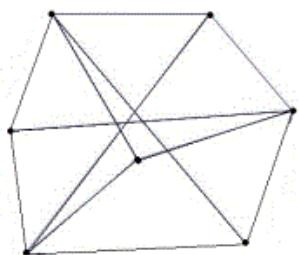

{0}------------------------------------------------

# 第十六届全国青少年信息学奥林匹克联赛初赛试题及解析

浙江省瑞安中学 张新华

(提高组 C++语言 二小时完成)

●● 全部试题答案均要求写在答卷纸上，写在试卷纸上一律无效●●

一.单项选择题(共 10 题，每题 1.5 分，共计 15 分。每题有且仅有一个正确选项。)

1.与 16 进制数 A1.2 等值的 10 进制数是 ( )。

A.101.2 B.111.4 C.161.125 D.177.25

2.一个字节(byte)由 ( ) 个二进制位组成。

A.8 B.16 C.32 D.以上都有可能

3.以下逻辑表达式的值恒为真的是 ( )

A. $P \vee (\neg P \wedge Q) \vee (\neg P \wedge \neg Q)$  B. $Q \vee (\neg P \wedge Q) \vee (P \wedge \neg Q)$   
C. $P \vee Q \vee (P \wedge \neg Q) \vee (\neg P \wedge Q)$  D. $P \vee \neg Q \vee (P \wedge \neg Q) \vee (\neg P \wedge Q)$

4.Linux 下可执行文件的默认扩展名为 ( )。

A.exe B.com C.dll D.以上都不是

5.如果在某个进制下等式  $7*7=41$  成立，那么在该进制下等式  $12*12=$  ( ) 也成立。

A.100 B.144 C.164 D.196

6.提出“存储程序”的计算机工作原理的是 ( )。

A.克劳德·香农 B.戈登·摩尔 C.查尔斯·巴比奇 D.冯·诺依曼

7.前缀表达式“ $+3*2+5\ 12$ ”的值是 ( )。

A.23 B.25 C.37 D.65

8.主存储器的存取速度比中央处理器(CPU)的工作速度慢很多，从而使得后者的效率受到影响。而根据局部性原理，CPU 所访问的存储单元通常都趋于聚集在一个较小的连续区域中。于是，为了提高系统整体的执行效率，在 CPU 中引入了 ( )。

A.寄存器 B.高速缓存 C.闪存 D.外存

9.完全二叉树的顺序存储方案，是指将完全二叉树的结点从上至下、从左至右依次存放到一个顺序结构的数组中。假定根结点存放在数组的 1 号位置，则第 K 号结点的父结点如果存在的话，应当存放在数组的 ( ) 号位置。

A. $2k$  B. $2k+1$  C. $k/2$  下取整 D. $(k+1)/2$  下取整

{1}------------------------------------------------

10.以下竞赛活动中历史最悠久的是（ ）。

- A.全国青少年信息学奥林匹克联赛（NOIP）
- B.全国青少年信息学奥林匹克竞赛（NOI）
- C.国际信息学奥林匹克竞赛（IOI）
- D.亚太地区信息学奥林匹克竞赛（APIO）

二.不定项选择题（共 10 题，每题 1.5 分，共计 15 分。每题有一个或多个正确选项。多选或少选均不得分。）

1.元素 R1、R2、R3、R4、R5 入栈的顺序为 R1、R2、R3、R4、R5。如果第一个出栈的是 R3，那么第五个出栈的可能是（ ）。

- A.R1 B.R2 C.R4 D.R5

2.Pascal 语言、C 语言、和 C++语言都属于（ ）。

- A.高级语言 B.自然语言 C.解释型语言 D.编译性语言

3.原地排序是指在排序过程中（除了存储待排序元素以外的）辅助空间的大小与数据规模无关的排序算法。以下属于原地排序的有（ ）。

- A.冒泡排序 B.插入排序 C.基数排序 D.选择排序

4.在整数的补码表示法中，以下说法正确的是（ ）。

- A.只有负整数的编码最高为 1
- B.在编码的位数确定后，所能表示的最小整数和最大整数的绝对值相同
- C.整数 0 只有唯一的一个编码
- D.两个用补码表示的数相加时，如果在最高位产生进位，则表示运算溢出

5.一颗二叉树的前序遍历序列是 ABCDEFG，后序遍历序列是 CBFEGDA，则根结点的左子树的结点个数可能是（ ）。

- A.0 B.2 C.4 D.6

6.在下列 HTML 语句中，可以正确产生一个指向 NOI 官方网站的超链接的是（ ）。

- A.<a href="http://www.noi.cn">欢迎访问 NOI 网站</a>
- B.<a href="http://www.noi.cn">欢迎访问 NOI 网站</a>
- C.<a href="http://www.noi.cn"></a>
- D.<a href="http://www.noi.cn">欢迎访问 NOI 网站</a>

7.关于拓扑排序，下面说法正确的是（ ）。

- A.所有连通的有向图都可以实现拓扑排序
- B.对同一个图而言，拓扑排序的结果是唯一的
- C.拓扑排序中入度为 0 的结点总会排在入度大于 0 的结点的前面
- D.拓扑排序结果序列中的第一个结点一定是入度为 0 的结点

8.一个平面的法线是指与该平面垂直的直线。过点 (1,1,1)、(0,3,0)、(2,0,0) 的平面的法线是（ ）。

- A.过点 (1,1,1)、(2,3,3) 的直线
- B.过点 (1,1,1)、(3,2,1) 的直线
- C.过点 (0,3,0)、(-3,1,1) 的直线
- D.过点 (2,0,0)、(5,2,1) 的直线

{2}------------------------------------------------

9.双向链表中有两个指针域 llink 和 rlink，分别指向该结点的前驱及后继。设 p 指向链表中的一个结点，它的左右结点均非空。现要求删除结点 P，则下面语句序列中正确的是（  
）。

- A. p->rlink->llink = p->rlink;  
p->llink->rlink = p->llink; delete p;
- B. P->llink->rlink = p->rlink;  
p->rlink->llink = p->llink; delete p;
- C. p->rlink->llink = p->llink;  
p->rlink->llink->rlink = p->rlink; delete p;
- D. p->llink->rlink = p->rlink;  
p->llink->rlink->llink = p->llink; delete p;

10.今年（2010）发生的事件有（  
）。

- A. 惠普实验室研究员 Vinay Deolalikar 自称证明了  $P \neq NP$
- B. 英特尔公司收购计算机安全软件公司迈克菲（McAfee）
- C. 苹果公司发布 iPhone 4 手机
- D. 微软公司发布 Windows 7 操作系统

三、问题求解（共 3 题，每题 5 分，共计 15 分）

1. LZW 编码是一种自适应词典编码。在编码的过程中，开始时只有一部基础构造元素的编码词典，如果在编码的过程中遇到一个新的词条，则该词条及一个新的编码会被追加到词典中，并用于后继信息的编码。

举例说明，考虑一个待编码的信息串：“xyx yy yy xyx”。初始词典只有 3 个条目，第一个为 x，编码为 1；第二个为 y，编码为 2；第三个为空格，编码为 3；于是串“xyx”的编码为 1-2-1（其中-为编码分隔符），加上后面的一个空格就是 1-2-1-3。但由于有了一个空格，我们就知道前面的“xyx”是一个单词，而由于该单词没有在词典中，我们就可以自适应的把这个词条添加到词典里，编码为 4，然后按照新的词典对后继信息进行编码，以此类推。于是，最后得到编码：1-2-1-3-2-2-3-5-3-4。

我们可以看到，信息被压缩了。压缩好的信息传递到接受方，接收方也只要根据基础词典就可以完成对该序列的完全恢复。解码过程是编码过程的逆操作。现在已知初始词典的 3 个条目如上述，接收端收到的编码信息为 2-2-1-2-3-1-1-3-4-3-1-2-1-3-5-3-6，则解码后的信息串是“\_\_\_\_\_”。

2. 无向图 G 有 7 个顶点，若不存在由奇数条边构成的简单回路，则它至多有\_\_\_\_\_条边。

3. 记 T 为一队列，初始时空，现有 n 个总和不超 32 的正整数依次入列。如果无论这些数具体为何值，都能找到一种出队的方式，使得存在某个时刻队列 T 中的数之和恰好为 9，那么 n 的最小值是\_\_\_\_\_。

四. 阅读程序写结果（共 4 题，每题 7 分，共计 28 分）

{3}------------------------------------------------

1.

```
#include <iostream>
using namespace std;
```

```
int main() {
    const int SIZE =10;
    int data[SIZE], i, j, cnt, n, m;
    cin>>n>>m;
    for(i = 1; i <= n; i++)
        cin>>data[i];
    for(i = 1; i <= n; i++) {
        cnt = 0;
        for(j = 1; j<= n; j++)
            if ((data[i] < data[j]) || (data[j] == data[i] && j< i))
                cnt++;
        if(cnt == m)
            cout<<data[i]<<endl;
    }
    return 0;
}
```

输入：

5 2

96 -8 0 16 87

输出：

2.

```
#include <iostream>
using namespace std;
```

```
int main()
{
    const int SIZE=100;
    int na, nb, a[SIZE], b[SIZE], i, j, k;
    cin>>na;
    for (i = 1; i <= na; i++)
        cin>>a[i];
    cin>>nb;
    for (i = 1; i <= nb; i++)
        cin>>b[i];
    i=1;
    j=1;
    while ((i <= na) && (j <= nb)) {
```

{4}------------------------------------------------

```

        if (a[i] <= b[j]) {
            cout<<a[i]<<' ';
            i++;
        }
        else {
            cout<<b[j]<<' ';
            j++;
        }
    }
    if (i <= na)
        for (k = i; k<= na; k++)
            cout<<a[k]<<' ';
    if (j <= nb)
        for (k = j; k<= nb; k++)
            cout<<b[k]<<' ';
    return 0;
}
输入:
5
1 3 5 7 9
4
2 6 10 14
输出: 

```

3.

```

#include <iostream>
using namespace std;

const int NUM=5;

int r(int n)
{
    int i;
    if(n<=NUM)
        return n;
    for(i=1;i<=NUM;i++)
        if(r(n-i)<0)
            return i;
    return -1;
}

int main()
{

```

{5}------------------------------------------------

```
    int n;
    cin>>n;
    cout<<r(n)<<endl;
    return 0;
}

```

输入：16

输出：

4.

```
#include <iostream>
using namespace std; 
const int size=100;

```

```
int n,m,r[size];
bool map[size][size],found;

```

```
bool successful()
{
    int i;
    for(i=1;i<=n;i++)
        if(!map[r[i]][r[i%n+1]])
            return false;
    return true;
}

```

```
void swap(int *a,int *b)
{
    int t;
    t=*a;
    *a=*b;
    *b=t;
}

```

```
void perm(int left,int right)
{
    int i;
    if(found)
        return;
    if(left>right)
    {
        if(successful())
        {
            for(i=1;i<=n;i++)
                cout<<r[i]<<' ';

```

{6}------------------------------------------------

```

        found=true;
    }
    return;
}
for(i=left;i<=right;i++)
{
    swap(r+left,r+i);
    perm(left+1,right);
    swap(r+left,r+i);
}
}

int main()
{
    int x,y,i;
    cin>>n>>m;
    memset(map,false,sizeof(map));
    for(i=1;i<=m;i++)
    {
        cin>>x>>y;
        map[x][y]=true;
        map[y][x]=true;
    }
    for(i=1;i<=n;i++)
        r[i]=i;
    found=false;
    perm(1,n);
    if(!found)
        cout<<"No soloution!"<<endl;
    return 0;
}

```

输入:

```

9 12
1 2
2 3
3 4
4 5
5 6
6 1
1 7
2 7
3 8
4 8

```

{7}------------------------------------------------

5 9

6 9

输出: \_\_\_\_\_

五、完善程序（第 1 空 2 分，其余 10 空，每空 2.5 分，共计 27 分）

1.(过河问题) 在一个月黑风高的夜晚,有一群人在河的右岸,想通过唯一的一根独木桥走到河的左岸.在伸手不见五指的黑夜里,过桥时必须借照灯光来照明,不幸的是,他们只有一盏灯.另外,独木桥上最多能承受两个人同时经过,否则将会坍塌.每个人单独过独木桥都需要一定的时间,不同的人要的时间可能不同.两个人一起过独木桥时,由于只有一盏灯,所以需要的时间是较慢的那个人单独过桥所花费的时间.现在输入  $N(2 \leq N < 1000)$  和这  $N$  个人单独过桥需要的时间,请计算总共最少需要多少时间,他们才能全部到达河左岸。

例如,有 3 个人甲、乙、丙,他们单独过桥的时间分别为 1 2 4,则总共最少需要的时间为 7.具体方法是:甲 乙一起过桥到河的左岸,甲单独回到河的右岸将灯带回,然后甲,丙在一起过桥到河的左岸,总时间为  $2+1+4=7$ 。

```
#include <iostream>
using namespace std;

const int size=100;
const int infinity=10000;
const bool Left=true;
const bool Right=false;
const bool left_to_right=true;
const bool right_to_left=false;

int n,hour[size];
bool pos[size];

int max(int a,int b)
{
    if(a>b)
        return a;
    else
        return b;
}

int go(bool stage)
{
    int i,j,num,tmp,ans;
    if(stage==right_to_left)
    {
        num=0;
        ans=0;
        for(i=1;i<=n;i++)
```

{8}------------------------------------------------

```

        if(pos[i]==Right)
        {
            num++;
            if(hour[i]>ans)
                ans=hour[i];
        }
        if(____(1)____)
            return ans;
        ans=infinity;
        for(i=1;i<=n-1;i++)
            if(pos[i]==Right)
                for(j=i+1;j<=n;j++)
                    if(pos[j]==Right)
                    {
                        pos[i]=Left;
                        pos[j]=Left;
                        tmp=max(hour[i],hour[j])+ ____ (2) ____;
                        if(tmp<ans)
                            ans=tmp;
                        pos[i]=Right;
                        pos[j]=Right;
                    }
        return ans;
    }
    if(stage==left_to_right)
    {
        ans=infinity;
        for(i=1;i<=n;i++)
            if(____(3)____)
            {
                pos[i]=Right;
                tmp=____(4)____;
                if(tmp<ans)
                    ans=tmp;
                ____ (5) ____;
            }
        return ans;
    }
    return 0;
}

int main()
{
    int i;

```

{9}------------------------------------------------

```

cin>>n;
for(i=1;i<=n;i++)
{
    cin>>hour[i];
    pos[i]=right;
}
cout<<go(right_to_left)<<endl;
return 0;
}

```

2. (烽火传递) 烽火台又称烽燧，是重要的防御设施，一般建在险要处或交通要道上。一旦有敌情发生，白天燃烧柴草，通过浓烟表达信息；夜晚燃烧干柴，以火光传递军情。在某两座城市之间有  $n$  个烽火台，每个烽火台发出信号都有一定的代价。为了使情报准确的传递，在  $m$  个烽火台中至少要有一个发出信号。现输入  $n$ 、 $m$  和每个烽火台发出的信号的代价，请计算总共最少需要话费多少代价，才能使敌军来袭之时，情报能在这两座城市之间准确的传递。

例如，有 5 个烽火台，它们发出信号的代价依次为 1、2、5、6、2，且  $m$  为 3，则总共最少花费的代价为 4，即由第 2 个和第 5 个烽火台发出信号。

```

#include <iostream>
using namespace std;
const int size=100;
int n,m,r,value[size],heap[size],pos[size],home[size],opt[size];
//heap[i]表示用顺序数组存储的堆 heap 中第 i 个元素的值
//pos[i]表示 opt[i]在堆 heap 中的位置，即 heap[pos[i]]=opt[i]
//home[i]表示 heap[i]在序列 opt 中的位置，即 opt[home[i]]=heap[i]

void swap(int i,int j)
//交换堆中的第 i 个和第 j 个元素
{
    int tmp;
    pos[home[i]]=j;
    pos[home[j]]=i;
    tmp=heap[i];
    heap[i]=heap[j];
    heap[j]=tmp;
    tmp=home[i];
    home[i]=home[j];
    home[j]=tmp;
}

void add(int k)
//在堆中插入 opt[k]
{

```

{10}------------------------------------------------

```

    int i;
    r++;
    heap[r]= (1);
    pos[k]=r;
    (2);
    i=r;
    while((i>1) && (heap[i]<heap[i/2]))
    {
        swap(i,i/2);
        i/=2;
    }
}

void remove(int k)
//在堆中删除 opt[k]
{
    int i,j;
    i=pos[k];
    swap(i,r);
    r--;
    if(i==r+1)
        return;
    while((i>1) && (heap[i]<heap[i/2]))
    {
        swap(i,i/2);
        i/=2;
    }
    while(i+i<=r)
    {
        if((i+i+1<=r) && (heap[i+i+1]<heap[i+i]))
            j=i+i+1;
        else
            (3);
        if(heap[i]>heap[j])
        {
            (4);
            i=j;
        }
        else
            break;
    }
}

int main()

```

{11}------------------------------------------------

```

{
    int i;
    cin >> n >> m;
    for(i=1; i<=n; i++)
        cin >> value[i];
    r=0;
    for(i=1; i<=m; i++)
    {
        opt[i]=value[i];
        add(i);
    }
    for(i=m+1; i<=n; i++)
    {
        opt[i]= (5) ;
        remove( (6) );
        add(i);
    }
    cout << heap[1] << endl;
    return 0;
}

```

## 分析与解答:

### 一. 单项选择题

1. 简单的进制转换,  $(A1.2)_{16}=10 \times 16+1 \times 16^{-1}=161.125$ , 因此答案选 C。

2. 计算机基础知识, 1B (Byte) = 8b(bit); 因此答案选 A。

3. 考察逻辑代数及化简。用到了逻辑代数的常用公式如:

$$
AB + \overline{AB} = A
$$

$$
A + \overline{A} = 1
$$

$$
A + \overline{AB} = A + B
$$

以选项 A 为例: 原式可化为  $P \oplus \overline{PQ} \oplus \overline{PQ} = P + \overline{P} = 1$ , 因此答案直接选 A。

4. 考查 Linux 基础知识, exe 和 com 均是 windows 下的可执行文件, dll 是动态链接库文件, 并非可执行文件。因此选 D。

{12}------------------------------------------------

5. 十进制的  $7 \times 7 = 49$ , X 进制下却为 41, 说明  $X > 10$ , 因此 X 进制下的  $7 \times 7$  也即是 10 进制下的  $7 \times 7$ , 即  $(41)_X = 4 \times X + 1 = (49)_{10}$ , 得  $X = 12$ . 因此,  $(12 \times 12)_{10} = (14 \times 14)_{10} = (196)_{10}$ ;  $(196)_{10} = (144)_{12}$ . 因此答案是 144, 选择 B。

6. 克劳德·香农 (Claude Elwood Shannon), 美国数学家、信息论的创始人; 戈登·摩尔 (Gordon Moore), Intel 公司的创始人之一, 1965 年提出“摩尔定律”; 查尔斯·巴比奇 (Charles Babbage), 十九世纪的英国数学家, 发明了世界上第一台机械计算机——差分机; 约翰·冯·诺依曼 (John von Neumann) 提出“存储程序”的计算机工作原理, 该理论的要点是: 数字计算机的数制采用二进制, 计算机应该按照程序顺序执行。人们把冯·诺依曼的这个理论称为冯·诺依曼体系结构。因此答案选择 D。

7. 前缀表达式的运算规则是用栈保存操作符和操作数, 当连续的操作数的个数为 2 时弹出两操作数和操作符运算后再压栈。因此前缀表达式“ $+3*2+5\ 12$ ”运算时是先依次存入  $+3*2+5$ , 当读入 12 时, 取出 5 和“+”号与 12 进行加法运算得结果 17, 17 与 2 又是连续的 2 个操作数, 取出“\*”号进行乘法运算得 34, 最后  $34+3=37$ 。因此答案选 C。

8. 寄存器是中央处理器内的组成部分。寄存器是有限存储容量的高速存储部件, 它们可用来暂存指令、数据和位址。在中央处理器的控制部件中, 包含的寄存器有指令寄存器(IR)和程序计数器(PC)。在中央处理器的算术及逻辑部件中, 包含的寄存器有累加器(ACC)。

高速缓存是为了大幅提升系统的执行效率, 在 CPU 与主存储器之间, 使用速度最快之 SRAM 来作为 CPU 的数据快取区, 目的是为了让数据访问的速度适应 CPU 的处理速度, 其基于的原理是内存中“程序执行与数据访问的局域性行为”, 即一定程序执行时间和空间内, 被访问的代码集中于一部分。

闪存 (Flash Memory) 是一种长寿命的非易失性 (在断电情况下仍能保持所存储的数据信息) 的存储器, 通常被用来保存设置信息, 如在电脑的 BIOS (基本输入输出程序)、PDA (个人数字助理)、数码相机中保存资料等。

存储器按照用途分为主存储器和辅助存储器, 主存储器又称内存储器 (简称内存), 辅助存储器又称外存储器 (简称外存)。外存通常是磁性介质或光盘, 像硬盘, 软盘, 磁带, CD 等, 能长期保存信息, 并且不依赖于电来保存信息, 速度与 CPU 相比就显得慢的多。因此答案选 B。

9. 完全二叉树的性质中有一条是: 除树根结点外, 若一个结点的编号为  $i$ , 则它的双亲结点的编号为  $[i/2]$ , 也就是说, 当  $i$  为偶数时, 其双亲结点的编号为  $i/2$ , 它是双亲结点的左孩子, 当  $i$  为奇数时, 其双亲结点的编号为  $(i-1)/2$ , 它是双亲结点的右孩子。因此答案为 C。

10. 考查对信息学竞赛的了解程度。1984 年邓小平指出: “计算机的普及要从娃娃做起。”教育部和中国科协委托中国计算机学会举办了全国青少年计算机程序设计竞赛 (简称: NOI), 答案为 B。

### 二、不定项选择题

1. 例如第五个出栈为 R4 的过程如下: R3 出栈, R2 出栈, R1 出栈, R4 入栈, R5 入栈,

{13}------------------------------------------------

R5 出栈, R4 出栈。其他的可能顺序依此类推即可, 唯有 R2 是不可能最后出栈的, 因为 R1 在栈底。因此答案选 ACD。

2. 自然语言通常是指一种自然地随文化演化的语言, 如英语、汉语、法语等, 与之相对应的是如编程语言等为计算机而设的“人造”语言。

计算机语言具有高级语言和低级语言之分。低级语言分机器语言(二进制语言)和汇编语言(符号语言), 这两种语言都是面向机器的语言, 和具体机器的指令系统密切相关, 难学难记, 于是人们又发明了更加易用的所谓高级语言。在这种语言下, 其语法和结构更类似普通英文, 且由于远离对硬件的直接操作, 使得一般人经过学习之后都可以编程。如 C/C++, Pascal 等。

编译性语言写的程序须编译成机器语言文件才可执行, 比如 exe 文件, 以后要运行的话就不用重新翻译了, 直接使用编译的结果就行了(exe 文件), 因为翻译只做了一次, 运行时不需要翻译, 所以编译型语言的程序一般执行效率较高。

解释型语言编写的程序不需要编译, 只是在运行程序的时候才翻译, 比如解释性 basic 语言, 专门有一个解释器能够直接执行 basic 程序, 每个语句都是执行的时候才翻译。这样解释性语言每执行一次就要翻译一次, 效率比较低。但兼容性高。因此答案选 AD。

3. 理解各种排序的基本原理即能选择正确的答案, 其中基数排序又叫“桶排序”, 特点是数据规模越大, 辅助空间就越大。答案为 ABD。

4. 考查补码的相关知识。如果补码的符号位为“0”, 表示是一个正数, 如果补码的符号位为“1”, 表示是一个负数, 因此选项 A 正确。

例如 8 位补码能够表示数的范围是 -128~127。10000000 表示最小值-128, 01111111 表示最大值 127, 因此选项 B 不正确。

+0 的补码就是其原码, 也就是说 0000 0000 而已(对于 8 位来说), -0 的补码是其反码加 1, 其反码是 1111 1111, 当然, 其反码加 1 后就是溢出一个进位后, 仍然是 0000 0000, 因此整数 0 只有唯一一个编码。因此选项 C 正确。

我们再来计算(-4)+(-4)的值, 下式补码的运算是正确的, 因此是否溢出还是正常进位, 是由计算机来判断的。计算机中常用的溢出判别称为双高位判别法。因此选项 D 不正确。

$$
\begin{array}{r} 11100 \\ +) 11100 \\ \hline 111000 = -8 \end{array}
$$

↑  
符号位的进位自动丢失

二进制的补码运算

5. 考察二叉树的遍历, 首先前序遍历顺序是根节点--左子树--右子树, 而后序遍历顺序是左子树--右子树--根节点, A 是根节点, 又由后序遍历知 D 必然是右子树的根节点, D 前面的 ABC 中 A 是根节点, 剩下的 BC 两个节点必然是左子树的, 因此答案选 B。

{14}------------------------------------------------

6. 考察 HTML 的相关知识。超链接的格式是 `<a href=" " ></a>`, 因此答案选 B。

7. 拓扑排序是图论的基本算法之一; 例如一件事情可以细分为很多工作, 但是这些工作是有一定顺序的, 某些工作必须要等到另外的工作完成才可以进行。确定这个顺序的过程就是拓扑排序。算法思想是把整个事情看成一个有向无环图, 每一个工作是一个点, 如点 A 到 B 有弧则表示工作 B 必须在工作 A 之后完成。具体实现过程为:

(1) 在图中选一个没有前趋的顶点并输出之, (该顶点并非唯一)

(2) 删除该顶点及由它发出的各边 (与它相连的顶点可能入度减为零), 直到图中不存在没有前趋的顶点为止。

若图中存在回路, 拓扑排序无法进行。因此答案选 D。

8. 考察立体几何知识, 设向量  $(x, y, z)$  垂直于该平面, 则向量  $(x, y, z)$  垂直于该平面所有向量, 又由于两个  $n$  维向量, 若其点积为 0, 则两向量垂直。根据题意, 位于该平面上的向量有:

$$
\vec{V1} = (1, 1, 1) - (0, 3, 0) = (1, -2, 1)
$$

$$
\vec{V2} = (1, 1, 1) - (2, 0, 0) = (-1, 1, 1)
$$

$$
\vec{V3} = (0, 3, 0) - (2, 0, 0) = (-2, 3, 0)
$$

根据向量的点积, 列出方程组如下:

$$
\begin{cases} x-2y+z=0 \\ -x+y+z=0 \\ -2x+3y=0 \end{cases} \longrightarrow \begin{cases} x=\frac{2}{3}y \\ y=y \\ z=\frac{1}{2}y \end{cases}
$$

因此, 所有为  $(3, 2, 1)$  倍数的向量均为该平面的垂直线。四个答案中:

A.  $(1, 1, 1) - (2, 3, 3) = (-1, -2, -2)$

B.  $(1, 1, 1) - (3, 2, 1) = (-2, -1, 0)$

C.  $(0, 3, 0) - (-3, 1, 1) = (3, 2, -1)$

D.  $(2, 0, 0) - (5, 2, 1) = (-3, -2, -1)$

只有 D 符合条件, 故选 D。

9. 考查双向链表知识, 双向链表参见下图: 模拟程序运行即可, 故答案为 BCD。

![Diagram of a doubly linked list with three nodes. Each node has three fields: llink, data, and rlink. The first node has data 'x', the second has data 'p', and the third has data 'x'. The llink of the first node points to the rlink of the third node. The rlink of the first node points to the llink of the second node. The llink of the second node points to the rlink of the first node. The rlink of the second node points to the llink of the third node. The llink of the third node points to the rlink of the second node.](95cd9f56a54683029052b8c644228506_img.jpg)

```
graph LR; Node1["llink | x | rlink"]; Node2["llink | p | rlink"]; Node3["llink | x | rlink"]; Node1 -- rlink --> Node2; Node2 -- llink --> Node1; Node2 -- rlink --> Node3; Node3 -- llink --> Node2; Node1 -- llink --> Node3; Node3 -- rlink --> Node1;
```

Diagram of a doubly linked list with three nodes. Each node has three fields: llink, data, and rlink. The first node has data 'x', the second has data 'p', and the third has data 'x'. The llink of the first node points to the rlink of the third node. The rlink of the first node points to the llink of the second node. The llink of the second node points to the rlink of the first node. The rlink of the second node points to the llink of the third node. The llink of the third node points to the rlink of the second node.

{15}------------------------------------------------

10. 时事题, Windows7 是 2009 年 10 月由微软发布的。因此答案为 ABC。

### 三. 问题求解

1. 很简单的模拟题, 根据规则可得 yyxy=4, xx=5, xyx=6, 答案为 yyxy xx yyxy xyx xx xyx。

2. 定理: 无向图 G 为二分图的充分必要条件是, G 至少有两个顶点, 且其所有回路的长度均为偶数, 可知此题是一个二分图问题。将顶点分为两个不相交的的集, 使得在同一个集内的顶点不相邻, 共有三种分法, 即一边是 3 一边是 4、一边是 2 一边是 5 和一边是 1 一边是 6。由于  $3 \times 4 > 2 \times 5 > 1 \times 6$ , 因此答案为 12。参考图形如下:



A graph with 6 vertices and 10 edges, illustrating a bipartite graph partitioning problem. The vertices are arranged in a roughly hexagonal shape with internal connections.

3. 本题可用抽屉原理求解。设  $a_i$  为各正整数值, 则 T 的队列顺序为  $a_1 a_2 \dots a_n$ , 设  $b_i$  为前 i 项数之和, 则  $b_0=0, b_1=a_1, b_2=a_1+a_2, b_3=a_1+a_2+a_3 \dots$ 。如队列 T 中的数之和恰好为 9, 实际上即是找到某个  $b_j$  和  $b_i$ , 使得  $b_j - b_i = 9$ 。由题意可知  $b_i$  取值范围为 1-32, 现将这 32 个数构造为集合  $\{1,10\}, \{2,11\}, \dots, \{8,17\}, \{18,27\}, \{19,28\}, \dots, \{23,32\}, \{24\}, \{25\}, \{26\}$ , 这 17 个集合中的任一个集合不能包含两个或两个以上的  $b_i$ , 否则它们的差为 9。例如设 n=17 时, 队列 T 为 11111111 10 11111111, 即  $b_1=1, b_2=2, \dots, b_8=8, b_9=18, b_{10}=19, b_{11}=20 \dots, b_{17}=26$ , 它们中没有任何两个数是在同一集合内的, 所以不存在数之和恰好等于 9。

故根据抽屉原理可得, 当 n=18 时, 至少存在两个  $b_i$  在同一个集合, 即它们的差为 9。因此, 答案为 n=18。

### 四. 阅读程序写结果

1. 简单模拟题, 程序从五个数中找到一个数, 使得有 m 个数比该数字大。输出结果为 6。

{16}------------------------------------------------

2. 简单算法题, 考的是归并排序, 程序对两个有序数组的数进行归并操作并输出有序数列。输出结果为 1 2 3 5 6 7 9 10 14。

3. 考查递归, 可寻找到规律, 即下面的式子:

$$
r(n) = \begin{cases} n \% 6 & (n \% 6 \neq 0) \\ -1 & (n \% 6 = 0) \end{cases}
$$

因此输出结果为 4。

4. 考查图论知识里的哈密尔顿图, 即由指定的起点前往指定的终点, 途中经过所有其他节点且只经过一次。输出结果为 1 6 9 5 4 8 3 2 7。

### 五. 完善程序

1. 答案如下:

① num <= 2 (或 num < 3 或 num == 2)

② go(LEFT\_TO\_RIGHT)

③ pos[i] == LEFT (或 LEFT == pos[i])

④ hour[i] + go(RIGHT\_TO\_LEFT) (或 go(RIGHT\_TO\_LEFT) + hour[i])

注: 如果是 C 或 pascal 语言, 答案为 time[i] + go(RIGHT\_TO\_LEFT) (或 go(RIGHT\_TO\_LEFT) + time[i])

⑤ pos[i] = LEFT

分析: 本题描述的实际是一个网上流行的 Flash 趣味小游戏, 游戏中是一家 5 口人过河, 每个人单独过桥时间为 1, 3, 6, 8, 12, 我们最容易想到的方案是用最快的人 (用 1 来指代该人) 来充当运输工具, 但实际上这并不是最优的, 正确方案是:

(1) 1 和 3 先过河, 1 带灯回来, 时间为 3+1=4 秒;

(2) 8 和 12 过河 (最优选择), 3 带灯回来, 时间为 12+3=15 秒;

(3) 1 和 6 过河, 1 带灯回来, 时间为 6+1=7 秒;

(4) 1 和 3 过河, 时间为 3 秒;

共计花费 29 秒。明白了思路, 程序就好编写了。本程序采用的是递归方式穷举所有可能以获得最优解, 关键函数 go() 代码注释如下:

```
int go(bool stage)//stage 用于控制这一步是从左岸到右岸还是从右岸到左岸
{
    int i,j,num,tmp,ans;//num 为人数, ans 为花费的总时间
    if(stage==right_to_left)//如果这一步是从右岸到左岸
    {
        num=0;
        ans=0;
        for(i=1;i<=n;i++)
            if(pos[i]==Right)
```

{17}------------------------------------------------

```

    {
        num++; //统计没过河的人数
        if(hour[i]>ans)
            ans=hour[i]; //获取最慢的人花费的时间给 ans
    }
    if(num<=2) //如果右岸只剩两个人
        return ans; //直接过河，输出时间即可，递归结束
    ans=infinity; //否则先将时间初始为最大值 1000
    for(i=1;i<=n-1;i++) //找出没过河的两人组的所有组合
        if(pos[i]==Right) //如果第 i 人没过河
            for(j=i+1;j<=n;j++)
                if(pos[j]==Right) //如果第 j 人没过河 (j>i)
                {
                    pos[i]=Left; //使第 i 人过河
                    pos[j]=Left; //使第 j 人过河
                    //计算两人从左岸到右岸花费时间及后续花费时间之和
                    tmp=max(hour[i],hour[j])+go(left_to_right); //后续时间将由递归求得
                    if(tmp<ans) //选择最短时间
                        ans=tmp;
                    pos[i]=Right; //恢复 i 到右岸以进行下一步递归穷举
                    pos[j]=Right; //恢复 j 到右岸
                }
    return ans;
}
if(stage==left_to_right) //如果这一步是从左岸选一人带灯回右岸
{
    ans=infinity; //先将时间初始化为最大值 10000
    for(i=1;i<=n;i++) //穷举所有在左岸的人进行带灯回右岸的尝试
        if(pos[i]==Left) //如果第 i 人在左岸
        {
            pos[i]=Right; //使此人回右岸
            //计算该步花费时间及后续花费全部时间之和，后续花费时间将由递归求得
            tmp=hour[i]+go(right_to_left);
            if(tmp<ans) //选择最优时间
                ans=tmp;
            pos[i]=Left; //恢复第 i 人到左岸以进行下一步递归穷举
        }
    return ans;
}
return 0;
}

```

2. 答案如下:

① opt[k]

{18}------------------------------------------------

② home[r] = k

③  $j = i + i$  (或  $j = 2 * i$  或  $j = i * 2$ )

④ swap(i, j) (或 swap(j, i))

⑤ value[i] + heap[1] (或 heap[1] + value[i])

⑥ i - m

分析：本题算法是动态规划+小根堆排序。

设  $F[i]$  表示将信息从 1 传到  $i$  所需花费的最小代价，点燃  $i$  之前，必须先点燃  $[i-M+1, i-1]$  区间中的某一个烽火台，因此状态转移方程为  $F[i] = \text{MIN}(F[k] + \text{value}[i])$ ;  
( $K \in [i-M+1, i-1]$ )。

由于小根堆对  $F[k]$  中的值进行排序，并将最小的值赋给 heap[1]，因此状态转移方程即化简为： $F[i] = \text{heap}[1] + \text{value}[i]$ 。

如果能熟练掌握堆排序和理解状态转移方程，就可以很容易看懂程序，此处不再赘述。