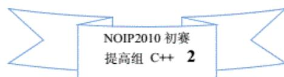
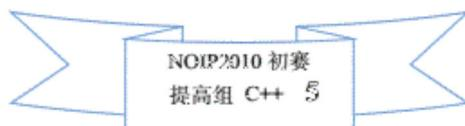
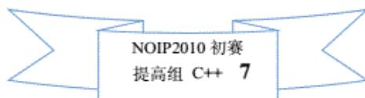
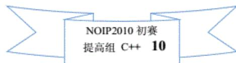

{0}------------------------------------------------

# 第十六届全国青少年信息学奥林匹克联赛初赛试题

## (普及组 C++语言 两小时完成)

●● 全部试题答案均要求写在答卷纸上，写在试卷纸上一律无效 ●●

## 一、单项选择题 (共 20 题，每题 1.5 分，共计 30 分。每题有且仅有一个正确选项。)

1.  $2E+03$  表示 ( )。  
A. 2.03                      B. 5                      C. 8                      D. 2000
2. 一个字节 (byte) 由 ( ) 个二进制位组成。  
A. 8                      B. 16                      C. 32                      D. 以上皆有可能
3. 以下逻辑表达式的值恒为真的是 ( )。  
A.  $P \vee (\neg P \wedge Q) \vee (\neg P \wedge \neg Q)$                       B.  $Q \vee (\neg P \wedge Q) \vee (P \wedge \neg Q)$   
C.  $P \vee Q \vee (P \wedge \neg Q) \vee (\neg P \wedge Q)$                       D.  $P \vee \neg Q \vee (P \wedge \neg Q) \vee (\neg P \wedge \neg Q)$
4. Linux 下可执行文件的扩展名为 ( )。  
A. exe                      B. com                      C. dll                      D. 以上都不是
5. 如果树根算第 1 层，那么一棵  $n$  层的二叉树最多有 ( ) 个结点。  
A.  $2^{n-1}$                       B.  $2^n$                       C.  $2^{n+1}$                       D.  $2^{n+1}$
6. 提出“存储程序”的计算机原理的是 ( )。  
A. 克劳德·香农                      B. 戈登·摩尔                      C. 查尔斯·巴比奇                      D. 冯·诺依曼
7. 设  $X$ 、 $Y$ 、 $Z$  分别代表三进制下的一位数字，若等式  $XY+ZX=XYX$  在三进制下成立，那么同样在三进制下，等式  $XY*ZX=( )$  也成立。  
A.  $YXZ$                       B.  $ZXY$                       C.  $XYZ$                       D.  $XZY$
8. Pascal 语言、C 语言和 C++ 语言都属于 ( )。  
A. 面向对象语言                      B. 脚本语言                      C. 解释性语言                      D. 编译性语言
9. 前缀表达式“ $+3*2+5\ 12$ ”的值是 ( )。  
A. 23                      B. 25                      C. 37                      D. 65
10. 主存储器的存取速度比中央处理器 (CPU) 的工作速度慢得多，从而使得后者的效率受到影响。而根据局部性原理，CPU 所访问的存储单元通常都趋于聚集在一个较小的连续区域中。于是，为了提高系统的整体执行效率，在 CPU 中引入 ( )。  
A. 寄存器                      B. 高速缓存                      C. 闪存                      D. 外存
11. 一个字长为 8 位的整数的补码是 1111 1001，则它的原码是 ( )。  
A. 0000 0111                      B. 0111 1001                      C. 1111 1001                      D. 1000 0111

{1}------------------------------------------------

- 
- 12. 基于比较的排序时间复杂度的下限是 ( ), 其中  $n$  表示待排序的元素个数。  
A.  $\Theta(n)$   
B.  $\Theta(n \log n)$   
C.  $\Theta(\log n)$   
D.  $\Theta(n^2)$
- 13. 一个自然数在十进制下有  $n$  位, 则它在二进制下的位数与 ( ) 最接近。  
A.  $5n$             B.  $n \cdot \log_2 10$             C.  $10 \cdot \log_2 n$             D.  $10 \cdot \log_2 n$
- 14. 在下列 HTML 语句中, 可以正确产生一个指向 NOI 官方网站的超链接的是 ( )。  
A. `<a href="http://www.noi.cn">欢迎访问 NOI 网站</a>`  
B. `<a href="http://www.noi.cn">欢迎访问 NOI 网站</a>`  
C. `<a href="http://www.noi.cn">`  
D. `<a href="http://www.noi.cn">欢迎访问 NOI 网站</a>`
- 15. 元素  $R_1, R_2, R_3, R_4, R_5$  入栈的顺序为  $R_1, R_2, R_3, R_4, R_5$ 。如果第一个出栈的是  $R_3$ , 那么第五个出栈的不可能是 ( )。  
A.  $R_1$             B.  $R_2$             C.  $R_4$             D.  $R_5$
- 16. 双向链表中有两个指针域 `llink` 和 `rlink`, 分别指向该结点的前驱和后继。设  $P$  指向链表中的一个结点, 它的左右结点均非空。现要求删除结点  $P$ , 则下面语句序列中错误的是 ( )。  
A. `P^rlink^llink = P^rlink;`  
`P^llink^rlink = P^llink; dispose(P)`  
B. `P^llink^rlink = P^rlink;`  
`P^rlink^llink = P^llink; dispose(P)`  
C. `P^rlink^llink = P^llink;`  
`P^rlink^llink ^rlink = P^rlink; dispose(P)`  
D. `P^llink^rlink = P^rlink;`  
`P^llink^rlink^llink = P^llink; dispose(P)`
- 17. 一棵二叉树的前序遍历序列是 ABCDEFG, 后序遍历序列是 CBFEGDA, 则根结点的左子树的结点个数可能是 ( )。  
A. 2            B. 3            C. 4            D. 5
- 18. 关于拓扑排序, 下面说法正确的是 ( )。  
A. 所有连通的有向图都可以实现拓扑排序  
B. 对同一个图而言, 拓扑排序的结果是唯一的  
C. 拓扑排序中入度为 0 的结点总会排在入度大于 0 的结点前面  
D. 拓扑排序结果序列中的第一个结点一定是入度为 0 的点
- 19. 完全二叉树的顺序存储方案, 是指将完全二叉树的结点从上至下、从左至右依次存放到一个顺序结构的数组中。假定根结点存放在数组的 1 号位置, 则第  $K$  号结点的父结点如果存在的话, 应当存放在数组的 ( ) 号位置。



A decorative banner with a blue border and a white center. The text inside the banner is "NOIP2010 初赛" on the top line, "提高组 C++" on the second line, and "2" on the third line.

NOIP2010 初赛 提高组 C++ 2

{2}------------------------------------------------

A.  $2k$       B.  $2k+1$       C.  $k/2$  下取整      D.  $(k+1)/2$  下取整

20. 全国青少年信息学奥林匹克系列活动的主办单位是（ ）。

- A. 教育部                                      B. 科技部  
C. 共青团中央                                  D. 中国计算机协会

## 二. 问题求解（共 2 题，每空 5 分，共计 10 分）

1. LZW 编码是一种自适应词典编码。在编码的过程中，开始时只有一部基础构造元素的编码词典，如果在编码的过程中遇到一个新的词条，则该词条及一个新的编码会被追加到词典中，并用于后继信息的编码。

举例说明，考虑一个待编码的信息串：“xyx yy yy xyx”。初始词典只有 3 个条目，第一个为 x，编码为 1；第二个为 y，编码为 2；第三个为空格，编码为 3；于是串“xyx”的编码为 1-2-1（其中-为编码分隔符），加上后面的一个空格就是 1-2-1-3。但由于有了一个空格，我们就知道前面的“xyx”是一个单词，而由于该单词没有在词典中，我们就可以自适应的把这个词条添加到词典里，编码为 4，然后按照新的词典对后继信息进行编码，以此类推。于是，最后得到编码：

1-2-1-3-2-2-3-5-3-4。

现在已知初始词典的 3 个条目如上述，则信息串“yyxy xx yyxy xyx xx xyx”的编码是\_\_\_\_\_。

2. 队列快照是指某一时刻队列中的元素组成的有序序列。例如，当元素 1、2、3 入队，元素 1 出队后，此刻的队列快照“2 3”。当元素 2、3 也出队后，队列快照是“ ”，即为空。现有 3 个正整数元素依次入队、出队。已知它们的和为 8，则共有\_\_\_\_\_种可能的不同的队列快照（不同队列的相同快照只计一次）。例如，“5 1”，“4 2 2”，“ ”都是可能的队列快照；而“7”不是可能的队列快照，因为剩下的 2 个正整数的和不可能为 1。

## 三. 阅读程序写结果（共 4 题，每题 8 分，共计 32 分）

```
1.
#include<iostream>
using namespace std;
void swap(int &a,int &b)
{
    int t;
    t=a;
    a=b;
    b=t;
}
int main()
{
    int a1,a2,a3,x;
    cin>>a1>>a2>>a3;
    if(a1>a2)
        swap(a1,a2);
```

{3}------------------------------------------------

```

    if(a2>a3)
        swap(a2,a3);
    if(a1>a2)
        swap(a1,a2);
    cin>>x;
    if(x<a2)
        if(x<a1)
            cout<<x<<' '<<a1<<' '<<a2<<' '<<a3<<endl;
        else
            cout<<a1<<' '<<x<<' '<<a2<<' '<<a3<<endl;
    else
        if(x<a3)
            cout<<a1<<' '<<a2<<' '<<x<<' '<<a3<<endl;
        else
            cout<<a1<<' '<<a2<<' '<<a3<<' '<<x<<endl;
    return 0;
}

```

输入:

91 2 20

77

输出: \_\_\_\_\_

2.

```

#include<iostream>
using namespace std;
int rSum(int j)
{
    int sum=0;
    while(j!=0)
    {
        sum=sum*10+(j%10);
        j=j/10;
    }
    return sum;
}
int main()
{
    int n,m,i;
    cin>>n>>m;
    for(i=n;i<m;i++)
        if(i==rSum(i))
            cout<<i<<' ';
    return 0;
}

```

{4}------------------------------------------------

}

输入:

90 120

输出:

3.

#include<iostream>

#include<string>

using namespace std;

int main()

{

string s;

char m1,m2;

int i;

getline(cin,s);

m1=' ';

m2=' ';

for(i=0;i<s.length();i++)

if(s[i]>m1)

{

m2=m1;

m1=s[i];

}

else if(s[i]>m2)

m2=s[i];

cout<<int(m1)<<' '<<int(m2)<<endl;

return 0;

}

输入: Expo 2010 Shanghai China

输出:

| 字符     | 空格 | '0' | 'A' | 'a' |
|--------|----|-----|-----|-----|
| ASII 码 | 32 | 48  | 65  | 97  |

4.

#include<iostream>

using namespace std;

const int NUM=5;

int r(int n)

{

int i;

if(n< NUM)

return n;



Decorative banner with text: NOIP2010 初赛 提高组 C++ 5

{5}------------------------------------------------

```

        for(i=1;i<=NUM;i++)
            if(r(n-i)<0)
                return i;
        return -1;
    }

int main()
{
    int n;
    cin>>n;
    cout<<r(n)<<endl;
    return 0;
}

```

(1) 输入: 7

输出: \_\_\_\_\_ (4 分)

(2) 输入: 16

输出: \_\_\_\_\_ (4 分)

## 四. 完善程序 (第 1 题, 每空 2 分, 第 2 题, 每空 3 分, 共 28 分)

1. (哥德巴赫猜想) 哥德巴赫猜想是指, 任一大于 2 的偶数都可写成两个质数之和。迄今为止, 这仍然是一个著名的世界难题, 被誉为数学王冠上的明珠。试编写程序, 验证任一大于 2 且不超过 n 的偶数都能写成两个质数之和。

```

#include<iostream>
using namespace std;
int main()
{
    const int SIZE=1000;
    int n,r,p[SIZE],i,j,k,ans;
    bool tmp;
    cin>>n;
    r=1;
    p[1]=2;
    for(i=3;i<=n;i++)
    {
        _____①_____;
        for(j=1;j<=r;j++)
            if(i%_____②_____==0)
            {
                tmp=false;

```

{6}------------------------------------------------

```

        break;
    }
    if(tmp)
    {
        r++;
        ③;
    }
}
ans=0;
for(i=2;i<=n/2;i++)
{
    tmp=false;
    for(j=1;j<=r;j++)
        for(k=j;k<=r;k++)
            if(i+i==④)
            {
                tmp=true;
                break;
            }
    if(tmp)
        ans++;
}
cout<<ans<<endl;
return 0;
}

```

若输入 n 为 2010, 则输出 ⑤ 时表示验证成功, 即大于 2 且不超过 2010 的偶数都满足哥德巴赫猜想。

2. (过河问题) 在一个月黑风高的夜晚, 有一群人在河的右岸, 想通过唯一的一根独木桥走到河的左岸。在伸手不见五指的黑夜里, 过桥时必须借照灯光来照明, 不幸的是, 他们只有一盏灯。另外, 独木桥上最多能承受两个人同时经过, 否则将会坍塌。每个人单独过独木桥都需要一定的时间, 不同的人要的时间可能不同。两个人一起过独木桥时, 由于只有一盏灯, 所以需要的时间是较慢的那个人单独过桥所花费的时间。现在输入 N(2<=N<1000) 和这 N 个人单独过桥需要的时间, 请计算总共最少需要多少时间, 他们才能全部到达河左岸。

例如, 有 3 个人甲、乙、丙, 他们单独过桥的时间分别为 1、2、4, 则总共最少需要的时间为 7。具体方法是: 甲、乙一起过桥到河的左岸, 甲单独回到河的右岸将灯带回, 然后甲、丙在一起过桥到河的左岸, 总时间为 2+1+4=7。

```

#include<iostream>
#include<cstring>
using namespace std;

```



A decorative banner with a blue border and a white center. The text inside the banner reads 'NOIP2010 初赛 提高组 C++ 7'.

{7}------------------------------------------------

---

```
const int SIZE=100;
const int INFINITY = 10000;
const bool LEFT=true;
const bool RIGHT =false;
const bool LEFT_TO_RIGHT=true;
const bool RIGHT_TO_LEFT=false;

int n,hour[SIZE];
bool pos[SIZE];

int max(int a,int b)
{
    if(a>b)
        return a;
    else
        return b;
}
int go(bool stage)
{
    int i,j,num,tmp,ans;
    if(stage==RIGHT_TO_LEFT)
    {
        num=0;
        ans=0;
        for(i=1;i<=n;i++)
            if(pos[i]==RIGHT)
            {
                num++;
                if( hour[i]>ans)
                    ans=hour[i];
            }
        if( ① )
            return ans;
        ans=INFINITY;
        for(i=1;i<=n-1;i++)
            if(pos[i]==RIGHT)
                for(j=i+1;j<=n;j++)
                    if(pos[j]==RIGHT)
```

{8}------------------------------------------------

```

        {
            pos[i]=LEFT;
            pos[j]=LEFT;
            tmp=max(hour[i],hour[j])+ _____②_____;
            if(tmp<ans)
                ans=tmp;
            pos[i]=RIGHT;
            pos[j]=RIGHT;
        }
        return ans;
    }
    if(stage==LEFT_TO_RIGHT)
    {
        ans=INFINITY;
        for(i=1;i<=n;i++)
            if( _____③_____)
            {
                pos[i]=RIGHT;
                tmp= _____④_____;
                if(tmp<ans)
                    ans=tmp;
                _____⑤_____;
            }
        return ans;
    }
    return 0;
}

int main()
{
    int i;
    cin>>n;
    for(i=1;i<=n;i++)
    {
        cin>>hour[i];
        pos[i]=RIGHT;
    }

```

{9}------------------------------------------------

```

    cout<<go[RIGHT_TO_LEFT]<<endl;
    return 0;
}

```

## NOIP2010 年普及组 (C++语言) 参考答案与评分标准

### 一、单项选择题: (每题 1.5 分)

|    |    |    |    |    |    |    |    |    |    |
|----|----|----|----|----|----|----|----|----|----|
| 1  | 2  | 3  | 4  | 5  | 6  | 7  | 8  | 9  | 10 |
| D  | A  | A  | D  | A  | D  | B  | D  | C  | B  |
| 11 | 12 | 13 | 14 | 15 | 16 | 17 | 18 | 19 | 20 |
| D  | B  | B  | B  | B  | A  | A  | D  | C  | D  |

### 二、问题求解: (共 2 题, 每空 5 分, 共计 10 分)

- 2-2-1-2-3-1-1-3-4-3-1-2-1-3-5-3-6 (或 22123113431213536)
- 49

### 三、阅读程序写结果 (共 4 题, 每题 8 分, 共计 32 分)

- 2 20 77 91
- 99 101 111
- 120 112
- (1) 1 (2) 4

### 四、完善程序 (前 4 空, 每空 2.5 分, 后 6 空, 每空 3 分, 共计 28 分)

(说明: 以下各程序填空可能还有一些等价的写法, 各省可请本省专家审定和上机验证, 不一定上报科学委员会审查)

1.

- ① tmp=true
- ② p[j]
- ③ p[r]=i
- ④ p[j]+p[k]
- ⑤ 1004

本小题中, LEFT 可用 true 代替, LEFT\_TO\_RIGHT 可用 true 代替, RIGHT\_TO\_LEFT 可用 false 代替。

2.

- ① num <= 2 (或 num < 3 或 num = 2)
- ② go(LEFT\_TO\_RIGHT)
- ③ pos[i] = LEFT (或 LEFT = pos[i])
- ④ hour[i] + go(RIGHT\_TO\_LEFT) (或 go(RIGHT\_TO\_LEFT) + hour[i])
- ⑤ pos[i] = LEFT

本小题中, LEFT 可用 true 代替, LEFT\_TO\_RIGHT 可用 true 代替, RIGHT\_TO\_LEFT 可用 false 代替。



NOIP2010 初赛  
提高组 C++ 10

NOIP2010 初赛 提高组 C++ 10