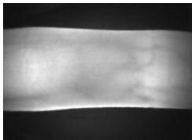
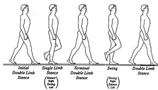
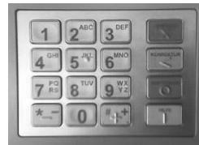
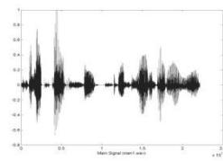

{0}------------------------------------------------

# 第十七届全国青少年信息学奥林匹克联赛初赛试题

## （普及组 C 语言 两小时完成）

●● 全部试题答案均要求写在答卷纸上，写在试卷纸上一律无效 ●●

## 一、单项选择题（共 20 题，每题 1.5 分，共计 30 分。每题有且仅有一个正确选项。）

1. 在二进制下， $1010110 + ( ) = 1100011$ 。  
A. 1011                      B. 1101                      C. 1010                      D. 1111
2. 字符“0”的 ASCII 码为 48，则字符“9”的 ASCII 码为（ ）。  
A. 39                      B. 57                      C. 120                      D. 视具体的计算机而定
3. 一片容量为 8GB 的 SD 卡能存储大约（ ）张大小为 2MB 的数码照片。  
A. 1600                      B. 2000                      C. 4000                      D. 16000
4. 摩尔定律（Moore's law）是由英特尔创始人之一戈登·摩尔（Gordon Moore）提出来的。根据摩尔定律，在过去几十年以及在可预测的未来几年，单块集成电路的集成度大约每（ ）个月翻一番。  
A. 1                      B. 6                      C. 18                      D. 36
5. 无向完全图是图中每对顶点之间都恰有一条边的简单图。已知无向完全图 G 有 7 个顶点，则它共有（ ）条边。  
A. 7                      B. 21                      C. 42                      D. 49
6. 寄存器是（ ）的重要组成部分。  
A. 硬盘                      B. 高速缓存                      C. 内存                      D. 中央处理器（CPU）
7. 如果根结点的深度记为 1，则一棵恰有 2011 个叶结点的二叉树的深度最少是（ ）。  
A. 10                      B. 11                      C. 12                      D. 13
8. 体育课的铃声响了，同学们都陆续地奔向操场，按老师的要求从高到矮站成一排。每个同学按顺序来到操场时，都从排尾走向排头，找到第一个比自己高的同学，并站在他的后面。这种站队的方法类似于（ ）算法。  
A. 快速排序                      B. 插入排序                      C. 冒泡排序                      D. 归并排序
9. 一个正整数在二进制下有 100 位，则它在十六进制下有（ ）位。

{1}------------------------------------------------

- A. 7                      B. 13                      C. 25                      D. 不能确定

10. 有人认为，在个人电脑送修前，将文件放入回收站中就是已经将其删除了。这种想法是（ ）。

- A. 正确的，将文件放入回收站意味着彻底删除、无法恢复
- B. 不正确的，只有将回收站清空后，才意味着彻底删除、无法恢复
- C. 不正确的，即使将回收站清空，文件只是被标记为删除，仍可能通过恢复软件找回
- D. 不正确的，只要在硬盘上出现过的文件，永远不可能被彻底删除

11. 广度优先搜索时，需要用到的数据结构是（ ）。

- A. 链表                      B. 队列                      C. 栈                      D. 散列表

12. 在使用高级语言编写程序时，一般提到的“空间复杂度”中的“空间”是指（ ）。

- A. 程序运行时理论上所占的内存空间
- B. 程序运行时理论上所占的数组空间
- C. 程序运行时理论上所占的硬盘空间
- D. 程序源文件理论上所占的硬盘空间

13. 在含有  $n$  个元素的双向链表中查询是否存在关键字为  $k$  的元素，最坏情况下运行的时间复杂度是（ ）。

- A.  $O(1)$                       B.  $O(\log n)$                       C.  $O(n)$                       D.  $O(n \log n)$

14. 生物特征识别，是利用人体本身的生物特征进行身份认证的一种技术。目前，指纹识别、虹膜识别、人脸识别等技术已广泛应用于政府、银行、安全防卫等领域。以下不属于生物特征识别技术及其应用的是（ ）。



A close-up image of a finger being scanned for vein patterns, used for vein authentication.

A. 指静脉验证



A diagram showing five stages of a human gait cycle: Initial Double Limb Stance, Single Limb Stance, Terminal Double Limb Stance, Swing, and Double Limb Stance.

B. 步态验证



A standard numeric keypad with letters above the numbers, used for ATM PIN verification.

C. ATM 机密码验证



A waveform graph showing a sound signal over time, used for voice authentication.

D. 声音验证

15. 现有一段文言文，要通过二进制哈夫曼编码进行压缩。简单起见，假设这段文言文只由 4 个汉字“之”、“乎”、“者”、“也”组成，它们出现的次数分别为 700、600、300、200。那么，“也”字的编码长度是（ ）。

- A. 1                      B. 2                      C. 3                      D. 4

16. 关于汇编语言，下列说法错误的是（ ）。

- A. 是一种与具体硬件相关的程序设计语言

{2}------------------------------------------------

- B. 在编写复杂程序时，相对于高级语言而言代码量较大，且不易调试
- C. 可以直接访问寄存器、内存单元、以及 I/O 端口
- D. 随着高级语言的诞生，如今已完全被淘汰，不再使用

17. ( ) 是一种选优搜索法，按选优条件向前搜索，以达到目标。当探索到某一步时，发现原先选择并不优或达不到目标，就退回一步重新选择。

- A. 回溯法                      B. 枚举法                      C. 动态规划                      D. 贪心法

18. 1956 年 ( ) 授予肖克利 (William Shockley)、巴丁 (John Bardeen) 和布拉顿 (Walter Brattain)，以表彰他们对半导体的研究和晶体管效应的发现。

- A. 诺贝尔物理学奖
- B. 约翰·冯·诺依曼奖
- C. 图灵奖
- D. 高德纳奖 (Donald E. Knuth Prize)

19. 对一个有向图而言，如果每个节点都存在到达其他任何节点的路径，那么就称它是强连通的。例如，右图就是一个强连通图。事实上，在删掉边 ( ) 后，它依然是强连通的。


A directed graph with 5 nodes arranged in a diamond shape. The top node is connected to the middle node by edge 'a'. The middle node is connected to the bottom node by edge 'b'. The left node is connected to the right node by edge 'c'. The left node is connected to the right node by edge 'd'. There are also edges from the top node to the right node, from the right node to the bottom node, and from the bottom node to the left node.

- A. a                      B. b                      C. c                      D. d

20. 从 ENIAC 到当前最先进的计算机，冯·诺依曼体系结构始终占有重要的地位。冯·诺依曼体系结构的核心内容是 ( )。

- A. 采用开关电路                      B. 采用半导体器件
- C. 采用存储程序和程序控制原理                      D. 采用键盘输入

## **二、问题求解 (共 2 题，每题 5 分，共计 10 分)**

1. 每份考卷都有一个 8 位二进制序列号。当且仅当一个序列号含有偶数个 1 时，它才是有效的。例如，00000000、01010011 都是有效的序列号，而 11111110 不是。那么，有效的序列号共有 \_\_\_\_\_ 个。

2. 定义字符串的基本操作为：删除一个字符、插入一个字符和将一个字符修改成另一个字符这三种操作。将字符串 A 变成字符串 B 的最少操作步数，称为字符串 A 到字符串 B 的编辑距离。字符串 "ABCDEFG" 到字符串 "BADECG" 的编辑距离为 \_\_\_\_\_。

## **三、阅读程序写结果 (共 4 题，每题 8 分，共计 32 分)**

1.

```
#include<stdio.h>
```

{3}------------------------------------------------

```
int main() {
    int i, n, m, ans;

    scanf("%d%d", &n, &m);
    i = n;
    ans = 0;
    while (i <= m) {
        ans += i;
        i++;
    }
    printf("%d\n", ans);
    return 0;
}
```

输入: 10 20

输出: \_\_\_\_\_

2.

```
#include <stdio.h>
#include <string.h>
#define SIZE 20

int main()
{
    char map[] = "22233344455566677778889999";
    char tel[SIZE];
    int i;

    scanf("%s", tel);
    for (i = 0; i < strlen(tel); i++)
        if ((tel[i] >= '0') && (tel[i] <= '9'))
            printf("%c", tel[i]);
        else if ((tel[i] >= 'A') && (tel[i] <= 'Z'))
            printf("%c", map[tel[i] - 'A']);
    return 0;
}
```

输入: CCF-NOIP-2011

{4}------------------------------------------------

输出: \_\_\_\_\_

3.

```
#include <stdio.h>
#include <string.h>
#define SIZE 100

int main()
{
    int n, i, sum, x, a[SIZE];

    scanf("%d", &n);
    memset(a, 0, sizeof(a));
    for (i = 1; i <= n; i++) {
        scanf("%d", &x);
        a[x]++;
    }

    i = 0;
    sum = 0;
    while (sum < (n / 2 + 1)) {
        i++;
        sum += a[i];
    }
    printf("%d\n", i);
    return 0;
}
```

输入:

11  
4 5 6 6 4 3 3 2 3 2 1

输出: \_\_\_\_\_

4.

```
#include <stdio.h>

int solve(int n, int m)
{
```

{5}------------------------------------------------

```

    int i, sum;

    if (m == 1)
        return 1;
    sum = 0;
    for (i = 1; i < n; i++)
        sum += solve(i, m - 1);
    return sum;
}

int main()
{
    int n, m;

    scanf("%d %d", &n, &m);
    printf("%d\n", solve(n, m));
    return 0;
}

```

输入: 7 4

输出: \_\_\_\_\_

## 四、完善程序（前 11 空，每空 2 分，后 2 空，每空 3 分，共计 28 分）

- 1. （子矩阵）输入一个  $n_1 \times m_1$  的矩阵 a，和  $n_2 \times m_2$  的矩阵 b，问 a 中是否存在子矩阵和 b 相等。若存在，输出所有子矩阵左上角的坐标；若不存在输出 “There is no answer”。

```

#include <stdio.h>
#define SIZE 50

int n1, m1, n2, m2, a[SIZE][SIZE], b[SIZE][SIZE];

int main()
{
    int i, j, k1, k2, good, haveAns;

    scanf("%d %d", &n1, &m1);
    for (i = 1; i <= n1; i++)

```

{6}------------------------------------------------

```

        for (j = 1; j <= m1; j++)
            scanf("%d", &a[i][j]);
scanf("%d %d", &n2, &m2);
for (i = 1; i <= n2; i++)
    for (j = 1; j <= m2; j++)
        ①;

haveAns = 0;
for (i = 1; i <= n1 - n2 + 1; i++)
    for (j = 1; j <= ②; j++) {
        ③;
        for (k1 = 1; k1 <= n2; k1++)
            for (k2 = 1; k2 <= ④; k2++) {
                if (a[i + k1 - 1][j + k2 - 1] != b[k1][k2])
                    good = 0;
            }
        if (good == 1) {
            printf("%d %d\n", i, j);
            ⑤;
        }
    }
}
if (haveAns == 0)
    printf("There is no answer\n");
return 0;
}

```

2. （大整数开方）输入一个正整数  $n$  ( $1 \leq n < 10^{100}$ )，试用二分法计算它的平方根的整数部分。

```

#include <stdio.h>
#include <string.h>
#define SIZE 200

typedef struct node {
    int len, num[SIZE];
} hugeint;

```

//其中 len 表示大整数的位数；num[1]表示个位、num[2]表示十位，以此类推

{7}------------------------------------------------

```

hugeint times(hugeint a, hugeint b)
//计算大整数 a 和 b 的乘积
{
    int i, j;
    hugeint ans;

    memset(ans.num, 0, sizeof(ans.num));
    for (i = 1; i <= a.len; i++)
        for (j = 1; j <= b.len; j++)
            ① += a.num[i] * b.num[j];
    for (i = 1; i <= a.len + b.len; i++) {
        ans.num[i + 1] += ans.num[i] / 10;
        ②;
    }
    if (ans.num[a.len + b.len] > 0)
        ans.len = a.len + b.len;
    else
        ans.len = a.len + b.len - 1;
    return ans;
}

```

```

hugeint add(hugeint a, hugeint b)
//计算大整数 a 和 b 的和
{
    int i;
    hugeint ans;

    memset(ans.num, 0, sizeof(ans.num));
    if (a.len > b.len)
        ans.len = a.len;
    else
        ans.len = b.len;
    for (i = 1; i <= ans.len; i++) {
        ans.num[i] += ③;
        ans.num[i + 1] += ans.num[i] / 10;
        ans.num[i] %= 10;
    }
    if (ans.num[ans.len + 1] > 0)

```

{8}------------------------------------------------

```

        ans.len++;
    return ans;
}

hugeint average(hugeint a, hugeint b)
//计算大整数 a 和 b 的平均数的整数部分
{
    int i;
    hugeint ans;

    ans = add(a, b);
    for (i = ans.len; i >= 2; i--) {
        ans.num[i - 1] += (④) * 10;
        ans.num[i] /= 2;
    }
    ans.num[1] /= 2;
    if (ans.num[ans.len] == 0)
        ans.len--;
    return ans;
}

hugeint plustwo(hugeint a)
//计算大整数 a 加 2 后的结果
{
    int i;
    hugeint ans;

    ans = a;
    ans.num[1] += 2;
    i = 1;
    while ((i <= ans.len) && (ans.num[i] >= 10)) {
        ans.num[i + 1] += ans.num[i] / 10;
        ans.num[i] %= 10;
        i++;
    }
    if (ans.num[ans.len + 1] > 0)
        ⑤;
    return ans;
}

```

{9}------------------------------------------------

```

}

int over(hugeint a, hugeint b)
//若大整数 a>b 则返回 1，否则返回 0
{
    int i;

    if (____⑥____)
        return 0;
    if (a.len > b.len)
        return 1;
    for (i = a.len; i >= 1; i--) {
        if (a.num[i] < b.num[i])
            return 0;
        if (a.num[i] > b.num[i])
            return 1;
    }
    return 0;
}

int main()
{
    char s[SIZE];
    int i;
    hugeint target, left, middle, right;

    scanf("%s", s);
    memset(target.num, 0, sizeof(target.num));
    target.len = strlen(s);
    for (i = 1; i <= target.len; i++)
        target.num[i] = s[target.len - i] - ____⑦____;
    memset(left.num, 0, sizeof(left.num));
    left.len = 1;
    left.num[1] = 1;
    right = target;
    do {
        middle = average(left, right);
        if (over(____⑧____) == 1)

```

{10}------------------------------------------------

```
        right = middle;
    else
        left = middle;
} while (over(plustwo(left), right) == 0);
for (i = left.len; i >= 1; i--)
    printf("%d", left.num[i]);
printf("\n");
return 0;
}
```