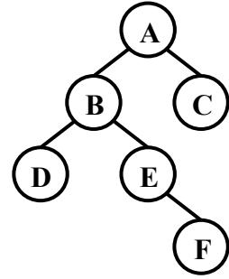
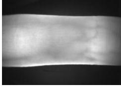
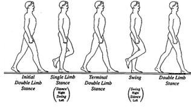
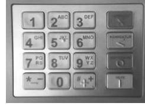
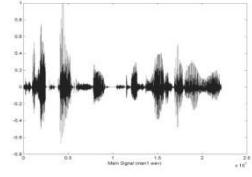
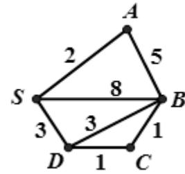
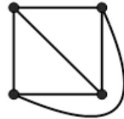
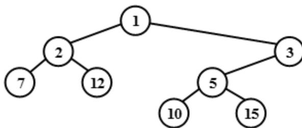

{0}------------------------------------------------

# 第十七届全国青少年信息学奥林匹克联赛初赛试题

## ( 提高组 C 语言 两小时完成 )

●● 全部试题答案均要求写在答卷纸上，写在试卷纸上一律无效 ●●

## 一、单项选择题（共 20 题，每题 1.5 分，共计 30 分。每题有且仅有一个正确选项。）

1. 在二进制下， $1010110 + ( ) = 1100011$ 。

- A. 1011                      B. 1101                      C. 1010                      D. 1111

2. 字符“A”的 ASCII 码为十六进制 41，则字符“Z”的 ASCII 码为十六进制的 ( )。

- A. 66                      B. 5A                      C. 50                      D. 视具体的计算机而定

3. 右图是一棵二叉树，它的先序遍历是 ( )。

- A. ABDEFC      B. DBEFAC      C. DFEBCA      D. ABCDEF



```
graph TD; A((A)) --- B((B)); A --- C((C)); B --- D((D)); B --- E((E)); E --- F((F));
```

A binary tree diagram. Node A is the root. Node B is the left child of A, and Node C is the right child of A. Node D is the left child of B, and Node E is the right child of B. Node F is the right child of E.

4. 寄存器是 ( ) 的重要组成部分。

- A. 硬盘      B. 高速缓存      C. 内存      D. 中央处理器 (CPU)

5. 广度优先搜索时，需要用到的数据结构是 ( )。

- A. 链表                      B. 队列                      C. 栈                      D. 散列表

6. 在使用高级语言编写程序时，一般提到的“空间复杂度”中的“空间”是指 ( )。

- A. 程序运行时理论上所占的内存空间  
B. 程序运行时理论上所占的数组空间  
C. 程序运行时理论上所占的硬盘空间  
D. 程序源文件理论上所占的硬盘空间

7. 应用快速排序的分治思想，可以实现一个求第  $k$  大数的程序。假定不考虑极端的最坏情况，理论上可以实现的最低的算法时间复杂度为 ( )。

- A.  $O(n^2)$                       B.  $O(n \log n)$                       C.  $O(n)$                       D.  $O(1)$

8. 为解决 Web 应用中的不兼容问题，保障信息的顺利流通， ( ) 制定了一系列标准，涉及 HTML、XML、CSS 等，并建议开发者遵循。

- A. 微软      B. 美国计算机协会 (ACM)      C. 联合国教科文组织      D. 万维网联盟 (W3C)

{1}------------------------------------------------

9. 体育课的铃声响了，同学们都陆续地奔向操场，按老师的要求从高到矮站成一排。每个同学按顺序来到操场时，都从排尾走向排头，找到第一个比自己高的同学，并站在他的后面。这种站队的方法类似于（ ）算法。

- A. 快速排序
- B. 插入排序
- C. 冒泡排序
- D. 归并排序

10. 1956 年（ ）授予肖克利（William Shockley）、巴丁（John Bardeen）和布拉顿（Walter Brattain），以表彰他们对半导体的研究和晶体管效应的发现。

- A. 诺贝尔物理学奖
- B. 约翰·冯·诺依曼奖
- C. 图灵奖
- D. 高德纳奖（Donald E. Knuth Prize）

## **二、不定项选择题（共 10 题，每题 1.5 分，共计 15 分。每题有一个或多个正确选项。多选或少选均不得分。）**

1. 如果根结点的深度记为 1，则一棵恰有 2011 个叶子结点的二叉树的深度可能是（ ）。

- A. 10
- B. 11
- C. 12
- D. 2011

2. 在布尔逻辑中，逻辑“或”的性质有（ ）。

- A. 交换律： $P \vee Q = Q \vee P$
- B. 结合律： $P \vee (Q \vee R) = (P \vee Q) \vee R$
- C. 幂等律： $P \vee P = P$
- D. 有界律： $P \vee 1 = 1$ （1 表示逻辑真）

3. 一个正整数在十六进制下有 100 位，则它在二进制下可能有（ ）位。

- A. 399
- B. 400
- C. 401
- D. 404

4. 汇编语言（ ）。

- A. 是一种与具体硬件无关的程序设计语言
- B. 在编写复杂程序时，相对于高级语言而言代码量较大，且不易调试
- C. 可以直接访问寄存器、内存单元、I/O 端口
- D. 随着高级语言的诞生，如今已完全被淘汰，不再使用

5. 现有一段文言文，要通过二进制哈夫曼编码进行压缩。简单起见，假设这段文言文只由 4 个汉字“之”、“乎”、“者”、“也”组成，它们出现的次数分别为 700、600、300、400。那么，“也”字的编码长度可能是（ ）。

- A. 1
- B. 2
- C. 3
- D. 4

{2}------------------------------------------------

6. 生物特征识别, 是利用人体本身的生物特征进行身份认证的一种技术。目前, 指纹识别、虹膜识别、人脸识别等技术已广泛应用于政府、银行、安全防卫等领域。以下属于生物特征识别技术及其应用的是 ( )。



A close-up image of a finger being scanned for vein patterns, used for vein authentication.

A. 指静脉验证



A diagram showing five stages of a human gait cycle: Initial Double Limb Stance, Single Limb Stance, Terminal Double Limb Stance, Swing, and Double Limb Stance.

B. 步态验证



A standard numeric keypad with letters above the numbers, used for ATM password verification.

C. ATM 机密码验证



A waveform graph showing amplitude over time, used for voice authentication.

D. 声音验证

7. 对于序列“7、5、1、9、3、6、8、4”，在不改变顺序的情况下，去掉 ( ) 会使逆序对的个数减少 3。

- A. 7 B. 5 C. 3 D. 6

8. 计算机中的数值信息分为整数和实数(浮点数)。实数之所以能表示很大或者很小的数, 是由于使用了 ( )。

- A. 阶码 B. 补码 C. 反码 D. 较长的尾数

9. 对右图使用 Dijkstra 算法计算 S 点到其余各点的最短路径长度时, 到 B 点的距离 d[B] 初始时赋为 8, 在算法的执行过程中还会出现 ( )。



A weighted undirected graph with 5 vertices (A, B, C, D, S) and 8 edges. The edges and their weights are: S-A (2), S-B (8), S-D (3), A-B (5), A-D (3), B-C (1), B-D (3), and C-D (1).

- A. 3 B. 7 C. 6 D. 5

10. 为计算机网络中进行数据交换而建立的规则、标准或约定的集合成为网络协议。下列英文缩写中, ( ) 是网络协议。

- A. HTTP B. TCP/IP C. FTP D. WWW

## 三、问题求解 (共 2 题, 每题 5 分, 共计 10 分)

1. 平面图是可以画在在平面上, 且它的边仅在顶点上才能相交的简单无向图。4 个顶点的平面图至多有 6 条边, 如右图所示。那么, 5 个顶点的平面图至多有 条边。



A complete graph K4 with 4 vertices and 6 edges, drawn as a square with both diagonals and one curved edge.

2. 定义一种字符串操作, 一次可以将其中一个元素移到任意位置。举例说明, 对于字符串 "BCA", 可以将 A 移到 B 之前, 变成字符串 "ABC"。如果要将字符串 "DACHEBGIF" 变成 "ABCDEFGHI", 最少需要 次操作。

## 四、阅读程序写结果 (共 4 题, 每题 8 分, 共计 32 分)

{3}------------------------------------------------

```

1.
#include <stdio.h>
#include <string.h>
#define SIZE 100

int main()
{
    int n, i, sum, x, a[SIZE];

    scanf("%d", &n);
    memset(a, 0, sizeof(a));
    for (i = 1; i <= n; i++) {
        scanf("%d", &x);
        a[x]++;
    }

    i = 0;
    sum = 0;
    while (sum < (n / 2 + 1)) {
        i++;
        sum += a[i];
    }
    printf("%d\n", i);
    return 0;
}

```

输入:

11

4 5 6 6 4 3 3 2 3 2 1

输出: \_\_\_\_\_

2.

```
#include <stdio.h>
```

```
int n;
```

```
void f2(int x, int y);
```

{4}------------------------------------------------

```
void f1(int x, int y)
{
    if (x < n)
        f2(y, x + y);
}
```

```
void f2(int x, int y)
{
    printf("%d ", x);
    f1(y, x + y);
}
```

```
int main()
{
    scanf("%d", &n);
    f1(0, 1);
    return 0;
}
```

输入: 30

输出: \_\_\_\_\_

3.

```
#include <stdio.h>
#define V 100
```

```
int n, m, ans, e[V][V], visited[V];
```

```
void dfs(int x, int len)
{
    int i;

    visited[x] = 1;
    if (len > ans)
        ans = len;
    for (i = 1; i <= n; i++)
        if ((visited[i] == 0) && (e[x][i] != -1))
            dfs(i, len + e[x][i]);
}
```

{5}------------------------------------------------

```
    visited[x] = 0;
}

int main()
{
    int i, j, a, b, c;

    scanf("%d%d", &n, &m);
    for (i = 1; i <= n; i++)
        for (j = 1; j <= n; j++)
            e[i][j] = -1;
    for (i = 1; i <= m; i++) {
        scanf("%d%d%d", &a, &b, &c);
        e[a][b] = c;
        e[b][a] = c;
    }
    for (i = 1; i <= n; i++)
        visited[i] = 0;
    ans = 0;
    for (i = 1; i <= n; i++)
        dfs(i, 0);
    printf("%d\n", ans);
    return 0;
}
```

输入:

```
4 6
1 2 10
2 3 20
3 4 30
4 1 40
1 3 50
2 4 60
```

输出: \_\_\_\_\_

4.

```
#include <stdio.h>
#include <string.h>
```

{6}------------------------------------------------

```
#define SIZE 10000
#define LENGTH 10

int n, m, a[SIZE][LENGTH];

int h(int u, int v)
{
    int ans, i;

    ans = 0;
    for (i = 1; i <= n; i++)
        if (a[u][i] != a[v][i])
            ans++;
    return ans;
}

int main()
{
    int sum, i, j;

    scanf("%d", &n);
    memset(a, 0, sizeof(a));
    m = 1;
    while (1) {
        i = 1;
        while ((i <= n) && (a[m][i] == 1))
            i++;
        if (i > n)
            break;
        m++;
        a[m][i] = 1;
        for (j = i + 1; j <= n; j++)
            a[m][j] = a[m - 1][j];
    }

    sum = 0;
    for (i = 1; i <= m; i++)
        for (j = 1; j <= m; j++)
```

{7}------------------------------------------------

```
        sum += h(i, j);  
printf("%d\n", sum);  
return 0;  
}
```

输入: 7

输出: \_\_\_\_\_

## **五、完善程序（第 1 题，每空 2 分，第 2 题，每空 3 分，共计 28 分）**

1. （**大整数开方**）输入一个正整数  $n$  ( $1 \leq n < 10^{100}$ )，试用二分法计算它的平方根的整数部分。

```
#include <stdio.h>  
#include <string.h>  
#define SIZE 200  
  
typedef struct node {  
    int len, num[SIZE];  
} hugeint;  
//其中 len 表示大整数的位数；num[1]表示个位、num[2]表示十位，以此类推  
  
hugeint times(hugeint a, hugeint b)  
{  
    int i, j;  
    hugeint ans;  
  
    memset(ans.num, 0, sizeof(ans.num));  
    for (i = 1; i <= a.len; i++)  
        for (j = 1; j <= b.len; j++)  
            ① += a.num[i] * b.num[j];  
    for (i = 1; i <= a.len + b.len; i++) {  
        ans.num[i + 1] += ans.num[i] / 10;  
        ②;  
    }  
    if (ans.num[a.len + b.len] > 0)  
        ans.len = a.len + b.len;  
    else
```

{8}------------------------------------------------

```

        ans.len = a.len + b.len - 1;
    return ans;
}

hugeint add(hugeint a, hugeint b)
{
    int i;
    hugeint ans;

    memset(ans.num, 0, sizeof(ans.num));
    if (a.len > b.len)
        ans.len = a.len;
    else
        ans.len = b.len;
    for (i = 1; i <= ans.len; i++) {
        ans.num[i] += ③;
        ans.num[i + 1] += ans.num[i] / 10;
        ans.num[i] %= 10;
    }
    if (ans.num[ans.len + 1] > 0)
        ans.len++;
    return ans;
}

hugeint average(hugeint a, hugeint b)
{
    int i;
    hugeint ans;

    ans = add(a, b);
    for (i = ans.len; i >= 2; i--) {
        ans.num[i - 1] += (④) * 10;
        ans.num[i] /= 2;
    }
    ans.num[1] /= 2;
    if (ans.num[ans.len] == 0)
        ans.len--;
    return ans;
}

```

{9}------------------------------------------------

```

}

hugeint plustwo(hugeint a)
{
    int i;
    hugeint ans;

    ans = a;
    ans.num[1] += 2;
    i = 1;
    while ((i <= ans.len) && (ans.num[i] >= 10)) {
        ans.num[i + 1] += ans.num[i] / 10;
        ans.num[i] %= 10;
        i++;
    }
    if (ans.num[ans.len + 1] > 0)
        ⑤;
    return ans;
}

int over(hugeint a, hugeint b)
{
    int i;

    if (⑥)
        return 0;
    if (a.len > b.len)
        return 1;
    for (i = a.len; i >= 1; i--) {
        if (a.num[i] < b.num[i])
            return 0;
        if (a.num[i] > b.num[i])
            return 1;
    }
    return 0;
}

int main()

```

{10}------------------------------------------------

```

{
    char s[SIZE];
    int i;
    hugeint target, left, middle, right;

    scanf("%s", s);
    memset(target.num, 0, sizeof(target.num));
    target.len = strlen(s);
    for (i = 1; i <= target.len; i++)
        target.num[i] = s[target.len - i] - ⑦;
    memset(left.num, 0, sizeof(left.num));
    left.len = 1;
    left.num[1] = 1;
    right = target;
    do {
        middle = average(left, right);
        if (over(⑧) == 1)
            right = middle;
        else
            left = middle;
    } while (over(plustwo(left), right) == 0);
    for (i = left.len; i >= 1; i--)
        printf("%d", left.num[i]);
    printf("\n");
    return 0;
}

```

2. （笛卡尔树）对于一个给定的两两不等的正整数序列，笛卡尔树是这样的一棵二叉树：首先，它是一个最小堆，即除了根结点外，每个结点的权值都大于父结点的权值；其次，它的中序遍历恰好就是给定的序列。例如，对于序列 7、2、12、1、10、5、15、3，下图就是一棵对应的笛卡尔树。现输入序列的规模  $n$  ( $1 \leq n < 100$ ) 和序列的  $n$  个元素，试求其对应的笛卡尔树的深度  $d$ （根节点深度为 1），以及有多少个叶节点的深度为  $d$ 。

```

#include <stdio.h>
#define SIZE 105
#define INFINITY 1000000

int n, a[SIZE], maxDeep, num;

```



```

graph TD
    1((1)) --- 2((2))
    1 --- 3((3))
    2 --- 7((7))
    2 --- 12((12))
    3 --- 5((5))
    5 --- 10((10))
    5 --- 15((15))

```

A Cartesian tree diagram. The root node is 1. Its left child is 2, and its right child is 3. Node 2 has left child 7 and right child 12. Node 3 has left child 5, which has left child 10 and right child 15.

{11}------------------------------------------------

```

void solve(int left, int right, int deep)
{
    int i, j, min;

    if (deep > maxDeep) {
        maxDeep = deep;
        num = 1;
    }
    else if (deep == maxDeep)
        ①;

    min = INFINITY;
    for (i = left; i <= right; i++)
        if (min > a[i]) {
            min = a[i];
            ②;
        }
    if (left < j)
        ③;
    if (j < right)
        ④;
}

int main()
{
    int i;

    scanf("%d", &n);
    for (i = 1; i <= n; i++)
        scanf("%d", &a[i]);
    maxDeep = 0;
    solve(1, n, 1);
    printf("%d %d\n", maxDeep, num);
    return 0;
}

```