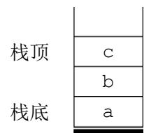

{0}------------------------------------------------

# 第十八届全国青少年信息学奥林匹克联赛初赛

## 普及组 C++语言试题

竞赛时间：2012 年 10 月 13 日 14:30~16:30

### 选手注意：

- 试题纸共有 10 页，答题纸共有 2 页，满分 100 分。请在答题纸上作答，写在试题纸上的一律无效。
- 不得使用任何电子设备（如计算器、手机、电子词典等）或查阅任何书籍资料。

### 一、单项选择题（共 20 题，每题 1.5 分，共计 30 分；每题有且仅有一个正确选项）

1. 计算机如果缺少（ ），将无法正常启动。  
A. 内存                      B. 鼠标                      C. U 盘                      D. 摄像头
2. （ ）是一种先进先出的线性表。  
A. 栈                              B. 队列  
C. 哈希表（散列表）              D. 二叉树
3. 目前计算机芯片（集成电路）制造的主要原料是（ ），它是一种可以在沙子中提炼出的物质。  
A. 硅                              B. 铜                              C. 锗                              D. 铝
4. 十六进制数 9A 在（ ）进制下是 232。  
A. 四                              B. 八                              C. 十                              D. 十二
5. （ ）不属于操作系统。  
A. Windows                      B. DOS                              C. PhotoShop                      D. NOI Linux
6. 如果一棵二叉树的中序遍历是 BAC，那么它的先序遍历不可能是（ ）。  
A. ABC                              B. CBA                              C. ACB                              D. BAC
7. 目前个人电脑的（ ）市场占有率最靠前的厂商包括 Intel、AMD 等公司。  
A. 显示器                      B. CPU                              C. 内存                              D. 鼠标

{1}------------------------------------------------

- 8. 使用冒泡排序对序列进行升序排序，每执行一次交换操作将会减少 1 个逆序对，因此序列

5, 4, 3, 2, 1

需要执行（ ）次交换操作，才能完成冒泡排序。

- A. 0                      B. 5                      C. 10                      D. 15
- 9. 1946 年诞生于美国宾夕法尼亚大学的 ENIAC 属于（ ）计算机。
- A. 电子管                      B. 晶体管  
C. 集成电路                      D. 超大规模集成电路
- 10. 无论是 TCP/IP 模型还是 OSI 模型，都可以视为网络的分层模型，每个网络协议都会被归入某一层中。如果用现实生活中的例子来比喻这些“层”，以下最恰当的是（ ）。

A. 中国公司的经理与朝鲜公司的经理交互商业文件

|       |          |     |          |
|-------|----------|-----|----------|
| 第 4 层 | 中国公司经理   |     | 朝鲜公司经理   |
|       | ↑ ↓      |     | ↑ ↓      |
| 第 3 层 | 中国公司经理秘书 |     | 朝鲜公司经理秘书 |
|       | ↑ ↓      |     | ↑ ↓      |
| 第 2 层 | 中国公司翻译   |     | 朝鲜公司翻译   |
|       | ↑ ↓      |     | ↑ ↓      |
| 第 1 层 | 中国邮递员    | ← → | 朝鲜邮递员    |

B. 军队发布命令

|       |      |      |      |      |      |      |      |      |
|-------|------|------|------|------|------|------|------|------|
| 第 4 层 | 司令   |      |      |      |      |      |      |      |
|       | ↓    |      |      |      |      |      |      |      |
| 第 3 层 | 军长 1 |      |      |      | 军长 2 |      |      |      |
|       | ↓    |      |      |      | ↓    |      |      |      |
| 第 2 层 | 师长 1 |      | 师长 2 |      | 师长 3 |      | 师长 4 |      |
|       | ↓    |      | ↓    |      | ↓    |      | ↓    |      |
| 第 1 层 | 团长 1 | 团长 2 | 团长 3 | 团长 4 | 团长 5 | 团长 6 | 团长 7 | 团长 8 |

{2}------------------------------------------------

C. 国际会议中，每个人都与他国地位对等的人直接进行会谈

|       |         |   |         |
|-------|---------|---|---------|
| 第 4 层 | 英国女王    | ↔ | 瑞典国王    |
| 第 3 层 | 英国首相    | ↔ | 瑞典首相    |
| 第 2 层 | 英国外交大臣  | ↔ | 瑞典外交大臣  |
| 第 1 层 | 英国驻瑞典大使 | ↔ | 瑞典驻英国大使 |

D. 体育比赛中，每一级比赛的优胜者晋级上一级比赛

|       |     |
|-------|-----|
| 第 4 层 | 奥运会 |
|       | ↑   |
| 第 3 层 | 全运会 |
|       | ↑   |
| 第 2 层 | 省运会 |
|       | ↑   |
| 第 1 层 | 市运会 |

11. 矢量图（Vector Image）图形文件所占的存储空间较小，并且不论如何放大、缩小或旋转等都不会失真，是因为它（ ）。

- A. 记录了大量像素块的色彩值来表示图像
- B. 用点、直线或者多边形等基于数学方程的几何图元来表示图像
- C. 每个像素点的颜色信息均用矢量表示
- D. 把文件保存在互联网，采用在线浏览的方式查看图像

12. 如果一个栈初始时为空，且当前栈中的元素从栈底到栈顶依次为 a, b, c（如右图所示），另有元素 d 已经出栈，则可能的入栈顺序是（ ）。

- A. a, d, c, b
- B. b, a, c, d
- C. a, c, b, d
- D. d, a, b, c



栈顶

|   |
|---|
| c |
| b |
| a |

栈底

Diagram of a stack with elements a, b, c from bottom to top. The top is labeled '栈顶' and the bottom is labeled '栈底'.

13. （ ）是主要用于显示网页服务器或者文件系统的 HTML 文件内容，并让用户与这些文件交互的一种软件。

- A. 资源管理器
- B. 浏览器
- C. 电子邮件
- D. 编译器

14. （ ）是目前互联网上常用的 E-mail 服务协议。

- A. HTTP
- B. FTP
- C. POP3
- D. Telnet

{3}------------------------------------------------

- 15. ( ) 就是把一个复杂的问题分成两个或者更多的相同或相似的子问题，再把子问题分成更小的子问题……直到最后的子问题可以简单的直接求解。而原问题的解就是子问题解的并。
- A. 动态规划                      B. 贪心                      C. 分治                      D. 搜索
- 16. 地址总线的位数决定了 CPU 可直接寻址的内存空间大小，例如地址总线为 16 位，其最大的可寻址空间为 64KB。如果地址总线是 32 位，则理论上最大可寻址的内存空间为 ( )。
- A. 128KB                      B. 1MB                      C. 1GB                      D. 4GB
- 17. 蓝牙和 Wi-Fi 都是 ( ) 设备。
- A. 无线广域网                      B. 无线城域网                      C. 无线局域网                      D. 无线路由器
- 18. 在程序运行过程中，如果递归调用的层数过多，会因为 ( ) 引发错误。
- A. 系统分配的栈空间溢出                      B. 系统分配的堆空间溢出  
C. 系统分配的队列空间溢出                      D. 系统分配的链表空间溢出
- 19. 原字符串中任意一段连续的字符组成的新字符串称为子串。则字符串“AAABBBCCC”共有 ( ) 个不同的非空子串。
- A. 3                      B. 12                      C. 36                      D. 45
- 20. 仿生学的问世开辟了独特的科学技术发展道路。人们研究生物体的结构、功能和工作原理，并将这些原理移植于新兴的工程技术之中。以下关于仿生学的叙述，错误的是 ( )。
- A. 由研究蝙蝠，发明雷达                      B. 由研究蜘蛛网，发明因特网  
C. 由研究海豚，发明声纳                      D. 由研究电鱼，发明伏特电池

### 二、问题求解（共 2 题，每题 5 分，共计 10 分）

- 1. 如果平面上任取  $n$  个整点（横纵坐标都是整数），其中一定存在两个点，它们连线的中点也是整点，那么  $n$  至少是\_\_\_\_\_。
- 2. 在 NOI 期间，主办单位为了欢迎来自全国各地的选手，举行了盛大的晚宴。在第十八桌，有 5 名大陆选手和 5 名港澳选手共同进膳。为了增进交流，他们决定相隔而坐，即每个大陆选手左右相邻的都是港澳选手、每个港澳选手左右相邻的都是大陆选手。那么，这一桌共有\_\_\_\_\_种不同的就坐方案。注意：如果在两个方案中，每个选手左边相邻的选手均相同，则视为同一个方案。

{4}------------------------------------------------

### 三、阅读程序写结果（共 4 题，每题 8 分，共计 32 分）

```
1. #include <iostream>
using namespace std;

int a, b, c, d, e, ans;

int main()
{
    cin>>a>>b>>c;
    d = a+b;
    e = b+c;
    ans = d+e;
    cout<<ans<<endl;
}
```

输入: 1 2 5

输出: \_\_\_\_\_

```
2. #include<iostream>
using namespace std;

int n, i, ans;

int main()
{
    cin>>n;
    ans = 0;
    for (i = 1; i <= n; i++)
        if (n % i == 0)
            ans++;
    cout<<ans<<endl;
}
```

输入: 18

输出: \_\_\_\_\_

```
3. #include <iostream>
```

{5}------------------------------------------------

```
using namespace std;

int n, i, j, a[100][100];

int solve(int x, int y)
{
    int u, v;

    if (x == n)
        return a[x][y];
    u = solve(x + 1, y);
    v = solve(x + 1, y + 1);
    if (u > v)
        return a[x][y] + u;
    else
        return a[x][y] + v;
}

int main()
{
    cin>>n;
    for (i = 1; i <= n; i++)
        for (j = 1; j <= i; j++)
            cin>>a[i][j];
    cout<<solve(1, 1)<<endl;
    return 0;
}
```

输入:

```
5
2
-1 4
2 -1 -2
-1 6 4 0
3 2 -1 5 8
```

输出: \_\_\_\_\_

4. #include <iostream>

{6}------------------------------------------------

```

#include <string>
using namespace std;

int n, ans, i, j;
string s;

char get(int i)
{
    if (i < n)
        return s[i];
    else
        return s[i-n];
}

int main()
{
    cin>>s;
    n = s.size();
    ans = 0;
    for (i = 1; i <= n-1; i++)
    {
        for (j = 0; j <= n-1; j++) if (get(i+j) < get(ans+j))
        {
            ans = i;
            break;
        }
        else if (get(i+j) > get(ans+j))
            break;
    }
    for (j = 0; j <= n-1; j++)
        cout<<get(ans+j);
    cout<<endl;
}

```

输入: CBBADADA

输出: \_\_\_\_\_

四、完善程序（前 2 空每空 2 分，后 8 空每空 3 分，共计 28 分）

{7}------------------------------------------------

- 1. （坐标统计）输入  $n$  个整点在平面上的坐标。对于每个点，可以控制所有位于它左下方的点（即  $x$ 、 $y$  坐标都比它小），它可以控制的点的数目称为“战斗力”。依次输出每个点的战斗力，最后输出战斗力最高的点的编号（如果若干个点的战斗力并列最高，输出其中最大的编号）。

```
#include<iostream>
using namespace std;

const int SIZE = 100;

int x[SIZE], y[SIZE], f[SIZE];
int n, i, j, max_f, ans;

int main()
{
    cin>>n;
    for (i = 1; i <= n; i++)
        cin>>x[i]>>y[i];
    max_f = 0;
    for (i = 1; i <= n; i++)
    {
        f[i] = ①;
        for (j = 1; j <= n; j++)
        {
            if (x[j] < x[i] && ②)
                ③;
        }
        if (④)
        {
            max_f = f[i];
            ⑤;
        }
    }
    for (i = 1; i <= n; i++)
        cout<<f[i]<<endl;
    cout<<ans<<endl;
}
```

{8}------------------------------------------------

- 2. （排列数）输入两个正整数  $n, m$  ( $1 \leq n \leq 20, 1 \leq m \leq n$ )，在  $1 \sim n$  中任取  $m$  个数，按字典序从小到大输出所有这样的排列。例如

输入：3 2

输出：1 2

1 3

2 1

2 3

3 1

3 2

```
#include<iostream>
#include<cstring>
using namespace std;

const int SIZE = 25;

bool used[SIZE];
int data[SIZE];
int n, m, i, j, k;
bool flag;

int main()
{
    cin>>n>>m;
    memset(used, false, sizeof(used));
    for (i = 1; i <= m; i++)
    {
        data[i] = i;
        used[i] = true;
    }
    flag = true;
    while (flag)
    {
        for (i = 1; i <= m-1; i++) cout<<data[i]<<" ";
        cout<<data[m]<<endl;
        flag = _____①_____;
        for (i = m; i >= 1; i--)
        {

```

{9}------------------------------------------------

```

    _____②_____ ;
for (j = data[i]+1; j <= n; j++) if (!used[j])
{
    used[j] = true;
    data[i] = _____③_____ ;
    flag = true;
    break;
}
if (flag)
{
    for (k = i+1; k <= m; k++)
        for (j = 1; j <= _____④_____ ; j++) if (!used[j])
        {
            data[k] = j;
            used[j] = true;
            break;
        }
    _____⑤_____ ;
}
}
}
}
}
}

```