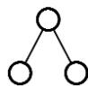
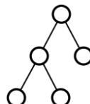
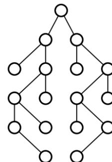

{0}------------------------------------------------

# 第十八届全国青少年信息学奥林匹克联赛初赛

## 提高组 C++语言试题

竞赛时间：2012 年 10 月 13 日 14:30~16:30

## 选手注意：

- 试题纸共有 15 页，答题纸共有 2 页，满分 100 分。请在答题纸上作答，写在试题纸上的一律无效。
- 不得使用任何电子设备（如计算器、手机、电子词典等）或查阅任何书籍资料。

## 一、单项选择题（共 10 题，每题 1.5 分，共计 15 分；每题有且仅有一个正确选项）

1. 目前计算机芯片（集成电路）制造的主要原料是（ ），它是一种可以在沙子中提炼出的物质。  
A. 硅                      B. 铜                      C. 锗                      D. 铝
2. （ ）是主要用于显示网页服务器或者文件系统的 HTML 文件内容，并让用户与这些文件交互的一种软件。  
A. 资源管理器          B. 浏览器                C. 电子邮件            D. 编译器
3. 目前个人电脑的（ ）市场占有率最靠前的厂商包括 Intel、AMD 等公司。  
A. 显示器                B. CPU                    C. 内存                    D. 鼠标
4. 无论是 TCP/IP 模型还是 OSI 模型，都可以视为网络的分层模型，每个网络协议都会被归入某一层中。如果用现实生活中的例子来比喻这些“层”，以下最恰当的是（ ）。  
A. 中国公司的经理与法国公司的经理交互商业文件

|       |          |     |          |
|-------|----------|-----|----------|
| 第 4 层 | 中国公司经理   |     | 法国公司经理   |
|       | ↑ ↓      |     | ↑ ↓      |
| 第 3 层 | 中国公司经理秘书 |     | 法国公司经理秘书 |
|       | ↑ ↓      |     | ↑ ↓      |
| 第 2 层 | 中国公司翻译   | ← → | 法国公司翻译   |
|       | ↑ ↓      |     | ↑ ↓      |
| 第 1 层 | 中国邮递员    |     | 法国邮递员    |

{1}------------------------------------------------

### B. 军队发布命令

|       |      |      |      |      |      |      |      |      |
|-------|------|------|------|------|------|------|------|------|
| 第 4 层 | 司令   |      |      |      |      |      |      |      |
|       | ↓    |      |      |      |      |      |      |      |
| 第 3 层 | 军长 1 |      |      |      | 军长 2 |      |      |      |
|       | ↓    |      |      |      | ↓    |      |      |      |
| 第 2 层 | 师长 1 |      | 师长 2 |      | 师长 3 |      | 师长 4 |      |
|       | ↓    |      | ↓    |      | ↓    |      | ↓    |      |
| 第 1 层 | 团长 1 | 团长 2 | 团长 3 | 团长 4 | 团长 5 | 团长 6 | 团长 7 | 团长 8 |

### C. 国际会议中，每个人都与他国地位对等的人直接进行会谈

|       |         |   |         |
|-------|---------|---|---------|
| 第 4 层 | 英国女王    | ↔ | 瑞典国王    |
| 第 3 层 | 英国首相    | ↔ | 瑞典首相    |
| 第 2 层 | 英国外交大臣  | ↔ | 瑞典外交大臣  |
| 第 1 层 | 英国驻瑞典大使 | ↔ | 瑞典驻英国大使 |

### D. 体育比赛中，每一级比赛的优胜者晋级上一级比赛

|       |     |
|-------|-----|
| 第 4 层 | 奥运会 |
|       | ↑   |
| 第 3 层 | 全运会 |
|       | ↑   |
| 第 2 层 | 省运会 |
|       | ↑   |
| 第 1 层 | 市运会 |

- 5. 如果不在快速排序中引入随机化，有可能导致的后果是（    ）。
- A. 数组访问越界

B. 陷入死循环

C. 排序结果错误

D. 排序时间退化为平方级
- 6. 1946 年诞生于美国宾夕法尼亚大学的 ENIAC 属于（    ）计算机。
- A. 电子管

B. 晶体管

C. 集成电路

D. 超大规模集成电路
- 7. 在程序运行过程中，如果递归调用的层数过多，会因为（    ）引发错误。
- A. 系统分配的栈空间溢出

B. 系统分配的堆空间溢出

{2}------------------------------------------------

- C. 系统分配的队列空间溢出 D. 系统分配的链表空间溢出
- 8. 地址总线的位数决定了 CPU 可直接寻址的内存空间大小，例如地址总线为 16 位，其最大的可寻址空间为 64KB。如果地址总线是 32 位，则理论上最大可寻址的内存空间为（ ）。
- A. 128KB B. 1MB C. 1GB D. 4GB
- 9. 以下不属于目前 3G（第三代移动通信技术）标准的是（ ）。
- A. GSM B. TD-SCDMA C. CDMA2000 D. WCDMA
- 10. 仿生学的问世开辟了独特的科学技术发展道路。人们研究生物体的结构、功能和工作原理，并将这些原理移植于新兴的工程技术之中。以下关于仿生学的叙述，错误的是（ ）。
- A. 由研究蝙蝠，发明雷达 B. 由研究蜘蛛网，发明因特网  
C. 由研究海豚，发明声纳 D. 由研究电鱼，发明伏特电池

## 二、不定项选择题（共 10 题，每题 1.5 分，共计 15 分；每题有一个或多个正确选项，多选或少选均不得分）

- 1. 如果对于所有规模为  $n$  的输入，一个算法均恰好进行（ ）次运算，我们可以说该算法的时间复杂度为  $O(2^n)$ 。
- A.  $2^{n+1}$  B.  $3^n$  C.  $n \cdot 2^n$  D.  $2^{2n}$
- 2. 从顶点  $A_0$  出发，对有向图（ ）进行广度优先搜索（BFS）时，一种可能的遍历顺序是  $A_0, A_1, A_2, A_3, A_4$ 。


Figure A: A directed graph with 5 vertices labeled A0, A1, A2, A3, and A4. A0 is at the top. A1 is to the left, A2 is below A1, A3 is below A0 and to the right of A2, and A4 is to the right of A0. The directed edges are: A0 to A1, A0 to A2, A0 to A3, A0 to A4, A1 to A2, and A2 to A3.

图 A


Figure B: A directed graph with 5 vertices labeled A0, A1, A2, A3, and A4. A0 is at the top. A1 is to the left, A2 is below A1, A3 is below A0 and to the right of A2, and A4 is to the right of A3. The directed edges are: A0 to A1, A0 to A3, A1 to A2, A2 to A3, and A3 to A4.

图 B

{3}------------------------------------------------


Figure C: A directed graph with 5 vertices labeled A0, A1, A2, A3, and A4. A0 is at the top, A1 is on the left, A2 is at the bottom-left, A3 is at the bottom-right, and A4 is on the right. Edges are: A0 to A1, A0 to A2, A0 to A4, A1 to A2, A2 to A3, and A3 to A4.

图 C


Figure D: A directed graph with 5 vertices labeled A0, A1, A2, A3, and A4. A0 is at the top, A1 is on the left, A2 is at the bottom-left, A3 is at the bottom-right, and A4 is on the right. Edges are: A0 to A1, A0 to A2, A0 to A3, A1 to A2, A2 to A3, and A3 to A4.

图 D

3. 如果一个栈初始时为空，且当前栈中的元素从栈底到栈顶依次为 a, b, c（如右图所示），另有元素 d 已经出栈，则可能的入栈顺序有（ ）。

- A. a, b, c, d
- B. b, a, c, d
- C. a, c, b, d
- D. d, a, b, c

|    |   |
|----|---|
| 栈顶 | c |
|    | b |
| 栈底 | a |

4. 在计算机显示器所使用的 RGB 颜色模型中，（ ）属于三原色之一。

- A. 黄色
- B. 蓝色
- C. 紫色
- D. 绿色

5. 一棵二叉树一共有 19 个节点，其叶子节点可能有（ ）个。

- A. 1
- B. 9
- C. 10
- D. 11

6. 已知带权有向图 G 上的所有权值均为正整数，记顶点 u 到顶点 v 的最短路程的权值为 d(u, v)。若 v<sub>1</sub>, v<sub>2</sub>, v<sub>3</sub>, v<sub>4</sub>, v<sub>5</sub> 是图 G 上的顶点，且它们之间两两都存在路径可达，则以下说法正确的有（ ）。

- A. v<sub>1</sub> 到 v<sub>2</sub> 的最短路径可能包含一个环
- B. d(v<sub>1</sub>, v<sub>2</sub>) = d(v<sub>2</sub>, v<sub>1</sub>)
- C. d(v<sub>1</sub>, v<sub>3</sub>) ≤ d(v<sub>1</sub>, v<sub>2</sub>) + d(v<sub>2</sub>, v<sub>3</sub>)
- D. 如果 v<sub>1</sub>→v<sub>2</sub>→v<sub>3</sub>→v<sub>4</sub>→v<sub>5</sub> 是 v<sub>1</sub> 到 v<sub>5</sub> 的一条最短路径，那么 v<sub>2</sub>→v<sub>3</sub>→v<sub>4</sub> 是 v<sub>2</sub> 到 v<sub>4</sub> 的一条最短路径

7. 逻辑异或 (⊕) 是一种二元运算，其真值表如下所示。

| a     | b     | a ⊕ b |
|-------|-------|-------|
| False | False | False |
| False | True  | True  |
| True  | False | True  |
| True  | True  | False |

以下关于逻辑异或的性质，正确的有（ ）。

- A. 交换律: a ⊕ b = b ⊕ a

{4}------------------------------------------------

- B. 结合律:  $(a \oplus b) \oplus c = a \oplus (b \oplus c)$
- C. 关于逻辑与的分配律:  $a \oplus (b \wedge c) = (a \oplus b) \wedge (a \oplus c)$
- D. 关于逻辑或的分配律:  $a \oplus (b \vee c) = (a \oplus b) \vee (a \oplus c)$
- 8. 十进制下的无限循环小数（不包括循环节内的数字均为 0 或均为 9 的平凡情况），在二进制下有可能是（ ）。
- A. 无限循环小数（不包括循环节内的数字均为 0 或均为 1 的平凡情况）
- B. 无限不循环小数
- C. 有限小数
- D. 整数
- 9. 以下（ ）属于互联网上的 E-mail 服务协议。
- A. HTTP
- B. FTP
- C. POP3
- D. SMTP
- 10. 以下关于计算复杂度的说法中，正确的有（ ）。
- A. 如果一个问题不存在多项式时间的算法，那它一定是 NP 类问题
- B. 如果一个问题不存在多项式时间的算法，那它一定不是 P 类问题
- C. 如果一个问题不存在多项式空间的算法，那它一定是 NP 类问题
- D. 如果一个问题不存在多项式空间的算法，那它一定不是 P 类问题

## 三、问题求解（共 2 题，每题 5 分，共计 10 分）

- 1. 本题中，我们约定布尔表达式只能包含  $p, q, r$  三个布尔变量，以及“与”（ $\wedge$ ）、“或”（ $\vee$ ）、“非”（ $\neg$ ）三种布尔运算。如果无论  $p, q, r$  如何取值，两个布尔表达式的值总是相同，则称它们等价。例如， $(p \vee q) \vee r$  和  $p \vee (q \vee r)$  等价， $p \vee \neg p$  和  $q \vee \neg q$  也等价；而  $p \vee q$  和  $p \wedge q$  不等价。那么，两两不等价的布尔表达式最多有\_\_\_\_\_个。
- 2. 对于一棵二叉树，独立集是指两两互不相邻的节点构成的集合。例如，图 1 有 5 个不同的独立集（1 个双点集合、3 个单点集合、1 个空集），图 2 有 14 个不同的独立集。那么，图 3 有\_\_\_\_\_个不同的独立集。



```
graph TD; A(( )) --- B(( )); A --- C(( ));
```

Figure 1: A binary tree with a root node and two leaf nodes.

图 1



```
graph TD; A(( )) --- B(( )); A --- C(( )); B --- D(( )); B --- E(( )); C --- F(( ));
```

Figure 2: A binary tree with a root node, two children, and three grandchildren.

图 2



```
graph TD; L1(( )) --- L2_1(( )); L1 --- L2_2(( )); L2_1 --- L3_1(( )); L2_1 --- L3_2(( )); L2_2 --- L3_3(( )); L2_2 --- L3_4(( )); L3_1 --- L4_1(( )); L3_1 --- L4_2(( )); L3_2 --- L4_3(( )); L3_2 --- L4_4(( )); L3_3 --- L4_5(( )); L3_3 --- L4_6(( )); L3_4 --- L4_7(( )); L3_4 --- L4_8(( ));
```

Figure 3: A larger binary tree with 15 nodes arranged in four levels.

图 3

{5}------------------------------------------------

## 四、阅读程序写结果（共 4 题，每题 8 分，其中第 3 题的 2 个小题各 4 分，共计 32 分）

```
1. #include <iostream>
using namespace std;

int n, i, temp, sum, a[100];

int main()
{
    cin>>n;
    for (i = 1; i <= n; i++)
        cin>>a[i];
    for (i = 1; i <= n - 1; i++)
        if (a[i] > a[i + 1]) {
            temp = a[i];
            a[i] = a[i + 1];
            a[i + 1] = temp;
        }
    for (i = n; i >= 2; i--)
        if (a[i] < a[i - 1]) {
            temp = a[i];
            a[i] = a[i - 1];
            a[i - 1] = temp;
        }
    sum = 0;
    for (i = 2; i <= n - 1; i++)
        sum += a[i];
    cout<<sum / (n - 2)<<endl;
    return 0;
}
```

输入:

8

40 70 50 70 20 40 10 30

输出: \_\_\_\_\_

{6}------------------------------------------------

```
2. #include <iostream>
using namespace std;

int n, i, ans;

int gcd(int a, int b)
{
    if (a % b == 0)
        return b;
    else
        return gcd(b, a%b);
}
int main()
{
    cin>>n;
    ans = 0;
    for (i = 1; i <= n; i++)
        if (gcd(n,i) == i)
            ans++;
    cout<<ans<<endl;
}
```

输入: 120

输出: \_\_\_\_\_

```
3. #include <iostream>
using namespace std;

const int SIZE = 20;

int data[SIZE];
int n, i, h, ans;

void merge()
{
    data[h-1] = data[h-1] + data[h];
    h--;
}
```

{7}------------------------------------------------

```

    ans++;
}
int main()
{
    cin>>n;
    h = 1;
    data[h] = 1;
    ans = 0;
    for (i = 2; i <= n; i++)
    {
        h++;
        data[h] = 1;
        while (h > 1 && data[h] == data[h-1])
            merge();
    }
    cout<<ans<<endl;
}

```

(1)  
 输入: 8  
 输出: \_\_\_\_\_ (4分)

(2)  
 输入: 2012  
 输出: \_\_\_\_\_ (4分)

4. #include <iostream>  
 #include <string>  
 using namespace std;  
  
 int lefts[20], rights[20], father[20];  
 string s1, s2, s3;  
 int n, ans;  
  
 void calc(int x, int dep)  
 {  
 ans = ans + dep\*(s1[x] - 'A' + 1);  
 if (lefts[x] >= 0) calc(lefts[x], dep+1);  
 if (rights[x] >= 0) calc(rights[x], dep+1);  
 }

{8}------------------------------------------------

```

}
void check(int x)
{
    if (lefts[x] >= 0) check(lefts[x]);
    s3 = s3 + s1[x];
    if (rights[x] >= 0) check(rights[x]);
}
void dfs(int x, int th)
{
    if (th == n)
    {
        s3 = "";
        check(0);
        if (s3 == s2)
        {
            ans = 0;
            calc(0, 1);
            cout<<ans<<endl;
        }
        return;
    }
    if (lefts[x] == -1 && rights[x] == -1)
    {
        lefts[x] = th;
        father[th] = x;
        dfs(th, th+1);
        father[th] = -1;
        lefts[x] = -1;
    }
    if (rights[x] == -1)
    {
        rights[x] = th;
        father[th] = x;
        dfs(th, th+1);
        father[th] = -1;
        rights[x] = -1;
    }
    if (father[x] >= 0)

```

{9}------------------------------------------------

```

        dfs(father[x], th);
    }
int main()
{
    cin>>s1;
    cin>>s2;
    n = s1.size();
    memset(lefts, -1, sizeof(lefts));
    memset(rights, -1, sizeof(rights));
    memset(father, -1, sizeof(father));
    dfs(0, 1);
}

```

输入:

ABCDEF

BCAEDF

输出: \_\_\_\_\_

## 五、完善程序（第 1 题第 2 空 3 分，其余每空 2.5 分，共计 28 分）

- 1. （排列数）输入两个正整数  $n, m$  ( $1 \leq n \leq 20, 1 \leq m \leq n$ )，在  $1 \sim n$  中任取  $m$  个数，按字典序从小到大输出所有这样的排列。例如

输入: 3 2

输出: 1 2

1 3

2 1

2 3

3 1

3 2

```

#include<iostream>
#include<cstring>
using namespace std;

const int SIZE = 25;

bool used[SIZE];
int data[SIZE];

```

{10}------------------------------------------------

```

int n, m, i, j, k;
bool flag;

int main()
{
    cin>>n>>m;
    memset(used, false, sizeof(used));
    for (i = 1; i <= m; i++)
    {
        data[i] = i;
        used[i] = true;
    }
    flag = true;
    while (flag)
    {
        for (i = 1; i <= m-1; i++) cout<<data[i]<<" ";
        cout<<data[m]<<endl;
        flag = ①;
        for (i = m; i >= 1; i--)
        {
            ②;
            for (j = data[i]+1; j <= n; j++) if (!used[j])
            {
                used[j] = true;
                data[i] = ③;
                flag = true;
                break;
            }
            if (flag)
            {
                for (k = i+1; k <= m; k++)
                    for (j = 1; j <= ④; j++) if (!used[j])
                    {
                        data[k] = j;
                        used[j] = true;
                        break;
                    }
                ⑤;
            }
        }
    }
}

```

{11}------------------------------------------------

```
    }  
  }  
}  
}
```

2. （新壳栈）小 Z 设计了一种新的数据结构“新壳栈”。首先，它和传统的栈一样支持压入、弹出操作。此外，其栈顶的前  $c$  个元素是它的壳，支持翻转操作。其中， $c > 2$  是一个固定的正整数，表示壳的厚度。小 Z 还希望，每次操作，无论是压入、弹出还是翻转，都仅用与  $c$  无关的常数时间完成。聪明的你能帮助她编程实现“新壳栈”吗？

程序期望的实现效果如以下两表所示。其中，输入的第一行是正整数  $c$ ，之后每行输入都是一条指令。另外，如遇弹出操作时栈为空，或翻转操作时栈中元素不足  $c$  个，应当输出相应的错误信息。

| 指令      | 涵义             |
|---------|----------------|
| 1 [空格]e | 在栈顶压入元素 e      |
| 2       | 弹出（并输出）栈顶元素    |
| 3       | 翻转栈顶的前 $c$ 个元素 |
| 0       | 退出             |

表 1：指令的涵义

| 输入  | 输出   | 栈中的元素<br>(左为栈底，右为栈顶) | 说明                     |
|-----|------|----------------------|------------------------|
| 3   |      |                      | 输入正整数 $c$              |
| 1 1 |      | 1                    | 压入元素 1                 |
| 1 2 |      | 1 2                  | 压入元素 2                 |
| 1 3 |      | 1 2 3                | 压入元素 3                 |
| 1 4 |      | 1 2 3 4              | 压入元素 4                 |
| 3   |      | 1 <u>4 3 2</u>       | 翻转栈顶的前 $c$ 个元素         |
| 1 5 |      | 1 4 3 2 5            | 压入元素 5                 |
| 3   |      | 1 4 <u>5 2 3</u>     | 翻转栈顶的前 $c$ 个元素         |
| 2   | 3    | 1 4 5 2              | 弹出栈顶元素 3               |
| 2   | 2    | 1 4 5                | 弹出栈顶元素 2               |
| 2   | 5    | 1 4                  | 弹出栈顶元素 5               |
| 3   | 错误信息 | 1 4                  | 由于栈中元素不足 $c$ 个，无法翻转，故操 |

{12}------------------------------------------------

|   |      |   |                             |
|---|------|---|-----------------------------|
|   |      |   | 作失败，输出错误信息                  |
| 2 | 4    | 1 | 弹出栈顶元素 4                    |
| 2 | 1    | 空 | 弹出栈顶元素 1                    |
| 2 | 错误信息 | 空 | 由于栈为空，无法弹出栈顶元素，故操作失败，输出错误信息 |
| 0 |      | 空 | 退出                          |

表 2：输入输出样例

```

#include <iostream>
using namespace std;

const int
    NSIZE = 100000,
    CSIZE = 1000;

int n, c, r, tail, head, s[NSIZE], q[CSIZE];
//数组 s 模拟一个栈，n 为栈的元素个数
//数组 q 模拟一个循环队列，tail 为队尾的下标，head 为队头的下标
bool direction, empty;

int previous(int k)
{
    if (direction)
        return ((k + c - 2) % c) + 1;
    else
        return (k % c) + 1;
}

int next(int k)
{
    if (direction)
        ①;
    else
        return ((k + c - 2) % c) + 1;
}

void push()

```

{13}------------------------------------------------

```

{
    int element;

    cin>>element;
    if (next(head) == tail) {
        n++;
        ②;
        tail = next(tail);
    }
    if (empty)
        empty = false;
    else
        head = next(head);
        ③ = element;
}

void pop()
{
    if (empty) {
        cout<<"Error: the stack is empty!"<<endl;
        return;
    }
    cout<< ④ <<endl;
    if (tail == head)
        empty = true;
    else {
        head = previous(head);
        if (n > 0) {
            tail = previous(tail);
            ⑤ = s[n];
            n--;
        }
    }
}

void reverse()
{
    int temp;

```

{14}------------------------------------------------

```

if ( _____⑥_____ == tail) {
    direction = !direction;
    temp = head;
    head = tail;
    tail = temp;
}
else
    cout<<"Error: less than "<<c<<" elements in the stack!"<<endl;
}

int main()
{
    cin>>c;
    n = 0;
    tail = 1;
    head = 1;
    empty = true;
    direction = true;
    do {
        cin>>r;
        switch (r) {
            case 1: push(); break;
            case 2: pop(); break;
            case 3: reverse(); break;
        }
    } while (r != 0);
    return 0;
}

```