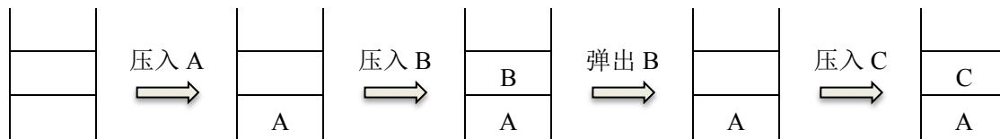
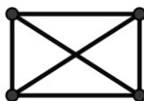
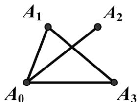

{0}------------------------------------------------

# 第十九届全国青少年信息学奥林匹克联赛初赛

## 普及组 Pascal 语言试题

竞赛时间：2013 年 10 月 13 日 14:30~16:30

### 选手注意：

- 试题纸共有 9 页，答题纸共有 2 页，满分 100 分。请在答题纸上作答，写在试题纸上的  
一律无效。
- 不得使用任何电子设备（如计算器、手机、电子词典等）或查阅任何书籍资料。

### 一、单项选择题（共 20 题，每题 1.5 分，共计 30 分；每题有且仅有一个正确选项）

1. 一个 32 位整型变量占用（ ）个字节。  
A. 4                      B. 8                      C. 32                      D. 128
2. 二进制数 11.01 在十进制下是（ ）。  
A. 3.25                  B. 4.125                  C. 6.25                  D. 11.125
3. 下面的故事与（ ）算法有着异曲同工之妙。  
    从前有座山，山里有座庙，庙里有个老和尚在给小和尚讲故事：“从前有座山，山里有座庙，庙里有个老和尚在给小和尚讲故事：‘从前有座山，山里有座庙，庙里有个老和尚给小和尚讲故事....’”  
A. 枚举                  B. 递归                  C. 贪心                  D. 分治
4. 逻辑表达式（ ）的值与变量 A 的真假无关。  
A.  $(A \vee B) \wedge \neg A$                       B.  $(A \vee B) \wedge \neg B$   
C.  $(A \wedge B) \vee (\neg A \wedge B)$                   D.  $(A \vee B) \wedge \neg A \wedge B$
5. 将 (2, 6, 10, 17) 分别存储到某个地址区间为 0~10 的哈希表中，如果哈希函数  $h(x) =$ （ ），将不会产生冲突，其中  $a \bmod b$  表示  $a$  除以  $b$  的余数。  
A.  $x \bmod 11$                       B.  $x^2 \bmod 11$   
C.  $2x \bmod 11$                       D.  $\lfloor \sqrt{x} \rfloor \bmod 11$ ，其中  $\lfloor \sqrt{x} \rfloor$  表示  $\sqrt{x}$  下取整
6. 在十六进制表示法中，字母 A 相当于十进制中的（ ）。  
A. 9                      B. 10                      C. 15                      D. 16

{1}------------------------------------------------

7. 下图中所使用的数据结构是（ ）。



The diagram illustrates a sequence of operations on a stack data structure. It consists of five rectangular boxes representing the stack at different stages, connected by arrows indicating operations. 1. The first box is empty. An arrow labeled '压入 A' (Push A) points to the second box. 2. The second box contains 'A' at the bottom. An arrow labeled '压入 B' (Push B) points to the third box. 3. The third box contains 'A' at the bottom and 'B' on top. An arrow labeled '弹出 B' (Pop B) points to the fourth box. 4. The fourth box contains only 'A' at the bottom. An arrow labeled '压入 C' (Push C) points to the fifth box. 5. The fifth box contains 'A' at the bottom and 'C' on top.

Diagram showing stack operations: pushing A, pushing B, popping B, and pushing C.

- A. 哈希表
- B. 栈
- C. 队列
- D. 二叉树

8. 在 Windows 资源管理器中，用鼠标右键单击一个文件时，会出现一个名为“复制”的操作选项，它的意思是（ ）。

- A. 用剪切板中的文件替换该文件
- B. 在该文件所在文件夹中，将该文件克隆一份
- C. 将该文件复制到剪切板，并保留原文件
- D. 将该文件复制到剪切板，并删除原文件

9. 已知一棵二叉树有 10 个节点，则其中至多有（ ）个节点有 2 个子节点。

- A. 4
- B. 5
- C. 6
- D. 7

10. 在一个无向图中，如果任意两点之间都存在路径相连，则称其为连通图。下图是一个有 4 个顶点、6 条边的连通图。若要使它不再是连通图，至少要删去其中的（ ）条边。



The diagram shows a complete graph with 4 vertices, denoted as K4. The vertices are arranged in a square pattern. Every vertex is connected to every other vertex by an edge, resulting in a total of 6 edges: 4 edges forming the square's perimeter and 2 diagonal edges crossing in the center.

A complete graph K4 with 4 vertices and 6 edges.

- A. 1
- B. 2
- C. 3
- D. 4

11. 二叉树的（ ）第一个访问的节点是根节点。

- A. 先序遍历
- B. 中序遍历
- C. 后序遍历
- D. 以上都是

12. 以  $A_0$  作为起点，对下面的无向图进行深度优先遍历时，遍历顺序不可能是（ ）。



The diagram shows an undirected graph with 4 vertices labeled  $A_0, A_1, A_2, A_3$ . The edges are as follows:  $A_0$  is connected to  $A_1$ ,  $A_2$ , and  $A_3$ . Additionally, there is an edge between  $A_1$  and  $A_3$ . Vertex  $A_2$  is only connected to  $A_0$ .

An undirected graph with 4 vertices A0, A1, A2, A3.

- A.  $A_0, A_1, A_2, A_3$
- B.  $A_0, A_1, A_3, A_2$
- C.  $A_0, A_2, A_1, A_3$
- D.  $A_0, A_3, A_1, A_2$

{2}------------------------------------------------

13. IPv4 协议使用 32 位地址，随着其不断被分配，地址资源日趋枯竭。因此，它正逐渐被使用（ ）位地址的 IPv6 协议所取代。

- A. 40
- B. 48
- C. 64
- D. 128

14. （ ）的平均时间复杂度为  $O(n \log n)$ ，其中  $n$  是待排序的元素个数。

- A. 快速排序
- B. 插入排序
- C. 冒泡排序
- D. 基数排序

15. 下面是根据欧几里得算法编写的函数，它所计算的是  $a$  和  $b$  的（ ）。

```
function euclid(a, b : longint) : longint;  
begin  
  if b = 0 then  
    euclid := a  
  else  
    euclid := euclid(b, a mod b);  
end;
```

- A. 最大公共质因子
- B. 最小公共质因子
- C. 最大公约数
- D. 最小公倍数

16. 通常在搜索引擎中，对某个关键词加上双引号表示（ ）。

- A. 排除关键词，不显示任何包含该关键词的结果
- B. 将关键词分解，在搜索结果中必须包含其中的一部分
- C. 精确搜索，只显示包含整个关键词的结果
- D. 站内搜索，只显示关键词所指向网站的内容

17. 中国的国家顶级域名是（ ）。

- A. .cn
- B. .ch
- C. .chn
- D. .china

18. 把 64 位非零浮点数强制转换成 32 位浮点数后，不可能（ ）。

- A. 大于原数
- B. 小于原数
- C. 等于原数
- D. 与原数符号相反

19. 下列程序中，正确计算 1, 2, ..., 100 这 100 个自然数之和  $sum$ （初始值为 0）的是（ ）。

|    |                                                                                       |    |                                                                                        |
|----|---------------------------------------------------------------------------------------|----|----------------------------------------------------------------------------------------|
| A. | <pre>i := 1;<br/>repeat<br/> sum := sum + i;<br/> inc(i);<br/>until i &gt; 100;</pre> | B. | <pre>i := 1;<br/>repeat<br/> sum := sum + i;<br/> inc(i);<br/>until i &lt;= 100;</pre> |
|----|---------------------------------------------------------------------------------------|----|----------------------------------------------------------------------------------------|

{3}------------------------------------------------

|    |                                                                            |    |                                                                             |
|----|----------------------------------------------------------------------------|----|-----------------------------------------------------------------------------|
| C. | <pre> i := 1; while i &lt; 100 do begin sum := sum + i; inc(i); end;</pre> | D. | <pre> i := 1; while i &gt;= 100 do begin sum := sum + i; inc(i); end;</pre> |
|----|----------------------------------------------------------------------------|----|-----------------------------------------------------------------------------|

20. CCF NOIP 复赛全国统一评测时使用的系统软件是（ ）。

- A. NOI Windows    B. NOI Linux    C. NOI Mac OS    D. NOI DOS

### **二、问题求解（共 2 题，每题 5 分，共计 10 分；每题全部答对得 5 分，没有部分分）**

- 7 个同学围坐一圈，要选 2 个不相邻的作为代表，有\_\_\_\_\_种不同的选法。
- 某系统自称使用了一种防窃听的方式验证用户密码。密码是  $n$  个数  $s_1, s_2, \dots, s_n$ ，均为 0 或 1。该系统每次随机生成  $n$  个数  $a_1, a_2, \dots, a_n$ ，均为 0 或 1，请用户回答  $(s_1a_1 + s_2a_2 + \dots + s_na_n)$  除以 2 的余数。如果多次的回答总是正确，即认为掌握密码。该系统认为，即使问答的过程被泄露，也无助于破解密码——因为用户并没有直接发送密码。

然而，事与愿违。例如，当  $n=4$  时，有人窃听了以下 5 次问答：

| 问答编号 | 系统生成的 $n$ 个数 |       |       |       | 掌握密码的用户的回答 |
|------|--------------|-------|-------|-------|------------|
|      | $a_1$        | $a_2$ | $a_3$ | $a_4$ |            |
| 1    | 1            | 1     | 0     | 0     | 1          |
| 2    | 0            | 0     | 1     | 1     | 0          |
| 3    | 0            | 1     | 1     | 0     | 0          |
| 4    | 1            | 1     | 1     | 0     | 0          |
| 5    | 1            | 0     | 0     | 0     | 0          |

就破解出了密码  $s_1 =$  \_\_\_\_\_,  $s_2 =$  \_\_\_\_\_,  $s_3 =$  \_\_\_\_\_,  $s_4 =$  \_\_\_\_\_。

### **三、阅读程序写结果（共 4 题，每题 8 分，共计 32 分）**

```

1.  var
    a,b: integer;

begin
  readln(a, b);
```

{4}------------------------------------------------

```
    writeln(a, '+', b, '=', a+b);  
end.
```

输入: 3 5

输出: \_\_\_\_\_

2. var

```
    a, b, u, i, num : integer;  
  
begin  
    readln(a, b, u);  
  
    num := 0;  
    for i:= a to b do  
    begin  
        if (i mod u = 0) then  
            inc(num);  
    end;  
  
    writeln(num);  
end.
```

输入: 1 100 15

输出: \_\_\_\_\_

3. const SIZE = 100;

var

```
    n, f, i, left, right, middle : integer;  
    a:array[1..SIZE] of integer;  
  
begin  
    readln(n, f);  
    for i := 1 to n do read(a[i]);  
    left := 1;  
    right := n;  
    repeat  
        middle := (left+right) div 2;
```

{5}------------------------------------------------

```

        if (f <= a[middle]) then
            right := middle
        else
            left := middle+1;
    until (left >= right);

    writeln(left);
end.

```

输入:

12 17

2 4 6 9 11 15 17 18 19 20 21 25

输出: \_\_\_\_\_

4. const SIZE = 100;  
 var  
   n, ans, i, j : integer;  
   height, num : array[1..SIZE] of integer;  
  
 begin  
   read(n);  
   for i := 1 to n do  
   begin  
     read(height[i]);  
     num[i] := 1;  
     for j := 1 to i-1 do  
     begin  
       if ((height[j] < height[i]) and (num[j] >= num[i])) then  
         num[i] := num[j]+1;  
     end;  
   end;  
   ans := 0;  
   for i := 1 to n do  
   begin  
     if (num[i] > ans) then  
       ans := num[i];  
   end;

{6}------------------------------------------------

```
writeln(ans);  
end.
```

输入:

6  
2 5 3 11 12 4

输出: \_\_\_\_\_

### 四、完善程序（共 2 题，每题 14 分，共计 28 分）

- 1. （序列重排）全局数组变量  $a$  定义如下:

```
const int SIZE = 100;  
int a[SIZE], n;
```

它记录着一个长度为  $n$  的序列  $a[1], a[2], \dots, a[n]$ 。

现在需要一个函数，以整数  $p$  ( $1 \leq p \leq n$ ) 为参数，实现如下功能：将序列  $a$  的前  $p$  个数与后  $n-p$  个数对调，且不改变这  $p$  个数（或  $n-p$  个数）之间的相对位置。例如，长度为 5 的序列 1, 2, 3, 4, 5，当  $p=2$  时重排结果为 3, 4, 5, 1, 2。

有一种朴素的算法可以实现这一需求，其时间复杂度为  $O(n)$ 、空间复杂度为  $O(n)$ :

```
procedure swap1(p : longint);  
var  
    i : longint;  
    b : array[1..SIZE] of longint;  
begin  
    for i := 1 to p do  
        b[    (1)    ] := a[i];                // (3 分)  
    for i := p + 1 to n do  
        b[i - p] :=     (2)    ;                // (3 分)  
    for i := 1 to     (3)     do                // (2 分)  
        a[i] := b[i];  
end;
```

我们也可以用时间换空间，使用时间复杂度为  $O(n^2)$ 、空间复杂度为  $O(1)$  的算法:

```
procedure swap2(p : longint);  
var  
    i, j, temp : longint;
```

{7}------------------------------------------------

```

begin
  for i := p + 1 to n do
  begin
    temp := a[i];
    for j := i downto     (4)     do                // (3 分)
      a[j] := a[j - 1];
        (5)     := temp;                        // (3 分)
  end;
end;

```

- 2. (二叉查找树) 二叉查找树具有如下性质: 每个节点的值都大于其左子树上所有节点的值、小于其右子树上所有节点的值。试判断一棵树是否为二叉查找树。

输入的第一行包含一个整数  $n$ , 表示这棵树有  $n$  个顶点, 编号分别为  $1, 2, \dots, n$ , 其中编号为 1 的为根结点。之后的第  $i$  行有三个数  $value, left\_child, right\_child$ , 分别表示该节点关键字的值、左子节点的编号、右子节点的编号; 如果不存在左子节点或右子节点, 则用 0 代替。输出 1 表示这棵树是二叉查找树, 输出 0 则表示不是。

```

program Bst;

const SIZE = 100;
const INFINITE = 1000000;

type node = record
  left_child, right_child, value : longint;
end;

var
  a : array[1..SIZE] of node;
  i, n : longint;

function is_bst(root, lower_bound, upper_bound : longint) : longint;
var
  cur : longint;
begin
  if root = 0 then
  begin
    is_bst := 1;

```

{8}------------------------------------------------

```

        exit;
    end;
    cur := a[root].value;
    if (cur > lower_bound) and (           (1)           ) and           // (3 分)
        (is_bst(a[root].left_child, lower_bound, cur) = 1) and
        (is_bst(           (2)          ,           (3)          ,           (4)           ) = 1) then
                                // (3 分, 3 分, 3 分)
        is_bst := 1
    else
        is_bst := 0;
    end;

begin
    readln(n);
    for i := 1 to n do
        read(a[i].value, a[i].left_child, a[i].right_child);
    writeln(is_bst(           (5)          , -INFINITE, INFINITE));    // (2 分)
end.

```