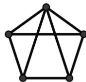
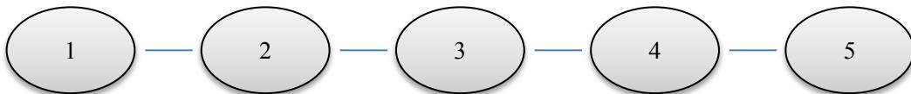

{0}------------------------------------------------

# 第十九届全国青少年信息学奥林匹克联赛初赛

## 提高组 C++语言试题

竞赛时间：2013 年 10 月 13 日 14:30~16:30

## 选手注意：

- 试题纸共有 12 页，答题纸共有 2 页，满分 100 分。请在答题纸上作答，写在试题纸上的一律无效。
- 不得使用任何电子设备（如计算器、手机、电子词典等）或查阅任何书籍资料。

## 一、单项选择题（共 15 题，每题 1.5 分，共计 22.5 分；每题有且仅有一个正确选项）

1. 一个 32 位整型变量占用（ ）个字节。  
A. 4                      B. 8                      C. 32                      D. 128
2. 二进制数 11.01 在十进制下是（ ）。  
A. 3.25                  B. 4.125                  C. 6.25                  D. 11.125
3. 下面的故事与（ ）算法有着异曲同工之妙。  
    从前有座山，山里有座庙，庙里有个老和尚在给小和尚讲故事：“从前有座山，山里有座庙，庙里有个老和尚在给小和尚讲故事：‘从前有座山，山里有座庙，庙里有个老和尚给小和尚讲故事....’”  
A. 枚举                  B. 递归                  C. 贪心                  D. 分治
4. 1948 年，（ ）将热力学中的熵引入信息通信领域，标志着信息论研究的开端。  
A. 冯·诺伊曼（John von Neumann）      B. 图灵（Alan Turing）  
C. 欧拉（Leonhard Euler）              D. 克劳德·香农（Claude Shannon）
5. 已知一棵二叉树有 2013 个节点，则其中至多有（ ）个节点有 2 个子节点。  
A. 1006                  B. 1007                  C. 1023                  D. 1024
6. 在一个无向图中，如果任意两点之间都存在路径相连，则称其为连通图。右图是一个有 5 个顶点、8 条边的连通图。若要使它不再是连通图，至少要删去其中的（ ）条边。



A graph with 5 vertices and 8 edges. It consists of a cycle of 5 vertices with 5 edges, and 3 additional edges connecting the vertices to form a triangle in the center, sharing vertices with the outer cycle.

{1}------------------------------------------------

- A. 2                      B. 3                      C. 4                      D. 5

- 7. 斐波那契数列的定义如下:  $F_1 = 1, F_2 = 1, F_n = F_{n-1} + F_{n-2} (n \geq 3)$ 。如果用下面的函数计算斐波那契数列的第  $n$  项, 则其时间复杂度为 ( )。

```
int F(int n)
{
    if (n <= 2)
        return 1;
    else
        return F(n - 1) + F(n - 2);
}
```

- A.  $O(1)$                       B.  $O(n)$                       C.  $O(n^2)$                       D.  $O(F_n)$
- 8. 二叉查找树具有如下性质: 每个节点的值都大于其左子树上所有节点的值、小于其右子树上所有节点的值。那么, 二叉查找树的 ( ) 是一个有序序列。
- A. 先序遍历                      B. 中序遍历                      C. 后序遍历                      D. 宽度优先遍历
- 9. 将 (2, 6, 10, 17) 分别存储到某个地址区间为 0~10 的哈希表中, 如果哈希函数  $h(x) =$  ( ), 将不会产生冲突, 其中  $a \bmod b$  表示  $a$  除以  $b$  的余数。
- A.  $x \bmod 11$                       B.  $x^2 \bmod 11$   
C.  $2x \bmod 11$                       D.  $\lfloor \sqrt{x} \rfloor \bmod 11$ , 其中  $\lfloor \sqrt{x} \rfloor$  表示  $\sqrt{x}$  下取整
- 10. IPv4 协议使用 32 位地址, 随着其不断被分配, 地址资源日趋枯竭。因此, 它正逐渐被使用 ( ) 位地址的 IPv6 协议所取代。
- A. 40                      B. 48                      C. 64                      D. 128
- 11. 二分图是指能将顶点划分成两个部分, 每一部分内的顶点间没有边相连的简单无向图。那么, 12 个顶点的二分图至多有 ( ) 条边。
- A. 18                      B. 24                      C. 36                      D. 66
- 12. ( ) 是一种通用的字符编码, 它为世界上绝大部分语言设定了统一并且唯一的二进制编码, 以满足跨语言、跨平台的文本交换。目前它已经收录了超过十万个不同字符。
- A. ASCII                      B. Unicode                      C. GBK 2312                      D. BIG5

- 13. 把 64 位非零浮点数强制转换成 32 位浮点数后, 不可能 ( )。
- A. 大于原数                      B. 小于原数  
C. 等于原数                      D. 与原数符号相反

{2}------------------------------------------------

14. 对一个  $n$  个顶点、 $m$  条边的带权有向简单图用 Dijkstra 算法计算单源最短路时，如果不使用堆或其它优先队列进行优化，则其时间复杂度为（ ）。

- A.  $O(mn + n^3)$
- B.  $O(n^2)$
- C.  $O((m + n) \log n)$
- D.  $O((m + n^2) \log n)$

15.  $T(n)$  表示某个算法输入规模为  $n$  时的运算次数。如果  $T(1)$  为常数，且有递归式  $T(n) = 2 * T(n / 2) + 2n$ ，那么  $T(n) =$  （ ）。

- A.  $\Theta(n)$
- B.  $\Theta(n \log n)$
- C.  $\Theta(n^2)$
- D.  $\Theta(n^2 \log n)$

## 二、不定项选择题（共 5 题，每题 1.5 分，共计 7.5 分；每题有一个或多个正确选项，多选或少选均不得分）

1. 下列程序中，正确计算 1, 2, ..., 100 这 100 个自然数之和  $sum$ （初始值为 0）的是（ ）。

|    |                                                                                |    |                                                                               |
|----|--------------------------------------------------------------------------------|----|-------------------------------------------------------------------------------|
| A. | <pre>for (i = 1; i &lt;= 100; i++)<br/> sum += i;</pre>                        | B. | <pre>i = 1;<br/>while (i &gt; 100) {<br/> sum += i;<br/> i++;<br/>}</pre>     |
| C. | <pre>i = 1;<br/>do {<br/> sum += i;<br/> i++;<br/>} while (i &lt;= 100);</pre> | D. | <pre>i = 1;<br/>do {<br/> sum += i;<br/> i++;<br/>} while (i &gt; 100);</pre> |

2. （ ）的平均时间复杂度为  $O(n \log n)$ ，其中  $n$  是待排序的元素个数。

- A. 快速排序
- B. 插入排序
- C. 冒泡排序
- D. 归并排序

3. 以  $A_0$  作为起点，对下面的无向图进行深度优先遍历时（遍历的顺序与顶点字母的下标无关），最后一个遍历到的顶点可能是（ ）。


An undirected graph with 5 vertices labeled A0, A1, A2, A3, and A4. A0 is at the top, A1 is at the middle left, A2 is at the bottom, A3 is at the middle right, and A4 is at the top right. The edges are: (A0, A1), (A0, A3), (A1, A2), (A1, A3), (A2, A3), and (A3, A4).

- A.  $A_1$
- B.  $A_2$
- C.  $A_3$
- D.  $A_4$

{3}------------------------------------------------

- 4. ( ) 属于 NP 类问题。
- A. 存在一个 P 类问题
- B. 任何一个 P 类问题
- C. 任何一个不属于 P 类的问题
- D. 任何一个在（输入规模的）指数时间内能够解决的问题
- 5. CCF NOIP 复赛考试结束后，因 ( ) 提出的申诉将不会被受理。
- A. 源程序文件名大小写错误
- B. 源程序保存在指定文件夹以外的位置
- C. 输出文件的文件名错误
- D. 只提交了可执行文件，未提交源程序

## 三、问题求解（共 2 题，每题 5 分，共计 10 分；每题全部答对得 5 分，没有部分分）

- 1. 某系统自称使用了一种防窃听的方式验证用户密码。密码是  $n$  个数  $s_1, s_2, \dots, s_n$ ，均为 0 或 1。该系统每次随机生成  $n$  个数  $a_1, a_2, \dots, a_n$ ，均为 0 或 1，请用户回答  $(s_1a_1 + s_2a_2 + \dots + s_na_n)$  除以 2 的余数。如果多次的回答总是正确，即认为掌握密码。该系统认为，即使问答的过程被泄露，也无助于破解密码——因为用户并没有直接发送密码。

然而，事与愿违。例如，当  $n = 4$  时，有人窃听了以下 5 次问答：

| 问答编号 | 系统生成的 $n$ 个数 |       |       |       | 掌握密码的用户的回答 |
|------|--------------|-------|-------|-------|------------|
|      | $a_1$        | $a_2$ | $a_3$ | $a_4$ |            |
| 1    | 1            | 1     | 0     | 0     | 1          |
| 2    | 0            | 0     | 1     | 1     | 0          |
| 3    | 0            | 1     | 1     | 0     | 0          |
| 4    | 1            | 1     | 1     | 0     | 0          |
| 5    | 1            | 0     | 0     | 0     | 0          |

就破解出了密码  $s_1 =$  \_\_\_\_\_,  $s_2 =$  \_\_\_\_\_,  $s_3 =$  \_\_\_\_\_,  $s_4 =$  \_\_\_\_\_。

- 2. 现有一只青蛙，初始时在  $n$  号荷叶上。当它某一时刻在  $k$  号荷叶上时，下一时刻将等概率地随机跳到  $1, 2, \dots, k$  号荷叶之一上，直至跳到 1 号荷叶为止。当  $n = 2$  时，平均一共跳 2 次；当  $n = 3$  时，平均一共跳 2.5 次。则当  $n = 5$  时，平均一共跳 \_\_\_\_\_ 次。



```
graph LR; 1((1)) --- 2((2)); 2 --- 3((3)); 3 --- 4((4)); 4 --- 5((5));
```

Diagram showing five numbered circles (1 to 5) connected by horizontal lines, representing a sequence of states or steps.

{4}------------------------------------------------

## 四、阅读程序写结果（共 4 题，每题 8 分，共计 32 分）

```
1. #include <iostream>
#include <string>
using namespace std;

int main() {
    string str;
    cin>>str;
    int n = str.size();
    bool isPlalindrome = true;
    for (int i = 0; i < n/2; i++) {
        if (str[i] != str[n-i-1]) isPlalindrome = false;
    }
    if (isPlalindrome)
        cout<<"Yes"<<endl;
    else
        cout<<"No"<<endl;
}
```

输入: abceecba

输出: \_\_\_\_\_

```
2. #include <iostream>
using namespace std;

int main()
{
    int a, b, u, v, i, num;

    cin>>a>>b>>u>>v;
    num = 0;
    for (i = a; i <= b; i++)
        if (((i % u) == 0) || ((i % v) == 0))
            num++;
    cout<<num<<endl;
    return 0;
}
```

{5}------------------------------------------------

```
}
```

输入: 1 1000 10 15

输出: \_\_\_\_\_

3. #include <iostream>  
using namespace std;

```
int main()  
{  
    const int SIZE = 100;  
    int height[SIZE], num[SIZE], n, ans;  
    cin>>n;  
    for (int i = 0; i < n; i++) {  
        cin>>height[i];  
        num[i] = 1;  
        for (int j = 0; j < i; j++) {  
            if ((height[j] < height[i]) && (num[j] >= num[i]))  
                num[i] = num[j]+1;  
        }  
    }  
    ans = 0;  
    for (int i = 0; i < n; i++) {  
        if (num[i] > ans) ans = num[i];  
    }  
    cout<<ans<<endl;  
}
```

输入:

8

3 2 5 11 12 7 4 10

输出: \_\_\_\_\_

4. #include <iostream>  
#include <cstring>  
using namespace std;

{6}------------------------------------------------

```

const int SIZE = 100;

int n, m, p, a[SIZE][SIZE], count;

void colour(int x, int y)
{
    count++;
    a[x][y] = 1;
    if ((x > 1) && (a[x - 1][y] == 0))
        colour(x - 1, y);
    if ((y > 1) && (a[x][y - 1] == 0))
        colour(x, y - 1);
    if ((x < n) && (a[x + 1][y] == 0))
        colour(x + 1, y);
    if ((y < m) && (a[x][y + 1] == 0))
        colour(x, y + 1);
}

int main()
{
    int i, j, x, y, ans;

    memset(a, 0, sizeof(a));
    cin >> n >> m >> p;
    for (i = 1; i <= p; i++) {
        cin >> x >> y;
        a[x][y] = 1;
    }
    ans = 0;
    for (i = 1; i <= n; i++)
        for (j = 1; j <= m; j++)
            if (a[i][j] == 0) {
                count = 0;
                colour(i, j);
                if (ans < count)
                    ans = count;
            }
}

```

{7}------------------------------------------------

```
    cout<<ans<<endl;
    return 0;
}
```

输入:

6 5 9

1 4

2 3

2 4

3 2

4 1

4 3

4 5

5 4

6 4

输出: \_\_\_\_\_

## 五、完善程序（第 1 题 15 分，第 2 题 13 分，共计 28 分）

- 1. （序列重排）全局数组变量  $a$  定义如下:

```
const int SIZE = 100;
```

```
int a[SIZE], n;
```

它记录着一个长度为  $n$  的序列  $a[1], a[2], \dots, a[n]$ 。

现在需要一个函数，以整数  $p$  ( $1 \leq p \leq n$ ) 为参数，实现如下功能：将序列  $a$  的前  $p$  个数与后  $n-p$  个数对调，且不改变这  $p$  个数（或  $n-p$  个数）之间的相对位置。例如，长度为 5 的序列 1, 2, 3, 4, 5，当  $p=2$  时重排结果为 3, 4, 5, 1, 2。

有一种朴素的算法可以实现这一需求，其时间复杂度为  $O(n)$ 、空间复杂度为  $O(n)$ :

```
void swap1(int p)
```

```
{
```

```
    int i, j, b[SIZE];
```

```
    for (i = 1; i <= p; i++)
```

```
        b[          (1)          ] = a[i];
```

// (2 分)

```
    for (i = p + 1; i <= n; i++)
```

```
        b[i - p] = a[i];
```

```
    for (i = 1; i <= n; i++)
```

{8}------------------------------------------------

```
        a[i] = b[i];  
}
```

我们也可以用时间换空间，使用时间复杂度为  $O(n^2)$ 、空间复杂度为  $O(1)$  的算法：

```
void swap2(int p)  
{  
    int i, j, temp;  
  
    for (i = p + 1; i <= n; i++) {  
        temp = a[i];  
        for (j = i; j >= (2); j--)                // (2 分)  
            a[j] = a[j - 1];  
        (3) = temp;                                // (2 分)  
    }  
}
```

事实上，还有一种更好的算法，时间复杂度为  $O(n)$ 、空间复杂度为  $O(1)$ ：

```
void swap3(int p)  
{  
    int start1, end1, start2, end2, i, j, temp;  
  
    start1 = 1;  
    end1 = p;  
    start2 = p + 1;  
    end2 = n;  
    while (true) {  
        i = start1;  
        j = start2;  
        while ((i <= end1) && (j <= end2)) {  
            temp = a[i];  
            a[i] = a[j];  
            a[j] = temp;  
            i++;  
            j++;  
        }  
    }  
}
```

{9}------------------------------------------------

```

    if (i <= end1)
        start1 = i;
    else if ( (4) ) { // (3 分)
        start1 = (5); // (3 分)
        end1 = (6); // (3 分)
        start2 = j;
    }
    else
        break;
}
}
}

```

- 2. （两元序列）试求一个整数序列中，最长的仅包含两个不同整数的连续子序列。如有多个子序列并列最长，输出任意一个即可。例如，序列“1 1 2 3 2 3 2 3 1 1 1 3 1”中，有两段满足条件的最长子序列，长度均为 7，分别用下划线和上划线标出。

```

#include <iostream>
using namespace std;

int main()
{
    const int SIZE = 100;

    int n, i, j, a[SIZE], cur1, cur2, count1, count2,
        ans_length, ans_start, ans_end;
    //cur1, cur2 分别表示当前子序列中的两个不同整数
    //count1, count2 分别表示 cur1, cur2 在当前子序列中出现的次数
    cin>>n;
    for (i = 1; i <= n; i++)
        cin>>a[i];
    i = 1;
    j = 1;
    //i, j 分别表示当前子序列的首尾，并保证其中至多有两个不同整数
    while ((j <= n) && (a[j] == a[i]))
        j++;
    cur1 = a[i];

```

{10}------------------------------------------------

```

cur2 = a[j];
count1 =           (1)          ;                                // (3 分)
count2 = 1;
ans_length = j - i + 1;
while (j < n) {
    j++;
    if (a[j] == cur1)
        count1++;
    else if (a[j] == cur2)
        count2++;
    else {
        if (a[j - 1] ==           (2)          ) {                // (3 分)
            while (count2 > 0) {
                if (a[i] == cur1)
                    count1--;
                else
                    count2--;
                i++;
            }
            cur2 = a[j];
            count2 = 1;
        }
        else {
            while (count1 > 0) {
                if (a[i] == cur1)
                              (3)          ;                    // (2 分)
                else
                              (4)          ;                    // (2 分)
                i++;
            }
                      (5)          ;                        // (3 分)
            count1 = 1;
        }
    }
}
if (ans_length < j - i + 1) {
    ans_length = j - i + 1;
    ans_start = i;
}

```

{11}------------------------------------------------

```
        ans_end = j;
    }
}
for (i = ans_start; i <= ans_end; i++)
    cout<<a[i]<<' ';
return 0;
}
```